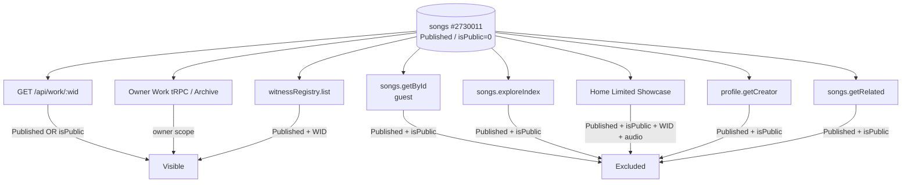

# ARMOR OF LIGHT Discovery Diagnostic

**Specimen:** `WID-MUS-382C1FB8-0ACBA81A` — **ARMOR OF LIGHT (EXTENDED)**  
**Method:** Read-only live database, public HTTP/tRPC probes, and active source inspection.  
**Boundary:** No code, schema, data, cache, publication state, WID, provenance, storage, route, or configuration was modified.

> **Diagnosis:** This is an **actual discovery and public-visibility consistency defect**, not a New This Week/Trending rank, carousel cap, or cache/index delay. The specimen is stored as `status = "Published"` but `isPublic = 0`. Explore, Home showcase, public creator/domain projections, public Work tRPC retrieval, and related Work all require **both** `Published` and `isPublic = true`; they exclude it before ranking. The public WID Protocol and right-rail Witness Registry use different visibility predicates and still return it. [1] [2] [3]

## 1. Specimen Facts

| Field | Live read-only value | Meaning |
|---|---|---|
| Work ID | `2730011` | Canonical numeric Work reference. |
| WID | `WID-MUS-382C1FB8-0ACBA81A` | Present. |
| Title | `ARMOR OF LIGHT (EXTENDED)` | Matches the supplied specimen. |
| Status | `Published` | The Work has a Published status. |
| Public visibility flag | `isPublic = 0` | The Work is excluded by the majority of public feed/projection paths. |
| Content type | `audio` | Satisfies audio type requirements where otherwise eligible. |
| `releaseDate` | `NULL` | “New” ordering falls back to `DATE(createdAt)`. |
| `createdAt` | `2026-08-18 04:47:58` | It is recent and would receive a recent effective date. |
| Recorded all-time plays | `7` | Used only after Trending visibility eligibility. [1] |

## 2. Current Retrieval and Projection Map

| Requested surface | Exact current router/query/component | Eligibility and ordering | Specimen result |
|---|---|---|---|
| **Canonical public WID record** | `GET /api/work/:wid` → `getSongByWitnessId` in `workRoute.ts` | Rejects only `Deleted` or `(!isPublic && status !== "Published")`. HTTP response has `max-age=300, stale-while-revalidate=60`. [2] | **Included.** Public HTTP probe returned `200` with the specimen WID/title. |
| **Canonical public Work tRPC / guest Work page** | `songs.getById` → `getSongWithCreator`; `LoopWorkPage` calls it with `staleTime: 30s`. [3] [4] | Public helper requires `isPublic = true`; owner fallback can return own Work. [3] | **Excluded for guest.** Direct guest tRPC probe returned `null`; guest browser route loaded the shell/right rail but not a public Work detail. |
| **Creator-owned archive** | `ArchivePage` → protected `songs.mySongs` → `getSongsByUser`. [5] | Owner-scoped list; it is not a public-discovery query. | **Included for owner.** Expected and not evidence of Explore eligibility. |
| **Explore base / music** | `ExplorePage.useExploreData` → `songs.exploreIndex` → `getPublicSongs`. [6] [7] | `getPublicSongs` requires `isPublic = true AND status = "Published"`; global audio rows sort by `COALESCE(releaseDate, DATE(createdAt)) DESC, createdAt DESC`. | **Excluded before ranking.** The specimen is absent from the canonical Explore base dataset. |
| **New This Week** | `songs.exploreIndex.newManifestations` → `getNewThisWeek`. [6] [8] | Same public/status gates; 180-day effective-date window; `releaseDate` then `createdAt` descending; `limit 20` inside aggregate. | **Excluded before date/window/rank.** If public, its `createdAt` fallback is interpreted correctly and would be a current candidate. |
| **Trending** | `songs.exploreIndex.trending` → `getTrendingWorks`. [6] [9] | Same public/status gates first; then score `weeklyPlays*3 + weeklyLikes*5 + playCount*0.1`; `limit 20` inside aggregate. | **Excluded before score.** With `isPublic = 0`, no Trending rank exists. If public later, top-20 rank would depend on seven-day plays/likes and the all-time-play tiebreaker. |
| **Limited Showcase** | `HomePage` → `songs.getWitnessedVoices` → `getWitnessedVoices`. [10] [11] | Requires non-null WID, `Published`, `isPublic = true`, `audio`; server newest-first `limit 10`, client displays first `6`. | **Excluded before newest-first/server 10/client 6 caps.** |
| **Creator/domain public projection** | `profile.getCreator`. [12] | Reads owner Works then filters public projection to `s.isPublic && s.status === "Published"`. | **Excluded.** |
| **Work-page related Works** | `LoopWorkPage` → `songs.getRelated({ songId, genre })`, client `staleTime: 60s`. [4] [13] | Related helper requires `isPublic = true AND status = "Published"`, excludes current ID, then ranks genre/tag similarity. | **Excluded.** It also can never return the current Work as its own related record. |
| **Right-rail “Connected Manifestations”** | `RightRail` → `witnessRegistry.list({type:"all", limit:3})`. [14] [15] | `getWitnessRegistry` requires only `status = "Published"` and non-null `witnessId`; it does **not** require `isPublic`; newest-first, server limit 3. | **Included.** This is the observed non-Explore path. Its UI label is misleading: it is a recent WID Registry feed, not `songs.getRelated`. |
| **Right-rail Recently Witnessed** | `RightRail` → `witnessRegistry.list({type:"all", limit:8})`, client sorts newest and displays 4. [14] [15] | Same `Published + WID` predicate, no `isPublic` condition. | **Included.** Separate public Registry projection. |

## 3. Direct Answers

| Question | Diagnosis |
|---|---|
| **A. Is Armor of Light in the canonical Explore dataset?** | **No.** The current Explore base dataset uses `getPublicSongs`, which requires both `isPublic = true` and `status = "Published"`. The specimen has `isPublic = 0`. [7] |
| **B. If yes, why is it not visible?** | Not applicable: it fails eligibility before any visible projection/ranking. |
| **C. If no, which filter excludes it?** | The `isPublic = true` predicate excludes it across Explore base, New This Week, Trending, Limited Showcase, creator public projection, public guest Work retrieval, and related Works. [3] [7] [8] [9] [11] [12] [13] |
| **D. Is publication timestamp interpreted correctly?** | **Yes, where eligibility exists.** `releaseDate` is null, so New This Week and global Explore order by `DATE(createdAt)`. The Work’s `createdAt` is current. This is not a date-window defect. [1] [7] [8] |
| **E. Are Explore sections intentionally limited/ranked?** | **Yes.** Explore calls its aggregate with limit 700, but internally Featured is capped at 8; New This Week and Trending at 20. The main music column starts with 40 visible rows until “Load more.” Limited Showcase has server 10 and client 6 caps. Trending uses an engagement score. These caps are intentional but do not explain this specimen’s absence because it fails visibility first. [6] [9] [10] [11] |
| **F. Is there a cache/index delay?** | **No evidence of an index delay.** The queried tRPC paths directly query database helpers; no server search/index cache was found in these paths. Client caches are 2 minutes for Explore/Home, 30 seconds for Work, 60 seconds for related/registry; the WID HTTP route is 5 minutes plus 60-second stale-while-revalidate. The specimen was created roughly 48 minutes before the probe and remains ineligible on fresh direct tRPC output. A stale card could persist briefly, but cache cannot cause its ongoing Explore omission. [2] [4] [6] [10] [14] |
| **G. Does Connected Manifestations use a different retrieval path from Explore?** | **Yes.** The right-rail section labelled “Connected Manifestations” calls `witnessRegistry.list`, whose database helper filters only `Published + witnessId`. It is a Registry-recency feed, not the Work page’s `songs.getRelated` path and not Explore’s `songs.exploreIndex`. That is why it can show the specimen while Explore cannot. [14] [15] |

## 4. Classification

| Diagnostic category | Result |
|---|---|
| Expected ranking behavior | **Not the primary cause.** Trending, New, and Showcase are limited/ranked as designed, but the specimen does not enter their eligible candidate sets. |
| Pagination/carousel behavior | **Not the primary cause.** Server/client caps would matter only after `isPublic = true`. |
| Caching/index delay | **Not the cause.** Fresh direct tRPC output still excludes the record; cache windows are short relative to the observation. |
| Visibility filtering | **Confirmed primary cause.** `Published` and `isPublic` have diverged. |
| Discovery bug | **Confirmed cross-projection consistency defect.** Public WID Registry and right-rail paths admit `Published + WID`, while public Work/Explore/Creator/Home paths require `Published + isPublic`. The current result is a public-facing Work/Registry record that is invisible to the main public-discovery and guest Work-detail projections. |

## 5. Narrow Operational Conclusion — No Change Made

The immediate defect is the inconsistent publication predicate, not absence of metadata, artwork, audio, WID, timestamp, ranking capacity, or cache propagation. The issue must be repaired separately from the authorized architecture slices because it touches public visibility semantics. This diagnosis does **not** authorize setting `isPublic`, modifying `updateStatus`, changing registry predicates, changing cache, changing Explore, or changing the right-rail label.

The public RightRail’s “Connected Manifestations” title should also not be read as evidence that Explore itself found this Work: current source shows that it is supplied by a different Witness Registry query. Any future correction must separately decide whether the Registry ledger should respect archive/unpublish visibility or whether Explore/public Work should accept Published WID-bearing records; that is a product/authority decision, not a rank tweak.

## References

[1]: Live read-only database query for WID `WID-MUS-382C1FB8-0ACBA81A`, 18 August 2026  
[2]: [Canonical WID Protocol route](../server/routes/workRoute.ts)  
[3]: [Work router and public get-by-ID path](../server/routers/songs.ts) and [public Work helper](../server/db/songs.ts)  
[4]: [Loop Work page](../client/src/pages/loop/LoopWorkPage.tsx)  
[5]: [Archive page](../client/src/pages/ArchivePage.tsx)  
[6]: [Explore aggregate router](../server/routers/songs.ts) and [Explore client](../client/src/pages/ExplorePage.tsx)  
[7]: [Public Work discovery helper](../server/db/songs.ts)  
[8]: [New This Week helper](../server/db/songs.ts)  
[9]: [Trending helper](../server/db/songs.ts)  
[10]: [Home page Limited Showcase](../client/src/pages/HomePage.tsx)  
[11]: [Witnessed Voices procedure](../server/routers/songs.ts)  
[12]: [Public creator projection](../server/routers/profile.ts)  
[13]: [Related Work helper](../server/db/songs.ts)  
[14]: [Right rail projection](../client/src/components/layout/RightRail.tsx)  
[15]: [Witness Registry procedure](../server/routers/witnessRegistry.ts) and [public ledger helper](../server/utils/db.ts)
