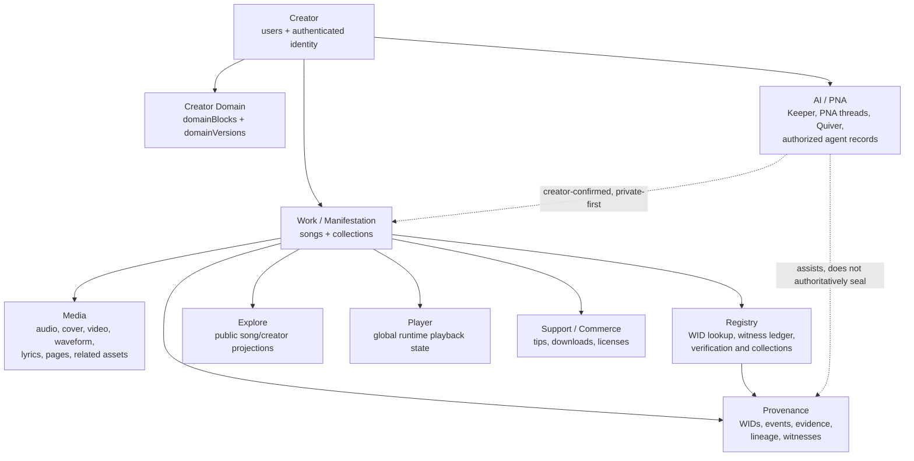
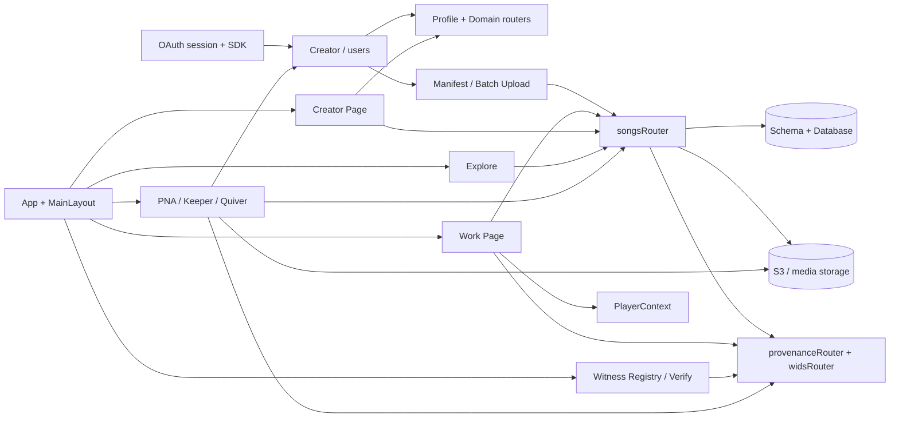
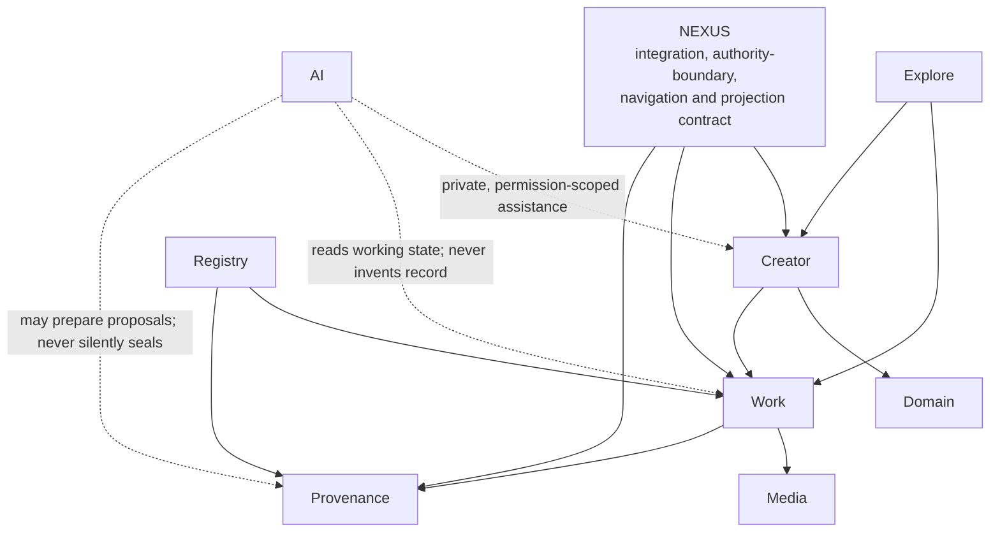

# Living Nexus: Current-to-Target Ontology and Dependency Map

**Status:** Source-bound, non-mutating architecture map  
**Scope:** Existing database, identity, works, provenance, creator domains, publishing state, routes, components, global state, API/data-access, and page dependencies.  
**Boundary:** This document maps what the platform currently records and renders. It does not alter doctrine, make legal conclusions, create a data model, authorize a migration, or change any code, route, deployment, record, asset, WID, account, or configuration.

> **Core finding:** Living Nexus already contains the substantial parts of the proposed ontology. The present system is not missing a Creator, Work, Provenance, Domain, Media, Registry, Explore, or AI layer. Its main issue is **distribution**: those roles are spread across tables, routers, pages, and contexts rather than named together as one explicit Nexus-centered contract.

## 1. Reading the Map Correctly

The **Nexus** in the target map should not initially be interpreted as a new authoritative database row that owns creators, works, or provenance. In the current system, authority is already correctly distributed: creators own their records; works carry linked media; provenance is separately recorded; and Registry, Explore, Player, and AI are service or projection layers. The evidence supports making **Nexus an explicit integration and navigation boundary**, not replacing those authorities with a new central object. [1] [2]

| Requested inspection area | Current evidence | Map result |
|---|---|---|
| Database schema and relationships | `users`, `songs`, collections, domain layouts, WIDs, evidence, events, lineage, witnesses, Quiver, PNA threads, and agent records are already separately modeled. [1] | **Mapped** |
| Authentication and creator identity | OAuth session authentication resolves a real user; profile and domain procedures remain user-scoped. [3] [4] | **Mapped** |
| Registered works and publishing state | Music registration is persisted through `songs.upload` and `songs.batchUpload`; Draft/Published state remains on the work record and publishing adds explicit readiness gates. [5] | **Mapped** |
| Provenance records | WIDs, events, evidence, lineage, witnesses, and version-related records are distinct from work metadata. [1] [6] | **Mapped** |
| Domain/creator relationships | Domain blocks and versions are creator-scoped. [1] [4] | **Mapped** |
| Routes, components, state, and APIs | `App`, `MainLayout`, the rails, work/creator/PNA pages, providers, and the tRPC router form the current operational graph. [7] [8] | **Mapped** |

## 2. Current Ontology



The current system’s primary entity relationships are already aligned with creator sovereignty. `users` are the creator identity and ownership anchor. `songs` are the primary work container, including the current music-first registration contract and legacy polymorphic media fields. Media attaches through storage and media-oriented fields on the work. Provenance has dedicated WID, evidence, event, lineage, and witness records. [1] [5] [6]

| Current entity or surface | Actual present responsibility | Target ontology position | Mapping |
|---|---|---|---|
| `users`, profiles, authenticated session | Creator identity, ownership, profile state, and domain scope | **Creator** | **Direct** |
| `songs`, collections, collection-track links | Work/manifestation record, state, relationship to an album/collection | **Work** | **Direct** |
| `fileUrl`, `coverArtUrl`, `videoUrl`, waveform, lyrics, pages, player asset type | Work-linked media and derivative presentation data | **Media** | **Direct** |
| `wids`, work evidence/events/lineage/witnesses | Seals, records, declarations, evidence, lineage, witness relationships | **Provenance** | **Direct** |
| `domainBlocks`, `domainVersions` | Creator-owned domain composition and history | **Domain** | **Direct** |
| WID lookup, witness ledger, verification routes, collection registry | Registry views and operations over creator/work/provenance facts | **Registry** | **Direct** |
| Public songs, creator profiles, search and trending/new-work queries | Discovery projections over published works and creators | **Explore** | **Direct** |
| Keeper, PNA threads, Quiver, authorized agents, commissions and ledger entries | Private creator assistance, working context, and accountable agent operations | **AI** | **Direct, service-bounded** |
| `PlayerContext` and global player chrome | Playback/runtime representation of a selected work | **Playback runtime** | **Supporting service** |
| `App`, `MainLayout`, providers, tRPC `appRouter` | Integration, navigation, and access composition | **Nexus integration boundary** | **Partial today** |

## 3. Current System Dependency Graph



### 3.1 Identity and authority path

```text
OAuth session
  ↓
SDK authentication
  ↓
Creator identity (users)
  ├── owns → Domain layout and domain versions
  ├── owns → Draft and published Works
  ├── owns → private Quiver assets and PNA threads
  └── authorizes → bounded AI/Agent capabilities
```

The identity model makes the creator—not a page, the Registry, the Player, or an AI surface—the authority root. Domain and private working-state records are owner-scoped, and the active music registration procedures operate under the authenticated creator. [3] [4] [5] [8]

### 3.2 Registration and provenance path

```text
Creator
  ↓
/manifest or /batch-upload
  ↓
Metadata + cover art + lyrics + audio handling
  ↓
Client-derived hash / signature / tone / waveform facts
  ↓
songs.upload or songs.batchUpload
  ├── persists → Work
  ├── links → Media
  ├── creates/links → WID and lyrics provenance where supplied
  ├── enqueues → non-blocking derivative work
  └── permits → explicit Draft or gated Publish state
```

This is the current practical **Creator → Work → Media + Provenance** path. The registry concern is present both in the WID router and inside work-registration procedures. That overlap is not a data-loss problem, but it means provenance capability is currently co-located with work creation rather than mediated by one singular Registry façade. [5] [6]

### 3.3 Public navigation path

```text
Home
  ↓
Explore ───────────→ Work Page ───────────→ Creator Page
  │                     │                        │
  │                     ├──→ Verify / Registry   ├──→ Creator Domain
  │                     ├──→ Player              └──→ Creator works
  │                     └──→ Support
  │
  └──────────────────→ songs and creators only

Register (Top Bar / Left Rail)
  ↓
/manifest (canonical music-registration entry)
```

`App` and `MainLayout` assemble the shared navigation. The Left Rail and Top Bar are not data authorities; they are route-selection infrastructure. `WitnessRegistryPage` is a public Registry/Provenance view. `SongDetailPage` is the work-facing conjunction of media, testimony, evidence, WID, player, and support. `CreatorProfilePage` is the creator/domain-facing conjunction. [7] [8]

## 4. Target Ontology



The target is a **clarification architecture**, not a mandate to collapse the existing schema. Its principal rule is that every surface declares which role it plays and does not impersonate another.

| Target layer | Authority rule | Existing system correspondence | Mapping condition |
|---|---|---|---|
| **Nexus** | Coordinates identity, work, provenance, projections, and services without becoming the origin owner | `App`, `MainLayout`, global providers, tRPC app router, and the Core/Next projection boundary | Make the boundary explicit; do not create a replacement owner table by default. |
| **Creator** | Owns meaning, domain, draft work, and permissions | `users`, profile/domain routers, authenticated ownership checks | Already direct. |
| **Work** | Carries creative state and links media/provenance | `songs`, collections, music registration contract | Already direct for music; legacy polymorphism remains a separate scope decision. |
| **Provenance** | Holds evidence, WID, lineage, witnesses, and events; it is not mutable UI state | WID, evidence, event, lineage, witness records; verification UI | Already direct; keep separated from PNA working state. |
| **Domain** | Is the creator-owned presentation/organization field | Domain blocks and domain versions | Already direct. |
| **Media** | Is attached/linked to work; bytes remain in storage, metadata remains in Core | S3/object URLs and work media fields | Already direct. |
| **Registry** | Provides verification, registration, and relationship views; it does not become creator identity | WID/provenance/witness routers and Registry pages | Direct but distributed across routers. |
| **Explore** | Projects public creator/work records for discovery; it does not own content | Explore route, public song/creator queries | Already direct. |
| **AI** | Reads permissioned context, prepares proposals, and acts only through explicit creator confirmation | PNA, Keeper, Quiver, agent capabilities/ledger | Direct in doctrine and partially distributed in runtime. |

## 5. Page and Component Dependency Map

| Surface | Depends on | Provides downstream context to | Target role |
|---|---|---|---|
| `App.tsx` | Router, global providers, lazy page modules | Every page and global chrome | Nexus composition |
| `MainLayout` | Left Rail, Top Bar, Context Drawer, Right Rail, auth/theme/player state | Shared navigation and runtime context | Nexus shell |
| `MusicEnvironment` | Auth, upload engine, registration helper, `songs.upload` | New Work and provenance facts | Creator → Work registration |
| `BatchUploadPage` | Auth, metadata helper, storage handoff, `songs.batchUpload` | Draft-first collection and work records | Creator → many Works |
| `SongDetailPage` | Song queries, provenance/evidence, player, work editor | Verify, play, support, creator traversal | Work surface |
| `CreatorProfilePage` | Creator profile/domain/work queries, player, work editor | Creator identity, domain, works, public trust | Creator/Domain surface |
| `WitnessRegistryPage` | Witness registry query | WID and witness ledger traversal | Registry/Provenance surface |
| `ExplorePage` | Public work and creator projections | Work and creator discovery | Explore surface |
| `PNAShellPage` | PNA threads, Keeper, Player, Quiver, user identity | Private working context and bounded AI proposals | AI workspace |
| `PlayerContext` | Selected work and playback state | Shared player chrome and PNA working state | Runtime service |

## 6. Seams, Not Defects

The map identifies seams that need naming and protection before any re-architecture. They are not authorization to delete, merge, or relocate code.

| Seam | Current reality | Why it matters in target ontology | No-change interpretation |
|---|---|---|---|
| **Nexus is implicit** | Integration is distributed across `App`, layout, providers, tRPC routing, and page-level contracts. | The target central Nexus relationship is not yet a typed or documented application boundary. | Name the boundary first; do not introduce a new data root prematurely. |
| **Registry capability is distributed** | WID lookup is in `widsRouter`; registration and work-bound provenance are also in `songsRouter`; public ledger uses witness/provenance routes. | Registry needs one conceptual contract even if implementation remains modular. | Preserve working procedures; define a registry façade contract later if approved. |
| **Work has legacy polymorphism** | `songs` presently contains music-first work plus historical multi-medium fields/types. | The target Work role is clean; the actual Core still carries prior architecture. | Keep the table and classifying fields until retain/replace/migrate/archive decisions and dependencies are proven. |
| **Working State versus Chain of Record** | PNA threads, notes, and Quiver assets are private/working structures; WIDs/events/evidence are provenance structures. | AI must not turn chat state into invented or automatic provenance. | Maintain explicit confirmation barriers and separate storage/status semantics. |
| **Player is global runtime, not work authority** | It holds current track/session facts and can inform context. | The target must not elevate playback state into ownership or provenance truth. | Keep it as an ephemeral runtime service. |
| **Explore is a projection** | It queries published work/creator information. | It should remain discoverability, not a competing catalog authority. | Keep public-query semantics separate from registration and provenance mutation. |
| **Domain is present but presentation-driven** | Domain blocks/version history are creator-owned composition. | The target treats Domain as a first-class Creator relation. | Preserve creator-scoped layout/version records; do not conflate them with Registry. |

## 7. Six-Layer Alignment

| Living Nexus layer | Current evidence | Target ontology effect |
|---|---|---|
| **Identity** | Creator identity, ownership, profile, and domain relations are explicit. | Strengthens Creator as an authority root. |
| **Manifestation** | Work pages, media fields, player, and domain presentation materialize the work. | Keeps Work and Media distinct. |
| **Relationship** | Creator-to-work, witness, support, collection, and discovery relations already exist. | Keeps Explore and Registry as relational projections. |
| **Registry** | WIDs, evidence, events, lineage, witnesses, verification, and registration procedures are present. | Names Provenance and Registry separately so the seal is never reduced to UI. |
| **Stewardship** | Draft state, owner checks, private Quiver/PNA state, and append-only records provide existing protection. | Keeps AI permission-scoped and creator-confirmed. |
| **Legacy** | Redirects, collections, historical fields, domain versions, and Core/Next separation preserve continuity. | Prevents a new ontology from becoming a destructive rewrite. |

## 8. Non-Change Recommendations

The following are architectural conclusions, **not approved implementation work**.

1. Treat **Nexus** as a named integration contract above the current distributed surfaces, not as a table that absorbs creator, work, or provenance ownership.
2. Keep the canonical authority chain explicit: **Creator owns Work; Work links Media; Provenance records the chain; Domain belongs to Creator; Registry and Explore project/query; AI assists under declared permission.**
3. Keep PNA, Quiver, player state, and draft/editor state classed as **working/runtime state** until the creator explicitly confirms an outward record action.
4. Normalize the **Registry conceptual façade** before moving implementation: every WID/provenance mutation should be explainable as a work-bound Registry action, even if current router modules remain separate.
5. Do not remove legacy multi-medium fields, redirects, or upload compatibility based on this map. Each still requires a retain/replace/migrate/archive decision with dependency evidence and rollback.

## 9. Map Summary

```text
CURRENT
────────────────────────────────────────────────────────────────

OAuth / session
  ↓
Creator (users)
  ├──→ Creator Page / Creator Domain
  ├──→ Register (/manifest or /batch-upload)
  │       ↓
  │     Work (songs / collections)
  │       ├──→ Media (audio, cover, waveform, lyrics, video)
  │       ├──→ Provenance (WID, evidence, events, lineage, witnesses)
  │       ├──→ Registry (verify, witness ledger, WID lookup)
  │       ├──→ Player (runtime representation)
  │       └──→ Explore (published projection)
  └──→ AI workspace (PNA, Quiver, permitted agent capability)

TARGET
────────────────────────────────────────────────────────────────

                         NEXUS
           Integration / routing / projection boundary
                              │
             ┌────────────────┼────────────────┐
             │                │                │
         Creator             Work          Provenance
             │                │                │
          Domain            Media          Registry
             │                │                │
             └───────────────┼────────────────┘
                             │
                 ┌───────────┼───────────┐
                 │           │           │
              Explore      Player        AI
          public projection runtime   private, permissioned
                                      creator assistance
```

## References

[1]: [Database schema](../drizzle/schema.ts)  
[2]: [ADR-029 Core–Doctrine Pack–Next continuity](ADR-029-CORE-DOCTRINE-NEXT-CONTINUITY.md)  
[3]: [SDK authentication and creator session resolution](../server/_core/sdk.ts)  
[4]: [Creator domain router](../server/routers/domain.ts)  
[5]: [Music registration and publishing procedures](../server/routers/songs.ts)  
[6]: [Provenance router](../server/routers/provenance.ts) and [WID router](../server/routers/wids.ts)  
[7]: [Application route composition](../client/src/App.tsx) and [main shared layout](../client/src/components/layout/MainLayout.tsx)  
[8]: [PNA thread router](../server/routers/pnaThreads.ts), [Quiver router](../server/routers/quiver.ts), and [PNA workspace](../client/src/pages/PNAShellPage.tsx)
