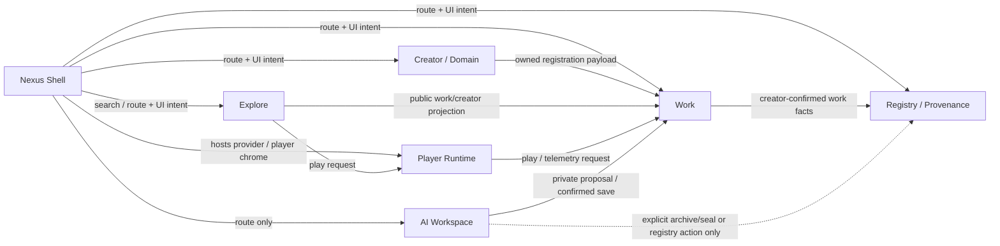

# Existing Boundary Interface Ledger

**Status:** Current-state interface receipt; no interface has been added, changed, or removed.  
**Source basis:** The current React routes and contexts, tRPC procedures, Drizzle models, and the completed ontology/refactor maps.  
**Boundary rule:** “Owner” means the boundary that owns the authority or persistent record—not necessarily the file currently containing a caller. Input/output fields below are **existing observed shapes**, not proposed APIs.

> **Central safeguard:** The application can pass a work reference, a public projection, or a private working proposal between boundaries. It must not pass creator authority, publication authority, or sealed provenance authority as though those were generic UI state.

## 1. Interface Topology

## 2. Shared Contract Vocabulary

| Contract term | Existing shape or source | Meaning and boundary limit |
|---|---|---|
| **Creator identity** | `ctx.user.id`, `users`, `useAuth()` | Ownership root for creator-scoped write procedures. It is never passed as a client-selected user ID to confer authority. [1] [2] |
| **Work reference** | `songId: number`, `witnessId: string`, `fileHash: string` | Identifies a work or its seal. A reference permits lookup only; it does not itself grant edit, publish, or download authority. [3] |
| **Public work projection** | Feed rows and song/creator results in `songs.exploreIndex`, `search.global`, `songs.getById` | Read-only public display data for Explore/Shell/Work pages. It is not a Draft or mutation contract. [3] [4] |
| **Registry fact** | WID, work event, lineage record, witness record, evidence | Sealed or historical record persisted through Registry/Provenance procedures. It is not Player state, chat state, or page-local state. [5] [6] |
| **Playback projection** | `Track` and immutable queue snapshots from `PlayerContext` | Runtime playable representation. It permits play/queue state, not work editing or provenance mutation. [7] |
| **Working State** | PNA threads/messages, Quiver assets, draft chat/visual proposals | Creator-private workspace state. It may prepare a proposal but cannot automatically publish, assign a WID, or assert lineage. [8] |

## 3. Nexus Shell Interfaces

| Caller | Owning boundary | Existing interface | Observed input → output | Persistence | Access and authority rule | Explicitly not transferred |
|---|---|---|---|---|---|---|
| `TopBar` | Explore/Registry query seam | `trpc.search.global.useQuery` | `{ q: string }` → `{ creators[], songs[], guides[] }` | Query over platform records | Public search/read only | Shell cannot alter search corpus, creator records, or works through this interface. [4] |
| `MainLayout` | Notifications / Work summary | `trpc.notifications.unreadCount.useQuery`, `trpc.songs.mySongs.useQuery` | `undefined` → unread count / owner song summaries | Notification and songs records | Enabled only when an authenticated user is present | Shell receives indicators; it does not receive a general write capability. [2] [3] |
| `TopBar` | Work/Commerce | `trpc.songs.download.useMutation` | `{ songId }` → `{ url, filename }` | Work storage and download record | Protected permission/tip gate | Shell cannot retrieve a protected file without the server-side entitlement decision. [3] |
| `TopBar` | Work/Commerce | `trpc.tips.createTipDownloadCheckout.useMutation` | `{ songId, origin }` → `{ url }` | Stripe checkout session and payment records | Protected procedure; canonical origin validation is server-owned | Shell cannot mark a payment, grant a download, or choose a foreign return origin. [3] |
| `LeftRail`, `TopBar`, `ContextDrawer` | Nexus Shell | Wouter navigation and route strings | route/mode/query string → page composition | URL history and client state | `authOnly` navigation checks where applicable | Navigation is not authorization; a route is not a mutation grant. [9] |
| `ThemeProvider` | Nexus Shell | `useTheme`, `setTheme`, `toggleTheme` | `LNTheme` → theme context and document `data-theme` | `localStorage` key `ln-theme` | Client preference only | Theme state cannot alter creator/work/provenance facts. [10] |

## 4. Creator / Domain Interfaces

| Caller | Owning boundary | Existing interface | Observed input → output | Persistence | Access and authority rule | Explicitly not transferred |
|---|---|---|---|---|---|---|
| `CreatorDomainShell`, `CreatorDomainPage` | Creator / Domain | `domain.getLayout` | `{ userId }` → `DomainBlock[]` | `domainBlocks` | Public read projection | Public readers cannot edit another creator’s layout. [11] |
| Creator owner surfaces | Creator / Domain | `domain.getMyLayout` | implicit `ctx.user.id` → `DomainBlock[]` | `domainBlocks` | Protected owner read | Caller cannot select a different user ID to acquire layout access. [11] |
| Creator owner surfaces | Creator / Domain | `domain.saveLayout` | `{ blocks: [{ blockType, position, visible, size, config }], changeNote? }` → `{ success, versionNumber }` | `domainBlocks`, `domainVersions` | Protected owner mutation; deliberate save creates a version record | A save cannot mutate past snapshots or another creator’s domain. [11] |
| Creator owner/public surfaces | Creator / Domain | `domain.getVersionHistory`, `domain.getPublicVersionHistory` | `{ limit? }` / `{ userId, limit? }` → `DomainVersion[]` | `domainVersions` | Owner or public read respectively | Version history is not a general registry-event writer. [11] |
| Creator profile surfaces | Creator / Domain | `profile.getByHandle`, `profile.getCreatorMini` | `{ handle }` / `{ userId }` → public creator projection | `users` | Public read | Private profile fields and identity editing are not granted. [12] |
| Creator owner surface | Creator / Domain | `profile.update` | profile Zod payload → `{ success }` | `users` | Protected `ctx.user.id` update | Caller cannot transfer account ownership or update another profile. [12] |
| Creator registration surfaces | Work | `songs.upload`, `songs.batchUpload` | single work payload or `{ albumName, genre, aiConsent, coverArtUrl, tracks[] }` → work/collection IDs and WID facts | `songs`, collections, storage links | Protected creator operation | Creator presence alone does not bypass attestation, duplicate checks, asset custody, or Publish gates. [3] |

## 5. Work Interfaces

| Caller | Owning boundary | Existing interface | Observed input → output | Persistence | Access and authority rule | Explicitly not transferred |
|---|---|---|---|---|---|---|
| Work, Explore, Player consumers | Work | `songs.getById` | `{ id }` → `{ song, creator }` | `songs`, `users` | Public read surface | Read access is not edit/publish/download entitlement. [3] |
| `MusicEnvironment` | Work registration | `songs.checkDuplicate` | `{ fileHash }` → `{ duplicate, isOwnWork?, existingTitle?, existingWid?, existingCreator?, existingCreatedAt? }` | Work records | Protected preflight | Hash lookup cannot force duplicate insertion or change a WID. [3] |
| `MusicEnvironment` | Work registration | `songs.upload` | title, asset/storage, WID/signature, metadata/tone/waveform/participation, attestation and status facts → `{ success, songId, witnessId }` | Work record and work-bound links | Protected creator request; Publish retains readiness gates | A UI field or AI suggestion cannot silently promote Draft to Published. [3] [13] |
| `BatchUploadPage` | Work registration | `songs.batchUpload` | album fields plus track payloads → `{ success, collectionId?, createdCount }` | `songs`, collections, storage links | Protected creator request; Draft-first batch posture | Batch scope does not bypass creator ownership, quotas, or track provenance. [3] |
| Work surface | Work interaction | `comments.list`, `comments.add`, `comments.addReply`; reactions | song/work IDs plus user content/type → comments/reaction counts | Comments and reaction records | Public reads; protected writes | No caller may impersonate a comment/reaction author. [3] |
| Player Runtime | Work telemetry | `songs.play`, `songs.recordPlay`, `songs.markPlayCompleted` | `songId`, session and duration facts → play result / completion state | Work play counts and `playEvents` | Public event path with server validation | Player cannot edit work metadata, ownership, publication, or WID. [3] [7] |

## 6. Registry / Provenance Interfaces

| Caller | Owning boundary | Existing interface | Observed input → output | Persistence | Access and authority rule | Explicitly not transferred |
|---|---|---|---|---|---|---|
| `WitnessRegistryPage` | Registry / Provenance | `witnessRegistry.list` | `{ type: "all" \| "full_works" \| "lyrics", cursor, limit }` → `{ items, nextCursor }` | Witnessed-work registry projection | Public read | A ledger reader cannot mutate a witnessed record. [14] |
| `VerifyPage` and Registry consumers | Registry / Provenance | `wids.lookup` / verification procedures | `{ wid }` or `{ witnessId }` → WID/creator/event or verification projection | WID and work-bound records | Public read | Lookup does not confer ownership, revocation, or rewrite authority. [5] [6] |
| `ProvenanceTimeline` | Registry / Provenance | `provenance.getTimeline` | `{ songId }` → event rows | `workEvents` | Public read | Timeline display cannot mutate history. [5] |
| Work-owner interface | Registry / Provenance | `provenance.addEvent` | `{ songId, eventType, eventLabel?, platformName?, platformUrl?, occurredAt? }` → completion | `workEvents` | Protected; verifies `song.userId === ctx.user.id` | A caller cannot write an event for another work or transfer existing event ownership. [5] |
| Work-owner interface | Registry / Provenance | `provenance.inviteWitness` / `acceptWitness` | invitation fields → `{ token, inviteUrl }`; `{ token, testimony? }` → completion | Witness invitation and witness records | Owner invitation and authenticated acceptance | Witnessing does not transfer the work or original creator authority. [5] |
| Registry client, caller not identified in supplied UI bundle | Registry / Provenance | `wids.register` | `{ wid, eventId, contentHash, signature? }` → insert result | WID record | Protected; WID tied to authenticated creator ID | A WID cannot be registered for a selected third-party creator or reassigned after the fact. [6] |

## 7. Explore Interfaces

| Caller | Owning boundary | Existing interface | Observed input → output | Persistence | Access and authority rule | Explicitly not transferred |
|---|---|---|---|---|---|---|
| `ExplorePage` | Explore projection | `songs.exploreIndex` | `{ seed?, limit?, randomize?, creatorId? }` → feed groups of `FeedRow[]` | `songs`, `users` public query projection | Public read | Explore cannot mutate feed rows, Draft status, creator ownership, or WID records. [4] |
| Nexus Shell or Explore | Explore/Registry query seam | `search.global` | `{ q }`, length-bounded → creator/song/guide results | Query across indexed platform records | Public read | Search cannot issue a database write or derive a seal. [4] |
| `ExplorePage` | Player Runtime | `addAndPlay` / `playQueueAt` | `Track` or queue + index → client audio-state change | Browser player state | Explicit creator/viewer click | Explore can request playback; it does not gain Work edit authority. [7] |

## 8. Player Runtime Interfaces

| Caller | Owning boundary | Existing interface | Observed input → output | Persistence | Access and authority rule | Explicitly not transferred |
|---|---|---|---|---|---|---|
| Nexus Shell, Work, Creator/Domain, Explore | Player Runtime | `usePlayer()` / `PlayerContext` | tracks, queue index/context, partial track updates → `PlayerContextValue`, active queue/track state | `sessionStorage` player session and local volume preference | Runtime-only client state | Queue snapshot remains immutable at play time; views cannot claim work ownership through it. [7] |
| Nexus player chrome and visual surfaces | Player Runtime | `useHarmonic()` / `HarmonicContext` | active `PlayerContext` state → harmonic signature/colors | In-memory derivation | Read-only derived state | Harmonic UI cannot forge/overwrite a work’s WID or provenance. [15] |
| Player client | Player Runtime | `playback.getSettings` / `saveSettings` | no input / preference payload → settings record | Playback settings storage | Protected user preference interface | Caller cannot retrieve or change another user’s preferences. [16] |
| Track-fade owner interface | Player Runtime | `playback.updateTrackFade` | `{ songId, fadeInSeconds, fadeOutSeconds }` → `{ success: true }` | Work fade fields | Protected plus work ownership check | Playback setting does not change broader publication/provenance state. [16] |

## 9. AI Workspace Interfaces

| Caller | Owning boundary | Existing interface | Observed input → output | Persistence | Access and authority rule | Explicitly not transferred |
|---|---|---|---|---|---|---|
| `PNAShellPage`, PNA panel | AI Workspace / appearance state | `keeper.getProfile`, `keeper.setActiveSkin` | `undefined` / `{ skinId }` → skin/profile state or success | `keeperSkins` and creator-scoped stats | Protected creator session | Skin selection does not alter provenance or another creator’s appearance state. [8] |
| PNA surfaces | AI Workspace | `keeper.chat` | `{ message, persona, history?, imageUrls?, attrs? }` → `{ reply, persona }` | Stateless invocation in observed router | Protected creator session | Chat reply is not automatically a saved thread, WID, provenance event, or published work. [8] |
| PNA surfaces | AI Workspace | `keeper.generateArtwork` | `{ prompt, styleTags? }` → `{ url, prompt }` | Temporary stored artifact | Protected creator session | Generation does not place the image in Quiver or public Registry without an explicit next action. [8] |
| PNA surfaces | AI Workspace | `pnaThread.create`, `get`, `append`, `setVisualProposal` | thread/message/proposal payloads → thread/message results | `pnaThreads`, `pnaThreadMessages` | Protected plus `ownedThread` ownership check | A user cannot read/append another user’s thread; proposal writes cannot target a user-role message. [8] |
| PNA/Quiver surfaces | Private Work/Media reserve | `quiver.save`, `list`, `get` | image/provenance metadata, filters, or asset ID → asset ID/list/detail | `quiverImages` | Protected creator-scoped ownership | Saving is explicit and private; no automatic outward publication or cross-user asset access. [8] |
| PNA diary actions | Creator-private archive / Registry-adjacent record | `keeper.saveChatArchive`, `sealChatArchive` | archive metadata/messages → archive ID/WID; `{ diaryWid }` → seal response | `keeperChatArchives` | Protected creator session | Sealed archive hash cannot be altered through routine chat state. [8] |
| AI capability actions | AI Workspace | `agents.*` procedures | capability/commission/ledger inputs as defined by router → agent/ledger projections | Agents, capability, commission, ledger records | Protected authority-scoped procedures | Agent authority is capability-bound; it cannot rewrite creator origin or sealed provenance. [17] |

## 10. Explicit Forbidden Transfers

The following are rules already supported by the current procedure/context separation and must remain explicit in any future refactor.

| Source boundary | Forbidden transfer | Why |
|---|---|---|
| Nexus Shell → any domain | Route access treated as mutation authority | Navigation is a UI concern; server authorization remains boundary-owned. |
| Creator / Domain → Registry | Creator editing state treated as a rewrite of sealed provenance | Creator may submit confirmed facts; Registry preserves the historical record. |
| Work → Registry | Any Draft/metadata update treated as automatic WID mutation | Work editing and WID/provenance sealing remain distinct operations. |
| Explore → Work or Registry | Feed/search query treated as a mutation channel | Explore is a public projection only. |
| Player Runtime → Work or Registry | Playback queue/harmonic state treated as authorship or evidence | Runtime state is ephemeral, derived, and non-authoritative. |
| AI Workspace → Work or Registry | Chat, a Vision result, or a private Quiver item treated as automatic publication/sealing | Creator must explicitly confirm each outward action. |
| Any caller → another creator | Client-selected user ID treated as authority | Ownership must come from the authenticated server context. |

## 11. Interfaces Requiring Consumer Confirmation Before Any Refactor

The ledger exposes four places that require a direct consumer inventory before any interface is moved or renamed: mixed `songsRouter` procedures; verification calls presently named under `songs`; the broad `keeperRouter`; and the secondary PNA panel. The supplied source confirms their current roles but does not prove every downstream caller. They remain **retain-in-place** until that inventory is complete. [3] [5] [8]

## 12. Unverified Boundaries

The ledger does not claim facts not proven by the inspected source. The precise active callers for `wids.register`, `provenance.addLineage`, and selected verification helpers were not in the provided client bundles. Detailed Stripe webhook operation, S3 credential lifecycle, cross-tab layout conflict resolution, real-time socket behavior, and any external background agent channel were also outside the source evidence reviewed here. These are marked for evidence collection, not treated as defects or grounds for a rewrite.

## References

[1]: [Authentication SDK](../server/_core/sdk.ts)  
[2]: [Shell layout](../client/src/components/layout/MainLayout.tsx)  
[3]: [Work and registration router](../server/routers/songs.ts), [Music Environment](../client/src/pages/manifestation-studio/environments/MusicEnvironment.tsx), and [Batch Upload page](../client/src/pages/BatchUploadPage.tsx)  
[4]: [Explore page](../client/src/pages/ExplorePage.tsx) and [search router](../server/routers/search.ts)  
[5]: [Provenance router](../server/routers/provenance.ts) and [Provenance Timeline](../client/src/components/ProvenanceTimeline.tsx)  
[6]: [WID router](../server/routers/wids.ts) and [Witness Registry router](../server/routers/witnessRegistry.ts)  
[7]: [Player context](../client/src/contexts/PlayerContext.tsx)  
[8]: [PNA shell](../client/src/pages/PNAShellPage.tsx), [PNA threads router](../server/routers/pnaThreads.ts), [Quiver router](../server/routers/quiver.ts), and [Keeper router](../server/routers/keeper.ts)  
[9]: [Application routes](../client/src/App.tsx), [Left Rail](../client/src/components/layout/LeftRail.tsx), [Top Bar](../client/src/components/layout/TopBar.tsx), and [Context Drawer](../client/src/components/layout/ContextDrawer.tsx)  
[10]: [Theme context](../client/src/contexts/ThemeContext.tsx)  
[11]: [Domain router](../server/routers/domain.ts) and [Creator Domain Shell](../client/src/pages/CreatorDomainShell.tsx)  
[12]: [Profile router](../server/routers/profile.ts)  
[13]: [Loop registration helpers](../shared/loopRegistration.ts)  
[14]: [Witness Registry page](../client/src/pages/WitnessRegistryPage.tsx)  
[15]: [Harmonic context](../client/src/contexts/HarmonicContext.tsx)  
[16]: [Playback router](../server/routers/playback.ts)  
[17]: [Agents router](../server/routers/agents.ts)
