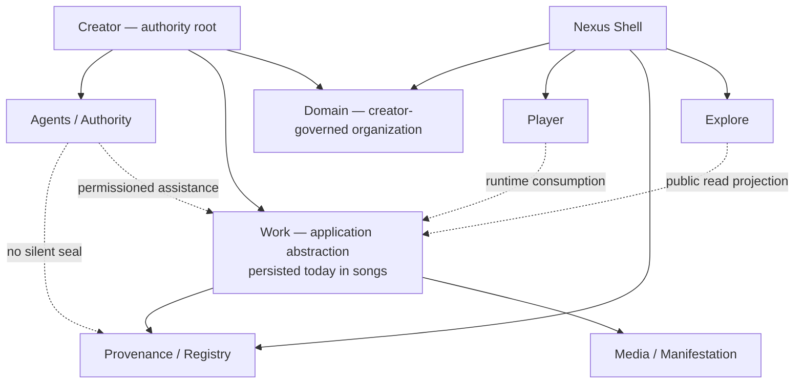

# Ontology Enforcement: Refactor Preparation Package

**Status:** Evidence-first preparation only. No implementation is authorized by this document.  
**Keeper directive:** Preserve the living system; clarify responsibility gradually; never sacrifice provenance for convenience.  
**Scope:** Existing application boundaries, with special attention to the overloaded `songsRouter` and the Work surface.  
**Hard boundary:** No application rebuild, database replacement, destructive rename of `songs`, WID/provenance mutation, route removal, data migration, deployment change, or working-system deletion is proposed or performed here.

> **Finding:** The current `songs` persistence table already carries the practical Work record. The refactor target is therefore an **application-level Work abstraction and compatibility façade pattern**, not a table rename or data-model replacement. The Registry remains evidence infrastructure, not a new owner of Creator, Domain, Explore, or Player. [1] [2]

## 1. Current and Target Architecture

The completed Current → Target map remains the governing description of the existing system. Creator is the human authority root; Creator governs Domain, Work, permissions, and authorized agents. Work links actual Media/Manifestations and the surrounding Registry/Provenance chain. Nexus Shell integrates navigation, Explore, Registry, Player, Creator Workspace, and public surfaces without becoming a business-rule god object. [1]



## 2. Exact `songsRouter` Responsibility Map

**Reading the table:** “Safe to move” means only that an internal helper or a compatibility façade could be extracted later; it never authorizes a route/schema/record move. “No” means preserve the current procedure and semantics until a separate dependency investigation is approved. “Conditional” requires stable output shape, callers, and rollback evidence first.

| Procedure | Current responsibility | Current dependencies / visible callers | Target domain | Safe to move? | Blocker or preservation rule |
|---|---|---|---|---|---|
| `checkDuplicate` | File-hash duplicate preflight; returns existing WID and owner-facing metadata | `songs` table; `MusicEnvironment`, `BatchUploadPage` | Registry-assisted Work registration | **Conditional** | Preserve exact hash lookup/result shape and owner visibility rule. |
| `discover` | Public filtered Work feed | `getPublicSongs`; public feed consumers | Explore | **Conditional** | Keep `songs.discover` compatibility alias and content-type behavior. |
| `discoverInfinite` | Cursor-based public Work feed | `getPublicSongs`; infinite discovery consumers | Explore | **Conditional** | Preserve cursor/limit pagination semantics. |
| `trending` | Public trending Work projection | `getTrendingWorks` | Explore | **Conditional** | Preserve scoring and public-status filters. |
| `newThisWeek` | New public Work projection | `getNewThisWeek` | Explore | **Conditional** | Preserve current time-window/fallback behavior. |
| `exploreIndex` | Music-first multi-bucket discovery projection | public Work query helpers; `ExplorePage` | Explore | **Conditional** | Preserve returned empty legacy buckets for wire compatibility. |
| `updateCredits` | Owner updates Work credits | `getSongById`, `updateSongCredits` | Work | **Conditional** | Preserve authenticated owner check. |
| `getTotalPlays` | Public creator play-total projection | `getCreatorTotalPlays` | Explore / Creator projection | **Conditional** | Read-only; retain output shape. |
| `getById` | Public Work read with owner Draft/Unlisted fallback | `getSongWithCreator`, owner helper; Work pages | Work | **Conditional** | Preserve owner fallback without exposing nonpublic work to others. |
| `verifyWid` | Canonical WID lookup for work, testimony, and project identifiers | WID/work/testimony/project data; `VerifyPage` | Registry | **No** | Do not alter identifier resolution, signature, hash, name-history, or public verification behavior. |
| `getWitnessedCount` | Public witnessed published-Work count | `songs` table | Registry projection | **Conditional** | Preserve public/published/WID filters. |
| `getCountsByContentType` | Public Work count by historic content type | `songs` table | Explore projection | **Conditional** | Retain legacy type fields; no table rename. |
| `countByCreator` | Public creator Work count | `songs` table | Creator projection | **Conditional** | Preserve published/public filters. |
| `getWitnessedVoices` | Recent witnessed audio Work feed | `songs` + `users` | Explore / Registry projection | **Conditional** | Preserve canonical `FeedRow` shape. |
| `mySongs` | Authenticated creator Work list | `getSongsByUser` | Creator Workspace / Work | **Conditional** | Preserve owner scoping. |
| `bySelf` | Authenticated creator Work list alias | `getSongsByUser` | Creator Workspace / Work | **Conditional** | Retain alias until all callers are inventoried. |
| `getMyDraft` | Authenticated creator Draft retrieval | `songs` table | Creator Workspace / Work | **Conditional** | Preserve owner-only Draft access. |
| `reorder` | Creator Work display ordering | owned Work list + reorder helper | Creator Domain / Work | **Conditional** | Validate every ID belongs to creator before reorder. |
| `upload` | Single Work registration, storage handoff, metadata, WID/lyrics facts, Draft/Publish gate | storage, registration helpers, `songs`, provenance/WID, visual queue; `MusicEnvironment` | Work + Media + Registry registration seam | **No** | Preserve all storage, WID, status, profile/visual publish gates, and creator confirmation semantics. |
| `uploadCoverArt` | Owner cover-art asset attachment | storage + owned Work | Media | **Conditional** | Keep work ownership and asset custody checks. |
| `batchUpload` | Draft-first multi-Work + collection registration | `songs`, collections, storage; `BatchUploadPage` | Work + Collection + Registry registration seam | **No** | Preserve WID-ALB/WID-LYR, collection links, Draft default, and per-track custody. |
| `verifyCollection` | WID-ALB / collection provenance verification | collections + collection tracks | Registry / Collection | **No** | Preserve sorted collective-hash/WID resolution. |
| `getCollectionForSong` | Work-to-collection projection | collection helper | Collection | **Conditional** | Preserve legacy collection relation. |
| `delete` | Creator soft-delete of Work | owner work helper | Work lifecycle | **Conditional** | Preserve deletion semantics and provenance continuity. |
| `hardDelete` | Privileged Work removal path | privileged work helper | Admin / Work lifecycle | **No** | Requires explicit retention/custody policy; no refactor first. |
| `batchDelete` | Creator multi-Work deletion | owned Work helpers | Work lifecycle | **Conditional** | Preserve ownership and each record’s archival behavior. |
| `dismissDrafts` | Creator Draft dismissal | Work lifecycle helpers | Creator Workspace / Work | **Conditional** | Preserve owner scoping and Draft-only limit. |
| `reorderMySongs` | Creator Work ordering | ordered Work helpers | Creator Domain / Work | **Conditional** | Preserve ownership validation. |
| `updateStatus` | Draft ↔ Published Work state transition | Work status helper, visual queue/event paths | Work lifecycle | **No** | Publish gate, public visibility, notifications, and provenance side effects must remain exact. |
| `updateMetadata` | Owner Work metadata update | owned Work, metadata helper | Work | **Conditional** | Must not mutate WID/hash/provenance fields by convenience. |
| `play` | Lightweight play increment | play helper | Player telemetry | **Conditional** | Preserve current counting semantics. |
| `recordPlay` | Audited playback event | play-event helper, session/duration facts; `PlayerContext` | Player telemetry | **Conditional** | Preserve `MIN_PLAY_SECONDS` and anti-fraud/session facts. |
| `markPlayCompleted` | Marks audited play completion | play-event helper; `PlayerContext` | Player telemetry | **Conditional** | Preserve completion audit semantics. |
| `playAuditStats` | Public/authorized play audit projection | play audit helper | Player telemetry | **Conditional** | Retain result shape and access rules. |
| `download` | Server-enforced media download entitlement | Work, tips, downloads, secure storage; shell/work controls | Commerce / Work Media | **No** | Keep entitlement decision and protected URL release server-side. |
| `updateLyrics` | Owner lyrics text update | Work helper | Work / Media | **Conditional** | Must not reassign existing lyrics WID or mutate sealed provenance. |
| `addLyricsWithWid` | Owner lyrics attachment with WID facts | Work + WID helpers | Work / Media / Registry seam | **No** | Preserve hash, WID-LYR, timestamp, ownership. |
| `replaceAudio` | Versioned audio replacement | Work/version/storage helpers | Media / Work lifecycle | **No** | Preserve prior audio version, lineage, and custody. |
| `getAudioVersions` | Owner audio-version list | Work/version helpers | Media / Registry projection | **Conditional** | Preserve owner access. |
| `getAudioVersionsByWid` | Public audio-version lookup by Work WID | WID/work versions | Registry / Media projection | **Conditional** | Preserve public WID resolution. |
| `uploadVideo` | Owner attached/generated video media mutation | Work/video/storage helpers | Media | **Conditional** | Preserve owner check and Work link. |
| `removeVideo` | Owner video detachment | Work/video helper | Media | **Conditional** | Preserve attachment history rules. |
| `uploadVideoByUrl` | Owner remote video attachment | Work/video helper | Media | **Conditional** | Validate source/custody semantics before any extraction. |
| `getRelated` | Related public Work projection | related-work helper | Explore / Work projection | **Conditional** | Read-only output compatibility. |
| `constellation` | Work relationship/discovery projection | Work relation/query helpers | Explore / Registry projection | **Conditional** | Do not infer lineage from similarity data. |
| `getLiked` | Creator/viewer liked-Work list | likes helper | Creator Workspace / Explore | **Conditional** | Preserve user scoping. |
| `getLikedOrdered` | Ordered liked-Work list | ordered likes helper | Creator Workspace / Explore | **Conditional** | Preserve user ordering. |
| `reorderLikes` | Viewer preference ordering | likes ordering helper | Creator Workspace / Explore | **Conditional** | Preference state is not Work authority. |
| `toggleLike` | Viewer Work-like mutation | like helper | Explore engagement | **Conditional** | Preserve user attribution. |
| `getLikeStatus` | Viewer-specific like state | like helper | Explore engagement | **Conditional** | Preserve user scoping. |
| `getLikeCount` | Public Work-like count | like helper | Explore projection | **Conditional** | Read-only result shape. |
| `getListenerCount` | Work listener projection | listener helper | Explore / Player projection | **Conditional** | Read-only; not a provenance event. |
| `getBulkLikeStatuses` | Viewer-specific bulk likes | likes helper | Explore engagement | **Conditional** | Preserve viewer scoping and pagination limits. |
| `getReactions` | Public Work reactions | reactions helper | Explore engagement | **Conditional** | Preserve public aggregate behavior. |
| `toggleReaction` | Viewer reaction mutation | reactions helper | Explore engagement | **Conditional** | Preserve attribution and Work reference. |
| `generateCaption` | Creator-assisted Work caption proposal | LLM + Work metadata | AI Workspace → Work proposal | **Conditional** | Proposal must stay noncanonical until creator saves. |
| `generateCollectionCertificate` | Collection certificate generation | collection/WID helpers | Registry / Collection | **No** | Preserve certificate identity and WID-ALB facts. |
| `getMyCollections` | Creator collection list | collections helper | Collection / Creator Workspace | **Conditional** | Preserve owner scope. |
| `getCollectionsByCreator` | Public creator collection projection | collections helper | Collection / Creator projection | **Conditional** | Preserve public filtering. |
| `getCollectionTracks` | Collection-to-Work projection | collection tracks helper | Collection | **Conditional** | Preserve Work IDs/order. |
| `updateCollectionCoverPosition` | Owner collection cover presentation | collection helper | Collection / Media presentation | **Conditional** | Presentation must not rewrite WID-ALB. |
| `uploadCollectionCover` | Owner collection cover attachment | storage + collection helper | Collection / Media | **Conditional** | Preserve ownership and media custody. |
| `updateCollectionDefaultView` | Owner collection presentation preference | collection helper | Collection / Domain presentation | **Conditional** | Preference-only; no Work/provenance change. |
| `getWorkerStats` | Owner/admin visual-worker status projection | queue helper | System / Media operations | **Conditional** | Do not move with Work registration in first slice. |
| `getGcodePresignedUploadUrl` | Signed media upload preparation for historic G-code media | storage helper | Media | **Conditional** | Retain as compatibility path; do not delete legacy medium support. |
| `getPublicAlbum` | Public legacy album/collection + Work projection | collections/projects helper | Collection / Project projection | **Conditional** | Preserve collection/project URL and relation compatibility. |

**Procedure-map conclusion:** `songsRouter` currently acts as a compatibility façade across at least Work registration/lifecycle, Media, Registry lookup, Explore projections, Player telemetry, Collection behavior, commerce-adjacent download enforcement, engagement, AI proposal, and system-worker status. The correct first move is not to split it publicly; it is to extract one bounded internal helper while preserving `songs.*` procedure signatures. [3]

## 3. Nexus Shell Responsibility Map

| Existing asset | Present responsibility | Target boundary | Refactor posture | Preservation constraint |
|---|---|---|---|---|
| `client/src/App.tsx` | Route table, lazy page loading, provider composition, redirects, subdomain guards | Nexus Shell | **Retain; clarify** | Preserve public, legacy, subdomain, OAuth-return, and canonical redirects. |
| `MainLayout.tsx` | Shared rail/top bar/drawer/right rail/player-layer composition | Nexus Shell | **No-touch in first slice** | Player mounting, z-index, mobile behavior, and route persistence must not regress. |
| `LeftRail.tsx` | Primary Loop navigation: Home, Explore, Register, Manage, Archive | Nexus Shell | **Retain** | Register must remain canonical `/manifest`; navigation is not authorization. |
| `TopBar.tsx` | Search, inline player chrome, auth affordances, notification/download entry | Nexus Shell hosting Player/Explore ports | **Conditional later** | Do not break global player, checkout security, search, or theme ownership. |
| `ContextDrawer.tsx` | Mode-driven secondary navigation | Nexus Shell | **Conditional later** | Preserve mode/routing/auth transitions, mobile dismissal, and no duplicate upload architecture. |
| Home/Explore public pages | Public orientation and Work/Creator discovery | Explore / Public surfaces | **Retain** | Explore remains a read projection; no Work/Registry mutation. |
| `/song/:id`, loop work surfaces | Work materialization and public traversal | Work surface | **Conditional later** | Preserve player, WID, download entitlement, and support behavior. |
| `/creator/:id`, creator domain pages, `/manifest`, `/manage` | Creator/Domain public and owner surfaces | Creator / Domain | **Conditional later** | Preserve ownership, profile, domain version, and Draft-registration behavior. |
| `/verify/:id`, `/witness-registry` | Public verification and witness ledger | Registry | **Retain** | Preserve immutable verification semantics. |
| Admin/developer/system routes | Moderation, logs, user/admin, developer surfaces | Admin/Developer/System | **No-touch in first slice** | Preserve role controls and restricted access. |

## 4. Work Surface Dependency Map

```text
WorkSurface (currently composed primarily in SongDetailPage / LoopWorkPage)
  ├── WorkIdentity      → songs.getById / creator summary
  ├── MediaSurface      → audio, cover, waveform, lyrics, attached video/version data
  ├── PlayerPort        → PlayerContext; playback telemetry; runtime-only queue state
  ├── RegistryPort      → WID, ProvenanceTimeline, evidence, events, lineage, witnesses
  ├── CreatorPort       → creator profile/domain navigation and authored context
  └── SupportPort       → server-enforced download/tip/support interactions
```

| Current component or context | Present dependency | Correct future boundary | First-slice posture |
|---|---|---|---|
| `SongDetailPage.tsx` | Work query, comments, evidence, events, player, harmonic state, editor actions, support | WorkSurface composition | **Do not split first**; it is a later composition target. |
| `LoopWorkPage.tsx` | Alternate Work flow, Player, Work editor, Support drawer | WorkSurface composition | **Do not merge/delete**; inventory callers and route posture first. |
| `PlayerContext.tsx` | Global Audio singleton, queue snapshots, telemetry, MediaSession, settings | Player runtime | **No-touch in first slice**. |
| `ProvenanceTimeline.tsx` | provenance timeline/query/mutation | RegistryPort | **Safe later extraction**; it is already comparatively bounded. |
| `WorkEditorContext.tsx` | Creative drawer/overlay and Work cache invalidation | Creator Workspace ↔ Work editing | **Safe later extraction**; preserve overlay behavior. |

## 5. Files: Change Later vs. Protected Now

| Classification | Files / areas | Reason |
|---|---|---|
| **Candidate first-change files** | New internal helper under `server/domains/registry/` (or `server/services/`); `server/routers/songs.ts`; a focused test file | A bounded helper extraction can preserve the existing tRPC façade and route/data contract. |
| **Conditional later** | `SongDetailPage.tsx`, `LoopWorkPage.tsx`, `WorkEditorContext.tsx`, `TopBar.tsx`, `ContextDrawer.tsx`, `server/routers/keeper.ts`, `server/routers/search.ts` | Each crosses multiple active boundaries; requires caller inventory, compatibility design, and focused smoke plans. |
| **Protected / no-touch before dedicated approval** | `drizzle/schema.ts`; migration SQL; `server/routers/provenance.ts`; WID issuance/query semantics in `server/routers/wids.ts`; `server/routers/witnessRegistry.ts`; `server/routers/tips.ts`; `PlayerContext.tsx`; `server/_core/*`; auth/session code; current upload storage endpoint | These hold WID/provenance, payment/entitlement, Player lifecycle, auth, schema, or asset-custody semantics. |
| **Never delete from this program without separate classification** | Legacy redirects, `songs` fields, old media routes, collection models, historical migration files, PNA/Quiver records | A retain/replace/migrate/archive decision requires live dependencies, rollback, and Keeper approval. |

## 6. Data and Provenance Risks

| Risk boundary | Existing invariant | Consequence if violated |
|---|---|---|
| Creator authority | `ctx.user` and owner checks govern creator/domain/Work actions | Client-selected creator IDs or shell routing could become an authority bypass. |
| Work persistence | `songs` is the existing Work compatibility anchor | Renaming/dropping fields would break IDs, public routes, client contracts, and historical media. |
| Registry/WID | WIDs, content hashes, signatures, events, evidence, lineage, witnesses, and version history are chain-of-record data | Convenience refactoring could sever verification, rewrite historical facts, or break public lookup. |
| Publish state | Draft/Published gates depend on creator readiness and bound visual evidence | A split could accidentally expose a Draft or weaken explicit Publish confirmation. |
| Media custody | S3 URLs/keys, audio versions, visual lineage, lyrics WIDs, and waveform assets are Work-linked | A generic “media” move could orphan assets or detach provenance. |
| Player runtime | Queue snapshots and global audio runtime survive shell navigation | Remounting/moving shell or Player code could stop playback, corrupt queue state, or misreport plays. |
| Commerce | Download entitlement, Stripe checkout metadata, payment return, and unlock records are server-bound | A router split could open file access or misattribute payment. |
| AI / Agent | PNA threads/Quiver are working state; agents are capability/ledger-bound | Chat or model output could be mistaken for canonical provenance or publication. |

## 7. Safe Migration Order

| Order | Permitted scope | Non-negotiable proof before next step |
|---|---|---|
| **0. Freeze and index** | Preserve routes, schema, `songs`, WIDs, storage keys, payment, Player, provenance. Complete procedure/caller inventory. | This package and a Keeper-approved first-slice scope. |
| **1. Extract one internal helper behind an existing façade** | One pure/bounded query or service call; no public tRPC name, route, schema, or payload change. | Typecheck; focused behavior test proving byte-for-byte equivalent response shape; full suite; affected public route smoke. |
| **2. Define boundary contracts** | Shared `WorkSummary`, `WorkDetail`, `RegistrySummary`, `PlaybackProjection`, and `WorkingState` types/adapters. | Consumer inventory and no change to persistence semantics. |
| **3. Separate read projections** | Explore and Registry read helpers behind compatibility aliases. | Existing `songs.*` consumers continue to receive identical data. |
| **4. Separate Work composition** | WorkSurface ports in existing detail pages; no page deletion/route migration. | Playback, Work loading, provenance, support, and authenticated editing smoke. |
| **5. Reassess façade retirement** | Only after usage evidence, route/procedure aliases, rollback plan, and approval. | No active callers; no WID/provenance/payment/player regression. |

## 8. Nominated First Small Refactor — Approval Required

### Proposal: Extract duplicate Work detection into a Registry-facing internal helper

**Scope:** Move only the body of `songsRouter.checkDuplicate` into a new internal function such as `lookupExistingWorkByFileHash(fileHash, requesterId)`. Keep `songs.checkDuplicate` as the identical protected tRPC façade, with the same Zod input, response keys, ownership semantics, query behavior, and client callers.

**Why this first:** It is a small read-only preflight that already crosses the Work/Registry boundary through a file hash and returns an existing WID. It does not create a Work, alter media, mint/replace a WID, change a public route, write a registry event, affect Player runtime, or touch payment. It establishes the compatibility-façade pattern required for every later extraction. [3]

| Required proof | Acceptance criterion |
|---|---|
| Behavior test | For no match, own match, and other-creator match: exact current response fields and values are retained. |
| Authorization test | Caller cannot obtain private/noncurrent information beyond the current response contract. |
| Typecheck and regression | `pnpm check` and full test suite pass. |
| Route safety | `/manifest` and `/batch-upload` still load; no upload, Draft, Publish, WID, or asset is created during validation. |
| Rollback | Delete the helper and restore the existing inline query; no schema/data/route rollback is required. |

**Explicitly excluded:** No change to `songs.upload`, `batchUpload`, `updateStatus`, WID issuance, provenance router, schema, storage API, client WID cryptography, Player, PNA, Quiver, payments, or public routes.

## 9. Keeper Decision

The requested preparation deliverables are complete. The only next authorized decision is whether to approve the **single internal `checkDuplicate` helper extraction** under the exact scope and proof gates above. Approval of this slice would not authorize any subsequent router split, page refactor, schema change, or legacy removal.

## References

[1]: [Current → Target Nexus Ontology Map](CURRENT_TO_TARGET_NEXUS_ONTOLOGY_MAP.md)  
[2]: [Existing Boundary Interface Ledger](EXISTING_BOUNDARY_INTERFACE_LEDGER.md)  
[3]: [Work router — `songsRouter`](../server/routers/songs.ts)  
[4]: [Nexus Shell routes](../client/src/App.tsx) and [shared layout](../client/src/components/layout/MainLayout.tsx)  
[5]: [Work detail surface](../client/src/pages/SongDetailPage.tsx), [Loop Work surface](../client/src/pages/loop/LoopWorkPage.tsx), [Player runtime](../client/src/contexts/PlayerContext.tsx), and [Provenance Timeline](../client/src/components/ProvenanceTimeline.tsx)  
[6]: [Schema](../drizzle/schema.ts), [Provenance router](../server/routers/provenance.ts), [WID router](../server/routers/wids.ts), [Witness Registry router](../server/routers/witnessRegistry.ts), and [Agents router](../server/routers/agents.ts)
