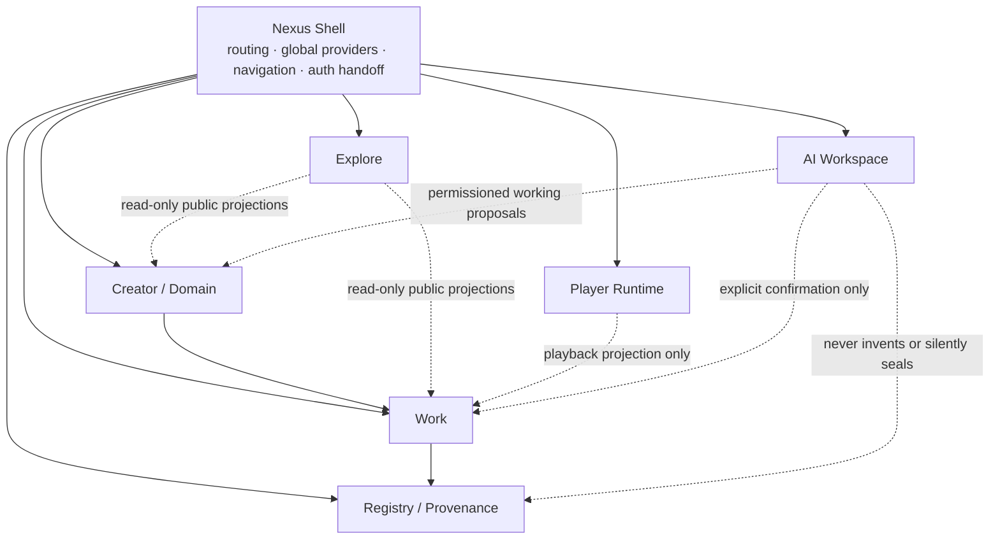

# Proposed Application-Boundary Refactor Plan

**Status:** Proposal only — no implementation authorized  
**Basis:** [Current → Target Nexus Ontology Map](CURRENT_TO_TARGET_NEXUS_ONTOLOGY_MAP.md)  
**Scope:** Application boundaries for routes, components, contexts, and tRPC/data-access namespaces.  
**Non-change boundary:** This plan does **not** modify code, schema, routes, data, deployment, configuration, user records, WIDs, assets, or runtime behavior.

> **Proposal thesis:** Living Nexus does not need a replacement architecture. It needs an explicit application-boundary contract around the architecture it already has. The refactor should make **Nexus** the integration shell, preserve **Creator**, **Work**, and **Provenance** as authority roots, and treat Registry, Explore, Player, and AI as bounded service/surface concerns.

## 1. Target Boundary Model



The arrows above describe **allowed dependency direction**, not ownership transfer. Nexus coordinates access and shared runtime composition, but it does not own creator identity, work truth, or provenance truth. Creator remains the ownership root. Work remains the creative record. Registry/Provenance remains the evidence and seal boundary. [1] [2]

| Boundary | Authority | May depend on | Must not become |
|---|---|---|---|
| **Nexus Shell** | Navigation, global provider composition, authenticated handoff, shared chrome | Boundary-facing view models and route contracts | Creator, Work, Provenance, or AI source of truth |
| **Creator / Domain** | Creator profile, owned domain layout, creator-scoped management | Creator identity, owned work summaries, domain versions | Public Registry or Player authority |
| **Work** | Work detail, draft/publish lifecycle, media linkage, creator edit actions | Creator identity, Registry seal/read models, playback requests | Global discovery index or AI truth authority |
| **Registry / Provenance** | WID lookup, verification, evidence, events, lineage, witness relationships, registration gate | Work identity and creator confirmation | Chat diary, player queue, or mutable presentation state |
| **Explore** | Read-only public discovery projections of creators and published works | Public Creator/Work projection ports | Draft/work mutation, provenance writing, or creator ownership |
| **Player Runtime** | Playback queue, active-track and harmonic runtime state, preferences | Minimal playable Work projection | Work editing, publication, authorship, or provenance mutation |
| **AI Workspace** | Permissioned chat, PNA threads, private Quiver workflow, bounded proposals, agent ledger | Working State, creator-scoped tools, proposal contracts | Creator identity, public publication authority, or provenance seal authority |

## 2. Proposed Boundary Assignment

### 2.1 Nexus Shell Infrastructure

| Current asset | Current responsibility | Proposed boundary | Proposed disposition |
|---|---|---|---|
| `client/src/App.tsx` | Global route declarations, lazy page loading, provider composition | Nexus Shell | **Retain** as the composition root |
| `client/src/components/layout/MainLayout.tsx` | Shared desktop/mobile viewport shell | Nexus Shell | **Retain** as shell host |
| `client/src/components/layout/LeftRail.tsx` | Primary navigation and active route presentation | Nexus Shell | **Retain**; consume only route descriptors |
| `client/src/components/layout/TopBar.tsx` | Global chrome, search entry, player strip/quick actions | Nexus Shell | **Adapt**; receive Player and Explore ports rather than own domain calls |
| `client/src/components/layout/ContextDrawer.tsx` | Contextual navigation and cross-surface drawer selection | Nexus Shell | **Retain**; restrict to navigation/context selection |
| `ThemeContext`, `RightRailContext` and comparable visual state providers | Global visual/runtime state | Nexus Shell | **Retain** as infrastructure, not ontology entities |

The shell should know **where a creator is going** and **which shared runtime is active**, but not execute Work, Registry, or AI business rules itself. Its practical dependency is a stable route descriptor plus boundary-owned view models. [3] [4]

### 2.2 Creator / Domain Surfaces

| Current asset | Current responsibility | Proposed boundary | Proposed disposition |
|---|---|---|---|
| `CreatorDomainShell.tsx` | Creator handle/domain shell and public-facing creator route | Creator / Domain | **Retain** as canonical creator-domain shell |
| `CreatorDomainPage.tsx` | Creator command and management surface | Creator / Domain | **Retain** as owner-facing surface |
| `CreatorProfilePage.tsx` | Broad creator profile, domain, works, and auxiliary interactions | Creator / Domain | **Migrate by feature**, not deletion; split presentation from unrelated tools |
| `server/routers/domain.ts` | Domain layout, blocks, and version history | Creator / Domain API | **Retain** as domain authority |
| `server/routers/profile.ts` | Creator profile and mixed creator/work query functions | Creator / Domain API | **Adapt**; narrow to Creator profile/projection functions |
| `/creator/:id`, `/@:handle`, owner management routes | Creator public and owner navigation | Creator / Domain routes | **Retain**; establish one canonical public creator projection |

The Creator boundary may request summaries of owned works, but it should not directly contain Registry mutation logic or Player session ownership. Domain versions remain creator-owned presentation history, not provenance events. [5] [6]

### 2.3 Work Surfaces

| Current asset | Current responsibility | Proposed boundary | Proposed disposition |
|---|---|---|---|
| `SongDetailPage.tsx` | Work detail, testimony, lyrics, related discovery, provenance panel, player actions, support | Work | **Adapt** into Work composition plus child ports for Registry and Player |
| `ManifestationStudio.tsx` | Registration gate/orchestrator | Work + Registry registration seam | **Retain** as the entry; explicitly call Registry registration contracts |
| `MusicEnvironment.tsx` | Single-track metadata, attestation, WID/tone/waveform preparation, Draft/Publish submission | Work registration surface | **Retain**; keep creator-confirmed registration intent visible |
| `BatchUploadPage.tsx` | Batch manifest creation and Draft-first ingestion | Work registration surface | **Migrate** toward the same registration boundary as single upload |
| `WorkEditorContext.tsx` | Editing overlay state, drawer state, work query invalidation | Work editing runtime | **Extract** from app-level context into a Work-owned editor module |
| `/song/:id`, `/manifest`, `/batch-upload` | Work detail and registration routes | Work routes | **Retain** with canonical aliases/redirects preserved |

`SongDetailPage` is allowed to **render** Registry and Player child surfaces, but must not own their data contract. Work may request `RegistrySummary` and `PlaybackProjection`; it should not call unrelated global service shapes directly. [7] [8]

### 2.4 Registry / Provenance Surfaces

| Current asset | Current responsibility | Proposed boundary | Proposed disposition |
|---|---|---|---|
| `WitnessRegistryPage.tsx` | Public witnessed-record ledger | Registry | **Retain** as public Registry surface |
| `VerifyPage.tsx` | WID/WID-ALB verification and certificate-facing view | Registry | **Retain** as verification surface |
| `ProvenanceTimeline.tsx` | Work-related event display and recording dialog | Registry component rendered by Work | **Extract** as a Registry-owned component port |
| `server/routers/provenance.ts` | Events, lineage, witnesses | Registry API | **Retain** |
| `server/routers/wids.ts` | WID lookup and protected registration | Registry API | **Retain** |
| `server/routers/witnessRegistry.ts` | Public witnessed-record listing | Registry API | **Extract/trim** only after import-dependency evidence is reviewed |
| `/witness-registry`, `/verify/:id` and related verification routes | Public Registry navigation | Registry routes | **Retain** |

Registry must be the only boundary allowed to describe a work as sealed, witnessed, or lineage-bearing. It can accept creator-confirmed work facts, but it must not accept a chat transcript, Player state, or AI suggestion as evidence by itself. [2] [9]

### 2.5 Explore Projections

| Current asset | Current responsibility | Proposed boundary | Proposed disposition |
|---|---|---|---|
| `ExplorePage.tsx` | Songs-and-creators public discovery, filters, view modes | Explore | **Retain** |
| `server/routers/search.ts` | Global search across multiple database concerns | Explore/Registry query seam | **Adapt** to query-only projection ports |
| `songs.exploreIndex` and related public listing procedures | Public work/creator discovery | Explore API | **Extract** from mixed Work router only behind compatibility aliases |
| `/explore` | Public discovery route | Explore route | **Retain** |

Explore consumes **published public projections**. It should not perform Draft creation, profile mutation, WID writing, or AI action. Its player coupling is limited to a play request carrying a minimal `PlaybackProjection`. [7] [10]

### 2.6 Player Runtime

| Current asset | Current responsibility | Proposed boundary | Proposed disposition |
|---|---|---|---|
| `PlayerContext.tsx` | Queue, active track, session state, audio runtime | Player Runtime | **Retain** |
| `HarmonicContext.tsx` | Active-track harmonic state | Player Runtime | **Retain** as derived runtime state |
| `GlobalPlayer.tsx` / player strip composition | Global player presentation | Player Runtime rendered by Nexus Shell | **Retain** |
| `server/routers/playback.ts` | Player settings and transition behavior | Player Runtime API | **Retain** |
| Player region in `TopBar.tsx` | Shell-hosted player rendering | Nexus Shell → Player Runtime | **Adapt** to a narrow runtime port |

The player’s queue must remain an immutable session snapshot, and harmonic state must remain derived from the active track. Player state is **working/runtime fact**, never a work-edit or provenance-write authority. [11]

### 2.7 AI Workspace

| Current asset | Current responsibility | Proposed boundary | Proposed disposition |
|---|---|---|---|
| `PNAShellPage.tsx` | Full-page PNA workspace, chat, modes, player-aware context, Quiver access | AI Workspace | **Adapt** so Nexus Shell owns navigation only |
| `PNAWorkspacePanel.tsx` | Secondary drawer PNA surface | AI Workspace legacy/duplicate surface | **Archive candidate**; first prove no active caller/dependency |
| `PNAQuiverWorkspace.tsx` | Private creator asset reserve and asset detail | AI Workspace ↔ Work/Media bridge | **Retain** with explicit private-media boundary |
| `UploadEngineContext.tsx` | File/pending-upload client runtime | Work registration infrastructure | **Retain**; do not make it AI authority |
| `server/routers/pnaThreads.ts` | Owner-scoped thread and message persistence | AI Workspace API | **Retain** |
| `server/routers/quiver.ts` | Private asset custody and deliberate publish state | AI Workspace ↔ Work/Registry bridge | **Retain** |
| `server/routers/agents.ts` | Authorized-agent capabilities and ledger | AI Workspace API | **Retain** |
| `server/routers/keeper.ts` | Chat, persona, notes, diaries, visual assistance, registration helpers | AI Workspace + registration seam | **Extract conceptually** into focused ports before moving files |
| `/pna` | PNA workspace route | AI Workspace route | **Retain** |

The AI Workspace can read **permission-scoped Working State** and prepare proposals. A Quiver asset remains private until a creator performs a distinct outward action. AI cannot publish a work, rewrite a WID, or infer a provenance chain from chat. [2] [12]

## 3. Dependency Direction to Establish

```text
Nexus Shell
  ├── routes to → Creator / Domain
  ├── routes to → Work
  ├── routes to → Registry
  ├── routes to → Explore
  ├── hosts → Player Runtime
  └── routes to → AI Workspace

Creator / Domain
  └── reads owned/public Work summaries

Work
  ├── links Media
  ├── requests RegistrySummary / RegistryAction
  └── requests PlaybackProjection

Registry / Provenance
  └── verifies and records creator-confirmed Work facts

Explore
  └── reads public CreatorProjection and WorkProjection

Player Runtime
  └── consumes PlaybackProjection only

AI Workspace
  ├── reads permission-scoped Working State
  ├── creates private proposals/assets
  └── requests creator-confirmed Work or Registry actions
```

No boundary should import an unrelated page to obtain a data shape. Page-to-page import is the principal signal that a view model, a child component port, or a query projection belongs in a boundary contract instead. The first refactor target is therefore **dependency direction**, not folder renaming.

## 4. Coupling to Break Deliberately

| Coupling | Current condition | Target condition | Priority | Planning disposition |
|---|---|---|---|---|
| `songsRouter` mixes registration, work retrieval, Explore queries, playback metrics, download authorization, and provenance verification | One API namespace crosses several concerns | Work, Registry, Explore, and Player-facing procedure groups expose stable compatibility aliases before physical splits | **High** | **Extract** by contract, not a big-bang router rewrite |
| `SongDetailPage` directly composes Work, Player, Registry, comments, discovery, and support concerns | One page carries several service/query responsibilities | Work surface receives Registry/Player/discovery child ports and view models | **High** | **Adapt** incrementally |
| `keeperRouter` mixes persona, chat, diaries, image assistance, and registration helpers | AI API has unrelated subdomains | Focused AI Conversation, AI Profile, AI Generation, and Registration Assist ports | **High** | **Extract** conceptually first |
| `profileRouter` exposes creator facts alongside work-oriented queries | Creator and Work query boundaries are mixed | Creator profile/domain contracts consume Work summaries through a Work projection | **Medium** | **Adapt** |
| `WorkEditorContext` combines overlay behavior with work cache/query invalidation | Global context has Work-specific state | Work editing runtime becomes Work-owned and invoked by shell through an explicit overlay port | **Medium** | **Extract** |
| `ExplorePage` consumes mixed `songs` query data and Player state | Discovery asks the Work namespace for its projection | Explore uses public Work/Creator projection procedures; Player receives a playback projection | **Medium** | **Adapt** |
| Verification UI reaches work-named verification procedures | Registry page crosses to Work API nomenclature | Verification resolves entirely through Registry contracts | **Medium** | **Migrate** with aliases |
| Secondary `PNAWorkspacePanel` and full `PNAShellPage` represent parallel PNA hosts | Duplicate interaction models risk divergent behavior | One primary full-page AI Workspace; any panel becomes a defined contextual adapter or is retired | **Medium** | **Archive candidate** after dependency proof |
| `witnessRegistryRouter` imports broad unrelated services | Registry route has broad server import fanout | Registry list endpoint depends only on registry projections/data helpers | **Medium** | **Trim** after import graph check |
| Top Bar initiates domain operations directly | Shell can reach into Work and search namespaces | Shell emits navigation/intents; child boundaries own mutation/query actions | **Low** | **Adapt** |

## 5. Phased Refactor Plan — Proposal Only

### Phase A — Freeze and Name the Contracts

Do not move a file. Document a boundary vocabulary and the smallest typed projection/intent contracts: `CreatorSummary`, `WorkSummary`, `WorkDetail`, `RegistrySummary`, `PlaybackProjection`, `ExploreCard`, `WorkingState`, and `AIProposal`. Name the current procedures that fulfil each contract. This phase reduces ambiguity while preserving every existing route and tRPC path.

### Phase B — Create Boundary Facades With Compatibility

Introduce conceptual façade namespaces behind existing procedures rather than replacing them. A Work route can continue calling a compatible `songs.getById` path while internally receiving a proposed Work-facing contract; a verification route can retain its URL while a Registry-shaped contract becomes the preferred entry. No schema migration or route deletion is included.

### Phase C — Decompose the Shell and Page Composition

Make `App`, `MainLayout`, Left Rail, Top Bar, and Context Drawer consume route descriptors and narrow boundary ports. Move Work-specific editor overlay state toward a Work editing runtime. Make `SongDetailPage` a Work composition surface with explicit child views for Registry and Player instead of a direct owner of every concern.

### Phase D — Separate Query and Mutation Boundaries

Split the *responsibilities* currently collected in `songsRouter` and `keeperRouter`: Work read/write, Registry verification/recording, Explore projections, Player preferences, AI conversation, AI appearance, AI media proposals, and creator-confirmed registration assistance. Preserve tRPC compatibility aliases until all direct consumers are migrated and validated.

### Phase E — Resolve Duplicate Hosts and Legacy Paths

Only after consumer inventory, migrate Creator profile duplication into the selected Creator/Domain shell, evaluate the secondary PNA panel, and classify legacy redirects or polymorphic work fields under the existing retain/replace/migrate/archive procedure. No deletion is permitted on the basis of this plan alone.

### Phase F — Confirm Boundary Enforcement

Validate that AI proposals cannot become Registry truth without explicit confirmation, Player state cannot edit Works, Explore cannot mutate creator/work records, and the shell does not import page-specific domain logic. This is the first phase at which cleanup candidates can be authorized individually.

## 6. Invariants, Risk, and Rollback

| Category | Mandatory safeguard |
|---|---|
| Creator authority | The authenticated creator remains the only authority for their domain, drafts, private Quiver assets, and outward publication choice. |
| Provenance | WIDs, evidence, events, lineage, witnesses, and sealed facts remain append-only or immutable according to their current contract. No AI/chat state becomes a seal by inference. |
| Route continuity | Existing public canonical routes and legacy redirects remain live until usage/dependency evidence supports a migration. |
| Data safety | No schema change, record migration, or backfill is bundled with boundary extraction. |
| Playback | Player queue snapshots and harmonic state remain runtime-only and preserve current mobile/browser behavior. |
| AI safety | PNA/Quiver remains private-first, permission-scoped, confirmation-gated, and owner-scoped. |
| Accessibility | Shell and drawer changes preserve focus, keyboard paths, reduced motion, and mobile layout behavior before any global rollout. |
| Rollback | Every boundary migration retains the prior route/procedure alias until focused tests, browser validation, and production-observation gates pass. |

## 7. Verification Gates for Any Future Authorization

No phase should proceed without a discrete approval and a short evidence packet showing the affected consumers, compatibility path, test plan, and rollback path. The minimum gates are:

| Gate | Evidence required |
|---|---|
| Boundary contract | Named input/output/projection contract and owning boundary |
| Consumer inventory | Every importing route, component, context, and tRPC caller listed |
| Authority review | Creator, Registry, and AI confirmation boundaries explicitly preserved |
| Compatibility | Existing route and procedure aliases listed with planned retention window |
| Regression plan | Focused behavior tests plus full TypeScript/test suite plan |
| Runtime plan | Guest public-route checks; authenticated mutation smoke remains creator-owned |
| Rollback | Exact revert/alias path with no record rewrite |

## 8. Keeper Decisions Required Before Any Refactor

1. Confirm that **Nexus is an application integration boundary**, not a new owner of creator/work/provenance records.
2. Confirm whether **Registry registration** is treated as a Registry capability called by Work registration, rather than a new independent creator-facing product area.
3. Select the canonical Creator public surface: current `CreatorDomainShell`, current `CreatorProfilePage`, or a feature-by-feature convergence plan.
4. Confirm that PNA remains **one full-page AI workspace** and that the secondary panel is only a candidate for retirement after caller proof.
5. Authorize, reject, or sequence a Phase A contract inventory. No code motion follows without a separate approval.

## References

[1]: [Current → Target Nexus Ontology Map](CURRENT_TO_TARGET_NEXUS_ONTOLOGY_MAP.md)  
[2]: [Core–Doctrine Pack–Next Continuity](ADR-029-CORE-DOCTRINE-NEXT-CONTINUITY.md)  
[3]: [Application route composition](../client/src/App.tsx)  
[4]: [Shared application layout](../client/src/components/layout/MainLayout.tsx)  
[5]: [Creator domain router](../server/routers/domain.ts) and [creator profile router](../server/routers/profile.ts)  
[6]: [Creator domain shell](../client/src/pages/CreatorDomainShell.tsx) and [creator domain page](../client/src/pages/CreatorDomainPage.tsx)  
[7]: [Work route and registration procedures](../server/routers/songs.ts)  
[8]: [Work detail page](../client/src/pages/SongDetailPage.tsx), [Music Environment](../client/src/pages/manifestation-studio/environments/MusicEnvironment.tsx), and [Batch Upload page](../client/src/pages/BatchUploadPage.tsx)  
[9]: [Provenance router](../server/routers/provenance.ts), [WID router](../server/routers/wids.ts), and [Witness Registry router](../server/routers/witnessRegistry.ts)  
[10]: [Explore page](../client/src/pages/ExplorePage.tsx) and [search router](../server/routers/search.ts)  
[11]: [Player context](../client/src/contexts/PlayerContext.tsx), [Harmonic context](../client/src/contexts/HarmonicContext.tsx), and [playback router](../server/routers/playback.ts)  
[12]: [PNA workspace](../client/src/pages/PNAShellPage.tsx), [PNA thread router](../server/routers/pnaThreads.ts), [Quiver router](../server/routers/quiver.ts), [Keeper router](../server/routers/keeper.ts), and [Agents router](../server/routers/agents.ts)
