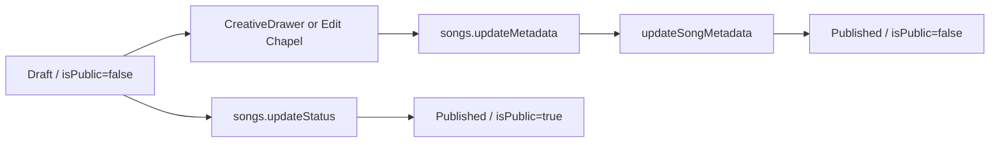

# Publication-State Semantics Diagnosis

**Specimen:** `WID-MUS-382C1FB8-0ACBA81A` — **ARMOR OF LIGHT (EXTENDED)**  
**Scope:** `songs.status` and `songs.isPublic` intent, all active source writers found by repository-wide inspection, public/owner/Registry readers, and live state combinations.  
**Boundary:** Read-only diagnosis. No state, schema, WID, provenance, storage, cache, deployment, configuration, route, or runtime behavior was changed.

> **Finding:** `status = "Published"` with `isPublic = false` is an **invalid but reachable divergent state** in the current application. It is **not** an evidenced, supported Published-but-private policy. The repository’s idempotent backfill explicitly defines the intended invariant: every Published song must be public, and every non-Published song must not be public. ARMOR OF LIGHT is one of two current rows violating that invariant. [1] [2]

## 1. Intended Meaning of the Two Fields

| Field | Technical role | Intended semantics from current source | It is **not** |
|---|---|---|---|
| `status` | Creator/Work lifecycle state with enum `Draft`, `Published`, `Unlisted`, `Deleted` | Describes the current lifecycle/posture of the Work. In normal procedures, only `Published` is intended for a discoverable public Work. [2] [3] | A separate “registered” state, a WID state, or an independent visibility policy. |
| `isPublic` | Denormalized public-projection gate | In normal creation and status transition paths, it is synchronized as `status === "Published"`; public feeds require both fields. [3] [4] | An independently supported embargo/unlisted flag for a Published Work. |

The strongest evidence is migration `0074_backfill_is_public.sql`. It documents a prior defect in which a status change failed to synchronize `isPublic`, then repairs **both directions**: non-Published works are set nonpublic and Published works are set public. [1]

> “Ensure all Published songs have `isPublic = true` (forward consistency).” — current migration comment and update predicate. [1]

The legitimate current combinations are therefore the synchronized lifecycle pairs below.

| `status` | Intended `isPublic` | Current policy interpretation |
|---|---:|---|
| `Draft` | `false` | Creator-private, editable Work. |
| `Published` | `true` | Public Work eligible for canonical guest detail, Explore, New This Week, Trending, Showcase, creator public projection, and related Works. |
| `Unlisted` | `false` | Nonpublic lifecycle state. It is the existing semantic place for a Work that should not enter public discovery. |
| `Deleted` | `false` | Soft-deleted Work; WID history is retained but public visibility is removed. |

## 2. Every Active State-Writer Found

The table below records all current source writers found by repository-wide search of `server`, `client`, and `drizzle` for song status/visibility writes. It distinguishes normal synchronized transitions from the one current unsynchronized mutation path.

| Writer / caller | Authority | Fields written | Resulting state behavior | Synchronizes invariant? |
|---|---|---|---|---|
| Single registration: `songs.upload` | Authenticated creator | `status: input.status ?? "Draft"`; `isPublic: createStatus === "Published"` | Draft creates `Draft/false`; direct publish creates `Published/true`. [5] | **Yes** |
| Batch registration: `songs.batchUpload` | Authenticated creator | `status: input.status ?? "Draft"`; `isPublic: (input.status ?? "Draft") === "Published"` | Draft-first by default; direct Published tracks are public. [5] | **Yes** |
| Owner status procedure: `songs.updateStatus` → `updateSongStatus` | Authenticated owner | `status`; derived `isPublic = status === "Published"` | Enforces ownership/cover/profile/testimony/partial-rights gates for Published, then writes the synchronized pair. [3] [5] | **Yes** |
| Owner soft delete: `songs.delete` → `deleteSong` | Authenticated owner | `status: "Deleted"`; `isPublic: false` | Removes public visibility while retaining WID records. [3] | **Yes** |
| Draft dismissal: `songs.dismissDrafts` | Authenticated owner | `status: "Deleted"`; `isPublic: false` | Soft-deletes selected owner Drafts only. [5] | **Yes** |
| Admin moderation removal | Admin pathway | `status: "Unlisted"`; `isPublic: false` | Removes a moderated Work from public visibility. [3] | **Yes** |
| Admin moderation restoration | Admin pathway | `status: "Published"`; `isPublic: true` | Restores a moderated Work to public state. [3] | **Yes** |
| API registration helper | Server API pathway | `status: "Published"`; `isPublic: true` | Creates public API-registered Work records. [3] | **Yes** |
| Current migration repair: `0074_backfill_is_public.sql` | Database migration | All inconsistent rows | Repairs non-Published/true and Published/false combinations idempotently. [1] | **Yes** |
| Owner metadata procedure: `songs.updateMetadata` → `updateSongMetadata` | Authenticated owner | Accepts optional `status` and writes it directly | If a Draft/Unlisted Work is set `Published` through this path, its prior `isPublic` remains unchanged. [5] [6] | **No — confirmed divergence path** |
| CreativeDrawer / Edit Chapel save | Authenticated owner UI | Calls `songs.updateMetadata` with selected `status` | The editor exposes the unsynchronized status mutation to normal owner use. [6] | **No — concrete UI caller** |

No active restore, import, or seed writer was found that establishes an intentional Published-but-private policy. Direct database operations could of course bypass application invariants, but the normal product path already contains a concrete reachable divergence: metadata editing can update `status` without updating `isPublic`. [3] [5] [6]

## 3. The Exact Divergence Path

The owner-facing `CreativeDrawer.handleSave()` includes the editor’s selected `status` in its `songs.updateMetadata` payload. The tRPC façade forwards that status to `updateSongMetadata`. That helper places `fields.status` in its SQL update set but does not assign `isPublic`. Therefore an existing `Draft/false` Work can become `Published/false` through a normal editor save. [5] [6]

This diagnosis identifies a **reachable cause class**. It does not claim a row-level audit trail proving which individual save created ARMOR OF LIGHT, because the current Work row does not retain a status-change actor/history record for that edit. The live database now has two `Published/false` rows—ARMOR OF LIGHT and `Waves | Waves (Alt-Hardcore / Post-Hardcore)`—which confirms this is not solely an isolated display artifact. [7]

## 4. Why the State Appears Contradictory in Public Surfaces

| Reader / projection | Predicate | ARMOR result | Interpretation |
|---|---|---|---|
| Guest Work tRPC: `songs.getById` → `getSongWithCreator` | Requires `isPublic = true`; owner fallback is owner-scoped. [3] | Excluded for guest. | Correct under intended public-feed invariant. |
| Explore base / New / Trending | Requires `status = "Published" AND isPublic = true`. [4] | Excluded before date/rank. | Correct under intended public-feed invariant. |
| Home Limited Showcase | Requires `Published`, `isPublic = true`, audio, and WID. [8] | Excluded before newest-first limit. | Correct under intended public-feed invariant. |
| Public creator projection | Filters to `isPublic && status === "Published"`. [9] | Excluded. | Correct under intended public-feed invariant. |
| Work related-items query | Requires `Published + isPublic`. [4] | Excluded. | Correct under intended public-feed invariant. |
| Owner Archive / Manage | Owner query does not apply public filter. [10] | Included. | Expected owner visibility. |
| Canonical WID Protocol | Rejects deleted Works and rejects nonpublic works only when they are not Published. [11] | Included. | **Inconsistent with the intended invariant.** It accepts the divergent state. |
| Right-rail Witness Registry | Requires `Published + witnessId`; does not require `isPublic`. [12] | Included. | **Inconsistent with the intended invariant.** It accepts the divergent state. |

The WID Protocol and Registry outcomes do **not** prove a legitimate direct-link-only publication policy. They reveal reader predicates that tolerate the divergent state while primary public-discovery readers do not. There is no supported `PrivatePublished`, `Embargoed`, or `DirectLinkOnly` status in the song enum, and the migration expressly repairs `Published/false` rather than preserving it. [1] [2]

## 5. Is ARMOR OF LIGHT Invalid or Legitimate?

| Candidate explanation | Evidence | Decision |
|---|---|---|
| Expected ranking behavior | The Work does not enter ranking because public filters exclude it first. | **Rejected.** |
| Cache/index delay | Fresh direct database and tRPC evaluation show `isPublic = 0`; no index path is involved in Explore. | **Rejected.** |
| Supported Published-but-private posture | No separate status exists; normal writers synchronize the fields; migration repairs this combination away. | **Rejected.** |
| Invalid legacy-only state | Migration documents a historical unsynchronized status writer. | **Partly true, but incomplete.** |
| Invalid currently reachable state | `updateMetadata` still accepts and writes `status` without synchronizing `isPublic`; current owner UI calls it with status. | **Confirmed.** |

**Final determination:** ARMOR OF LIGHT is an **invalid but reachable publication-state divergence**. It is not a legitimate Published-but-private state in the current product model. The appropriate state for a private/unlisted Work is `Unlisted/false` or `Draft/false`, not `Published/false`. A repair must be separately authorized because it affects publication state and public discoverability.

## 6. Scope of a Future Repair — Not Authorized Here

This report does not authorize a fix. A future narrow repair would need to decide and test all of the following before changing any record:

1. Whether `songs.updateMetadata` should reject `status`, delegate status changes to `updateSongStatus`, or synchronize `isPublic` through the same publication gate.
2. Whether existing divergent rows should be repaired through an explicit reviewed migration rather than silently altered at runtime.
3. Whether the canonical WID Protocol and Witness Registry should enforce the normal public invariant, or whether a separately named, permissioned direct-record posture should be introduced deliberately.
4. How every transition preserves Draft/Published gates, WID/provenance records, owner access, Archive, payments, Player behavior, and existing public routes.

## References

[1]: [Migration 0074 — visibility backfill and invariant](../drizzle/0074_backfill_is_public.sql)  
[2]: [Songs schema status and visibility columns](../drizzle/schema.ts)  
[3]: [Database status, delete, moderation, API registration, and public helper paths](../server/utils/db.ts)  
[4]: [Public Explore, New, Trending, and related Work helpers](../server/utils/db.ts)  
[5]: [Songs router registration/status/metadata procedures](../server/routers/songs.ts)  
[6]: [Creative Drawer metadata/status caller](../client/src/components/CreativeDrawer.tsx) and [Edit Chapel](../client/src/components/EditChapel.tsx)  
[7]: Live read-only aggregate query of `songs` state combinations, 18 August 2026  
[8]: [Home Limited Showcase procedure](../server/routers/songs.ts) and [Home page](../client/src/pages/HomePage.tsx)  
[9]: [Public creator projection](../server/routers/profile.ts)  
[10]: [Creator Archive](../client/src/pages/ArchivePage.tsx)  
[11]: [Canonical WID Protocol route](../server/routes/workRoute.ts)  
[12]: [Witness Registry procedure](../server/routers/witnessRegistry.ts) and [right rail](../client/src/components/layout/RightRail.tsx)
