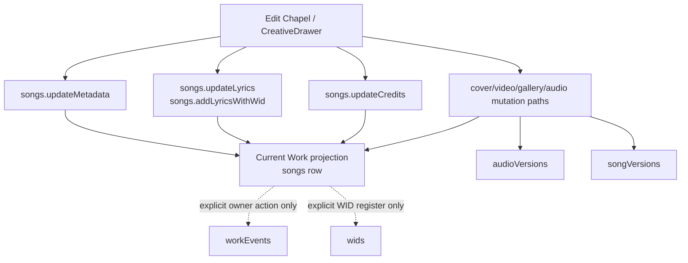

# Slice 3 — Work Revision Processing Architecture

**Status:** Architecture report only. No implementation, schema, data, WID, provenance, route, storage, or behavior change is included.  
**Scope:** Current Work editing, revision, manifestation versioning, provenance, WID, AI/human authority, and public current-state projection.  
**Technical boundary:** This is a source-backed software architecture analysis. It does not make legal conclusions about authorship, ownership, evidence, or the legal force of any WID.

> **Governing distinction:** A **WID** identifies the Work. A **Revision** identifies a later accepted state change. A **Manifestation Version** identifies a substantive media manifestation where appropriate. A **Provenance Event** records an authoritative transition. The current system has pieces of each; it does not yet join them into one revision-processing contract.

## 1. Executive Assessment

The current Work record is the `songs` row. It is the live current-state projection used by Work pages, edit surfaces, player/media flows, and most registration/public-query procedures. Existing edit procedures update this row in place. Existing history is fragmented: audio replacement creates `audioVersions`, dedicated version upload creates `songVersions`, owner-created timeline entries use `workEvents`, and WID registry anchors use the separate `wids` table. None of those is currently a complete revision history for all editable Work components. [1] [2] [3]

The correct target is **not** to rewrite the Work table or mint another WID system. It is to introduce a typed revision-processing layer that can describe a creator-authorized change, preserve a prior and proposed state for that component, and emit an explicit provenance event only after acceptance. The immediate safe implementation candidate is smaller: a pure client/shared **change classifier** that labels a proposed change without writing anything, resealing anything, or changing current edit behavior.

## 2. Current Revision and Edit Architecture



| Current subsystem | What it does now | What it does **not** do now |
|---|---|---|
| Edit Chapel / CreativeDrawer | Opens one app-root overlay through `WorkEditorContext`; calls `songs.updateMetadata`, `songs.updateLyrics`, and video/upload helpers; invalidates current Work queries after save. [4] | It does not capture a before-state, classify a revision, require an acceptance artifact, or add a timeline event automatically. |
| `songs.updateMetadata` | Owner-scoped dynamic update of current Work fields and `updatedAt`. It can edit editorial, visual, HAAI, relationship, access, commerce, and status-related fields. [1] [5] | It does not recompute WID-MUS, create a revision record, preserve prior values, or add a provenance event. |
| `songs.updateLyrics` | Owner-scoped replacement of `lyricsText` on the current Work. [1] [5] | It does not recalculate `lyricsHash`, `lyricsWid`, or `lyricsAddedAt`. |
| `songs.addLyricsWithWid` | Owner-scoped lyrics update that calculates/sets separate lyrics provenance facts. [1] [5] | It does not create a general Work revision record or alter WID-MUS. |
| `songs.updateCredits` | Owner-scoped replacement of `creditsJson`. [1] [5] | It does not preserve a credit revision history or emit a provenance event. |
| Audio replacement | `songs.replaceAudio` archives the current audio in `audioVersions`, then replaces the canonical Work audio/hash/WID. [1] [5] | It does not normalize all non-audio edits into a revision model. |
| Dedicated versions | `versions.upload` archives the original/current audio and creates `songVersions`; it hashes new bytes, produces WID-Vn, and repoints current Work audio. [6] | It does not version metadata, lyrics, artwork, credits, HAAI, or relationships. |
| Provenance router | Owner can add Work events, lineage edges, and witness invitations through separate protected procedures. [2] | It is not called automatically by ordinary edits or audio-version paths in the inspected code. |
| WID router | An authenticated caller can register `{ wid, eventId, contentHash, signature? }` in the separate WID registry. [3] | It is not invoked automatically by the inspected Work registration or edit procedures. |

## 3. Existing Schema Relevant to Revisions

| Existing structure | Current role | Reusable for revision architecture? | Limitation |
|---|---|---|---|
| `songs` | Current Work state, metadata, media links, WID-MUS facts, lyrics WID, status, visual/HAAI fields, relationship pointers, collection membership, and timestamps. [7] | **Yes, as current projection only.** | In-place updates overwrite many fields and do not preserve a cross-component change history. |
| `audioVersions` | Historical audio artifacts for the `replaceAudio` path. [1] [5] | **Yes, as audio manifestation history.** | Does not cover metadata or other manifestations. |
| `songVersions` | Dedicated version rows for `versions.upload`, including label/change note, media location, WID-Vn, and disclosure. [6] | **Yes, as substantive audio manifestation history.** | Parallel to `audioVersions`; does not model all revisions. |
| `wids` | Separate WID anchor: `wid`, `eventId`, `contentHash`, `creatorId`, and optional signature. [7] | **Yes, as Registry anchor.** | No automatic link from current edit procedures. |
| `workEvents` | Timeline events read and written through provenance helper functions. [2] | **Yes, as authoritative event presentation/audit.** | Current event input lacks before/after snapshot, authorization reason, AI lineage, and revision-kind structure. |
| Work lineage | Parent/child Work relationships with enumerated relationship type. [2] | **Yes, for Work-to-Work lineage.** | Does not express a revision of the same Work component. |
| Witness records | Witness invitation, role, contribution, testimony, and acceptance. [2] | **Yes, for human witness relationship.** | Does not itself authorize a Work revision. |
| Agent commissions and ledger | Owner-scoped, Draft-only agent authority and append-only consequential-action ledger. [7] | **Yes, as AI authority/audit precedent.** | Current capability is `music_draft`; it does not accept or record canonical Work revisions. |
| PNA threads / Quiver | Private working messages and creative assets. [7] | **Yes, as proposal/source material.** | Neither is canonical Work state, a revision, or an automatic provenance action. |

## 4. WID-Bound Fields: Current Fact and Required Decision

The current single-track WID-MUS signature serializes exactly the following object before ECDSA signing:

```ts
JSON.stringify({ fileHash, title, participation, toneLabel, timestamp })
```

`fileHash` comes from canonical audio bytes. `toneLabel` is derived from preparation inputs—genre, BPM, key, moods, participation, and up to 48 characters of the current emotional hint, which is `originStory || caption`. Therefore title and participation are directly included; audio bytes are directly included through `fileHash`; and tone-related inputs are **indirectly WID-bound through the derived `toneLabel`**. [8] [9]

> **No reseal policy exists today.** Existing metadata edits do not recalculate the current WID-MUS or signature. The architecture must preserve that fact and require a future Keeper decision before it interprets a WID-bound edit as an ordinary revision, a reseal candidate, a manifestation version, or a prohibited operation.

## 5. Work Component Classification — Current → Target

“Current mutation path” states what exists. “Revisionable?” and “recommended boundary” are target architecture recommendations only; they do not change current behavior.

| Component | Current storage | Current mutation path | WID-bound now? | Revisionable target category | Manifestation / version? | Provenance required target? | AI-sensitive? | Recommended target boundary |
|---|---|---|---|---|---|---|---|---|
| Title | `songs.title` | `updateMetadata` | **Direct** | Metadata Revision; reseal-policy decision | No | Yes, after acceptance | No | Work Revision → WID-bound review |
| Artist / creator | `songs.userId`; creator profile | No ordinary Work mutation; ownership is server-derived | No | Relationship / attribution correction | No | Yes | No | Creator/Work authority, never client-selected |
| Participation | `participationMusic/Lyrics/Voice` | `updateMetadata` | **Direct** | Metadata / authorship Revision; reseal-policy decision | No | Yes | **Yes** | Work Revision + authorship declaration |
| Tone label inputs | genre/BPM/key/moods/origin/caption → `toneProfileJson` | `updateMetadata`; preparation seal | **Indirect via toneLabel** | Metadata Revision; reseal-policy decision | No | Yes | Possibly | Work Revision → WID-bound review |
| Genre | `songs.genre` | `updateMetadata` | Indirect | Metadata Revision | No | Recommended | No | Work metadata revision |
| BPM | `songs.bpm` | `updateMetadata` | Indirect | Metadata Revision | No | Recommended | No | Work metadata revision |
| Key | `songs.keySignature` | `updateMetadata` | Indirect | Metadata Revision | No | Recommended | No | Work metadata revision |
| Caption | `songs.caption` | `updateMetadata` | Indirect where used as emotional hint | Editorial/metadata Revision | No | Recommended | Possible | Work editorial revision |
| Description | `songs.description` | `updateMetadata` | No | Editorial Revision | No | Recommended | Possible | Work editorial revision |
| Credits | `songs.creditsJson` | `updateCredits` | No | Credit Revision | No | **Yes** | Possible | Attributions component |
| Release date | `songs.releaseDate` | `updateMetadata` | No | Metadata Revision | No | Recommended | No | Work metadata revision |
| ISRC | `songs.isrc` | Registration fields; no inspected dedicated editor path | No | Identifier/metadata Revision | No | **Yes** | No | Distribution identifier component |
| Lyrics | `songs.lyricsText` | `updateLyrics` or `addLyricsWithWid` | No for WID-MUS | Lyrics Revision | Separate lyrics manifestation possible | **Yes** | **Yes** | Lyrics component + WID-LYR decision |
| Lyrics hash / WID | `lyricsHash`, `lyricsFileHash`, `lyricsWid`, `lyricsAddedAt` | `addLyricsWithWid` / server helper | Separate WID-LYR | Lyrics anchor / manifestation decision | Yes, if new lyric artifact | **Yes** | Possible | Registry-linked Lyrics component |
| Artwork / cover | `coverArtUrl`, focal position, aspect ratio | `updateMetadata`; upload cover path | No | Artwork Revision | Can become visual manifestation if substantive | Recommended | **Yes** if generated | Media component + source/lineage |
| Gallery images | `galleryImagesJson` | `updateMetadata` | No | Artwork / documentation Revision | Independent components | Recommended | **Yes** if generated | Media component collection |
| Waveform | `waveformUrl`, `waveformKey` | Registration/derived asset path; no ordinary edit in inspected drawer | No | System-derived component update | Derived from audio | Recommended system event | No | Derived media component |
| Audio | `fileUrl`, `fileKey`, duration/audio technical fields | `replaceAudio`; `versions.upload` | **Direct via fileHash** | Manifestation Version | **Yes** | **Yes** | **Yes** if generated | Audio manifestation version |
| Audio hash | `songs.fileHash`; version paths | Audio replacement/version upload | **Direct** | Manifestation Version | **Yes** | **Yes** | No | Registry-bound audio anchor |
| HAAI fields | `haai*`, `haaiDeclaredAt` | `updateMetadata` | Only indirect if origin/caption alters tone label | HAAI Revision | No | **Yes** | **Yes** | Human/AI declaration component |
| AI disclosure | `aiDisclosure`, tool flags, participation | `updateMetadata` | Participation is direct; disclosure itself is not | Authorship / HAAI Revision | No | **Yes** | **Yes** | Authorship declaration component |
| Ownership declaration | `ownershipStatus` | `updateMetadata` | No | Rights/authorization Revision | No | **Yes** | No | Work authorization declaration |
| Provenance declaration | `workEvents`, `wids`, evidence/lineage records | explicit provenance/WID procedures | Separate anchor/event | Provenance Event | No | **Always** | Possible | Registry only |
| Visual lineage | `visualSource`, `visualPrompt`, `visualLineageJson` | `updateMetadata` / registration | No | Artwork/HAAI Revision | Independent visual component | **Yes** | **Yes** | Media lineage component |
| Parent Work relationship | `parentSongId`; Work lineage edge | `updateMetadata` / `provenance.addLineage` | No | Relationship Revision | No | **Yes** | No | Relationship + Registry event |
| Collections | `collectionId`, `trackOrder`, collection records | collection/batch procedures | No | Relationship / organization Revision | No | Recommended | No | Collection membership component |
| Projects | project membership/block records | project router procedures | No | Relationship / organization Revision | No | Recommended | No | Project membership component |

## 6. Revision Ontology

The target needs a small set of **semantic revision kinds**, not a generic “version number” and not one undifferentiated JSON blob.

```text
Work (WID identifies the Work)
  ├── Current Projection (songs row)
  ├── Revision History
  │     ├── Metadata Revision
  │     ├── Lyrics Revision
  │     ├── Artwork / Gallery Revision
  │     ├── HAAI / Authorship Revision
  │     ├── Credit Revision
  │     └── Relationship Revision
  ├── Manifestation History
  │     ├── Audio Version (audioVersions / songVersions today)
  │     ├── Video / visual manifestation where substantive
  │     └── Lyrics artifact where separately anchored
  └── Provenance Events
        └── accepted revision, anchor, witness, lineage, or system-derived transition
```

| Ontology object | Purpose | Must contain | Must not become |
|---|---|---|---|
| **Revision intent** | A proposed component change before acceptance | component, prior state reference, proposed state, initiator, source, AI involvement, reason | A silent database write |
| **Accepted revision** | A creator-authorized accepted Work-state change | revision kind, actor, authorizing creator, accepted timestamp, before/after canonical values, WID-bound classification | A replacement WID or a generic manifestation version |
| **Manifestation version** | A substantive replacement/version of audio, video, or a separately identified artifact | media location/hash, version relation, source, version label/note, WID behavior | A catch-all for title, credits, or ordinary metadata |
| **Provenance event** | A Chain-of-Record statement about an authoritative transition | event type, actors, target Work/revision/manifestation reference, time, intent/source | Mutable editor form state |
| **Current projection** | Fast current Work display/public API source | current accepted values plus current media pointers | A reconstructed event graph on every page load |

## 7. Human and AI Authorship Boundary

The platform already distinguishes creator-owned Draft agent commissions and private PNA/Quiver working state from WID/provenance anchors. That is the correct foundation. AI output must remain a proposal until a creator accepts it. [7]

| Change origin | Required target representation | May become current state? | May become provenance automatically? |
|---|---|---|---|
| Human-authored change | Creator as initiator and authorizer | Yes, after owner action | No; accepted transition needs explicit event policy |
| AI-assisted change | Creator initiator/authorizer plus AI assistance disclosure/source | Yes, after creator acceptance | No |
| AI-derived suggestion | Proposal with model/source/prompt/input reference | No | No |
| Creator-accepted AI suggestion | Creator acceptance linked to proposal/source and disclosure | Yes | Only through accepted-revision provenance policy |
| System-derived change | System actor, deterministic source and rule version | Yes, only for declared derived components such as waveform | Only through explicit system-event policy |

No target revision architecture should infer authorship from a model response, an image generation, a chat turn, a player state, or a Quiver item. PNA threads and Quiver assets remain private Working State until a creator confirms an outward action. [7]

## 8. Current-State Projection and History

The public creator/Work surface should continue to read the current `songs` projection. It should **not** replay a full event graph to render title, media, cover, status, or credits.

```text
Accepted revision or manifestation version
  ↓
Current Work projection update (songs row)
  ↓
Public Work / Creator / Explore / Player reads current state

Accepted transition
  ↓
Revision history + provenance event remain queryable separately
```

Current history is split across `audioVersions`, `songVersions`, `workEvents`, WID registry rows, lineage, witness records, and some mutable fields on `songs`. There is no single revision-history query that can reconstruct the prior state of ordinary metadata, credits, artwork, HAAI declarations, or relationships. [1] [2] [6]

## 9. Reuse, Holes, and Future Primitives

| Category | Existing infrastructure to reuse | Architectural hole | Proposed primitive — not implemented |
|---|---|---|---|
| Work state | `songs` current projection and owner checks | No before/after state for ordinary edits | Typed `RevisionIntent` / `AcceptedWorkRevision` contract |
| Provenance | `workEvents`, `provenance.addEvent`, `wids.register` | Current event input lacks a typed revision reference and immutable change summary | Revision-linked provenance event adapter |
| Versions | `audioVersions`, `songVersions`, `versions.upload`, `replaceAudio` | Two audio-history paths and no classification bridge to revisions | Manifestation-version adapter, not table merge |
| WID | Existing WID-MUS/WID-LYR and separate registry rows | No current reseal policy for WID-bound edits | Policy decision table, then later explicit reseal workflow if approved |
| AI authority | Agent commissions/ledger; PNA threads; Quiver custody | No standardized proposal-to-creator-accepted-revision handoff | Typed `RevisionProposalSource` reference |
| Current projection | `songs` row and existing page queries | No revision acceptance layer before in-place edit | Projection updater used only after accepted revision |

### What genuinely requires new infrastructure later

A fully durable revision system ultimately requires a persisted accepted-revision history with component-aware before/after data, actor/authority/source, AI disclosure reference, and a relation to a provenance event. Existing `workEvents` alone cannot reconstruct state, while `songs` alone cannot preserve it. This is a later persistence decision; Slice 3 neither adds nor presupposes a migration.

## 10. Smallest Safe Slice 4 Candidate — Proposal Only

### `classifyPreparedWorkChange` — pure, client/shared, no persistence

The smallest safe next slice is a pure classifier, placed beside `PreparedWorkRegistration`, that compares an existing Work projection and a proposed patch. It returns only:

```ts
{
  component: "metadata" | "lyrics" | "artwork" | "credits" | "haai" | "relationship" | "manifestation",
  changedFields: string[],
  widBoundFields: string[],
  requiresResealPolicyDecision: boolean,
  suggestedRevisionKind: string,
  aiSensitivity: "none" | "declaration" | "proposal-source"
}
```

It would not intercept existing mutations, alter a tRPC input, persist a draft/revision/event, reseal a WID, write storage, or change the Edit Chapel. It would establish testable vocabulary and force WID-bound changes to be **identified**, not silently reinterpreted. Any future UI or server enforcement would require a separate authorization.

## 11. Likely Future File Scope

| Scope | Files likely to change only after separate Slice 4 approval |
|---|---|
| Pure classification | `shared/preparedWorkRegistration.ts` or a sibling `shared/workRevisionClassification.ts`; focused unit test |
| Edit intent UI, later | `CreativeDrawer.tsx`, `WorkEditorContext.tsx`, possibly `EditChapel.tsx` |
| Acceptance/persistence, later | `server/routers/songs.ts`, `server/routers/provenance.ts`, a new bounded revision service/router, schema/migration only if evidence requires it |
| Projection/history, later | Work detail/Creator surfaces and a read-only revision history component |

| Protected files / systems | Why they remain untouched in Slice 3 and any classification-only Slice 4 |
|---|---|
| `drizzle/schema.ts` and migrations | No schema decision is authorized. |
| `songs.upload`, `batchUpload`, `generateWID`, existing ECDSA serialization | Current registration and WID semantics must remain exact. |
| `wids` and provenance mutation behavior | Registry semantics require separate authority/policy approval. |
| `versions.upload`, `replaceAudio`, `audioVersions`, `songVersions` | Existing manifestation history must not be merged or renamed without dedicated compatibility evidence. |
| Player, payment, storage, public routes, PNA runtime | Outside Work revision classification scope. |

## 12. Data and Provenance Risk Register

| Risk | Why it matters | Required safeguard |
|---|---|---|
| WID-bound fields mutate in place today | Title/participation/tone-label inputs can change without WID resealing under existing edit paths. | Classify first; require a future Keeper policy before enforcement or reseal. |
| Lyrics text can drift from lyrics WID/hash | Plain `updateLyrics` does not refresh WID-LYR fields. | Keep current behavior unchanged; future Lyrics Revision must preserve prior/current text and state an anchor policy. |
| Two audio-version systems | `audioVersions` and `songVersions` have overlapping but distinct semantics. | Do not merge them; map/adapter first. |
| Asset upload precedes registration | An asset may exist without a Work record if subsequent registration fails. | Do not conflate asset custody with accepted revision. |
| Generic revision blob | Could erase the difference between a metadata correction, accepted AI proposal, substantive media version, and chain event. | Use typed revision kinds and component-aware payload contracts. |
| AI attribution drift | AI may provide a suggestion but must not gain authorship or publication authority. | Persist proposal source and creator acceptance separately, only after approval. |
| Public projection cost | Rebuilding Work state by replaying history would degrade Work page/Explore/Player reads. | Keep `songs` as current projection; query history only on demand. |

## 13. Proof Requirements and Rollback

Any future Slice 4 proposal must carry tests proving:

| Proof | Required evidence |
|---|---|
| Classification correctness | Every requested component maps to one revision kind, WID-bound status, AI sensitivity, and no enforcement side effect. |
| WID preservation | Existing WID payload/signature bytes and registration payload remain identical. |
| No mutation | Classifier makes no network, storage, tRPC, schema, WID, provenance, or database write. |
| Edit compatibility | Existing `updateMetadata`, lyrics, credits, art, audio, Draft/Published, and version tests retain current behavior. |
| Projection compatibility | Work pages and player continue reading the existing `songs` shape. |
| Rollback | Delete the pure classifier and its tests; no data/schema/storage/provenance rollback is needed. |

## 14. Keeper Decision Required

Slice 3 establishes that a durable revision system cannot be safely delivered as a rename or a generic `versionNumber`. The immediate approved decision point is narrower: whether to authorize the **pure `classifyPreparedWorkChange` Slice 4 candidate**. That slice would make no mutation and would not decide resealing, revision acceptance, persistence, or provenance policy.

## References

[1]: [Work mutations and registration router](../server/routers/songs.ts)  
[2]: [Provenance router](../server/routers/provenance.ts)  
[3]: [WID registry router](../server/routers/wids.ts)  
[4]: [Work editor context](../client/src/contexts/WorkEditorContext.tsx) and [Creative Drawer](../client/src/components/CreativeDrawer.tsx)  
[5]: [Work persistence helpers](../server/db/songs.ts)  
[6]: [Dedicated version router](../server/routers/versions.ts)  
[7]: [Schema: Work, Registry, Agent, and Working-State records](../drizzle/schema.ts)  
[8]: [Music preparation and current WID sealing](../client/src/pages/manifestation-studio/environments/MusicEnvironment.tsx)  
[9]: [Prepared Work Registration boundary](../shared/preparedWorkRegistration.ts)
