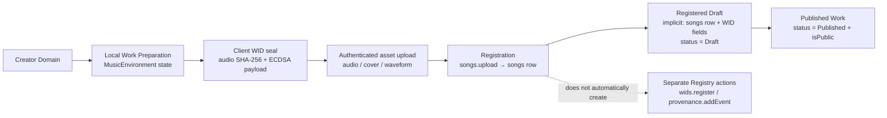

# Work Preparation, Registration, and Publication: Current → Target Map

**Status:** Source-bound lifecycle audit; no implementation is authorized or performed by this document.  
**Scope:** The existing music Work path from creator preparation through Draft, registration, WID/provenance anchoring, edits, versioning, and publication.  
**Boundary:** This is a technical map of what the platform stores and does. It is not a legal conclusion about copyright, authorship, ownership, evidentiary sufficiency, or the legal force of a WID.

> **Core finding:** The current single-track flow does **not** have a database-persisted, editable “unregistered Draft.” It has an in-memory preparation state. Once the creator submits `songs.upload`, the platform creates a `songs` record that can have `status: "Draft"` while already carrying the client-generated WID, file hash, public key, and signature. “Registered” is currently an **implicit condition**, not a distinct `songs.status` value. [1] [2]

## 1. Current → Target Lifecycle



| Target stage | Current implementation | What is persisted | Important boundary |
|---|---|---|---|
| **Creator Domain** | Authenticated creator supplies all registration inputs through the Manifestation Studio or batch page. | Creator identity is server-derived through `ctx.user.id`. | A client cannot select another creator as the owner. [2] |
| **Work Draft** | Before submission, single-track preparation lives in React state. A submitted Draft is a real `songs` row. | Nothing before submission; after `songs.upload`, `songs.status = Draft`, `isPublic = false`, plus submitted work fields. | The current product conflates “registered” and “saved as Draft” in one persistence action. [1] [2] |
| **Prepare / Edit** | Audio ingestion prefills editable metadata; creator edits local state until they deliberately generate a WID and submit. | No database Work record yet. | Editing is local and noncanonical until `songs.upload`. [1] |
| **Register** | `handlePublish` uploads prepared assets, then invokes protected `songs.upload`; batch uses `songs.batchUpload`. | `songs` row, storage URLs/keys, and supplied WID/hash/signature fields. | Registration is distinct from the separate `wids` registry table. [1] [2] |
| **WID + provenance anchor** | Client seals WID-MUS for the single Work; server creates WID-LYR after song persistence if lyrics exist; batch creates WID-ALB after track creation. | Work-level WID facts are stored on `songs`; lyrics WID on `songs`; collection WID in collection data. | A separate `wids` table record and a `provenanceEvents` row are **not automatically created** by the visible `songs.upload` or `batchUpload` code. [2] [3] [4] |
| **Publish** | Creation may directly use `Published`; a registered Draft may later change state through `songs.updateStatus`. | `status`, `isPublic`, plus nonblocking feed and visual-queue effects from `updateStatus`. | Published is explicit; Registered is not an enum state. [2] [5] |

## 2. Direct Answers to the Requested Current-State Questions

| Question | Current, source-backed answer |
|---|---|
| **1. Where is a Work Draft created?** | In the single-track path, an unsaved preparation draft exists only in `MusicEnvironment` state. A persisted Draft is created only when the creator submits `songs.upload` with `status: "Draft"`; the server calls `createSong` and writes a full work row. Batch registration similarly defaults to Draft and persists each track during `songs.batchUpload`. [1] [2] |
| **2. What metadata can be edited before upload?** | Single-track preparation exposes audio, cover file/remote cover, visual prompt/lineage, title, genre, BPM, key signature, lyrics, mood tags, caption, origin story, AI-consent choice, participation axes, attestation, and Draft/Published intent. Audio ingestion can prefill title, genre, BPM, key, lyrics, duration, and embedded cover art; creators may then edit those local values. [1] |
| **3. What metadata is persisted before WID issuance?** | **None in the single-track path.** The WID seal is generated before asset upload and before `songs.upload` persists the Work. The client then submits the prepared metadata and WID facts together. [1] |
| **4. Exactly when is the WID generated?** | When the creator invokes `generateWID()` after an audio file and title exist, before `handlePublish()`. The client reads the audio bytes, computes SHA-256 `fileHash`, creates an ECDSA P-256 keypair, derives tone, signs the exact payload `{ fileHash, title, participation, toneLabel, timestamp }`, and derives `WID-MUS-{hash[0:8]}-{hash[8:16]}`. [1] |
| **5. Exactly when is a provenance event created?** | The inspected `songs.upload` and `songs.batchUpload` procedures do not call `addWorkEvent`, `insertProvenanceEvent`, or `insertWid`. A work timeline event is created only when an authenticated owner later invokes `provenance.addEvent`; a separate WID registry record is created only when an authenticated caller invokes `wids.register`. [2] [3] [4] |
| **6. Exactly when is `contentHash` calculated/bound?** | `songs.fileHash` is computed client-side from the audio bytes during `generateWID()` and passed to `songs.upload`. The separate `wids.contentHash` column is not populated by `songs.upload`; it is supplied explicitly to `wids.register` alongside `wid` and `eventId`. Lyrics receive a server-calculated SHA-256 after song persistence; batch collections receive a server-calculated SHA-256 over sorted track WIDs. [1] [2] [3] [4] |
| **7. Which artwork/assets cross the registration boundary?** | Single registration sends canonical audio `fileUrl/fileKey`, cover art URL, optional waveform URL/key, visual source/prompt/lineage, and may pass gallery image JSON. The upload endpoint stores audio, cover, video, and G-code assets; audio metadata is stripped and covers are micronized before storage. Lyrics are sent as text; the initial single-track route does not send a separate lyrics file asset. [1] [6] |
| **8. What can be edited after WID issuance?** | `updateMetadata` permits title, genre, caption, description, headline caption, moods, release date, cover URL/position, AI consent/disclosure and HAAI fields, ownership status, parent link, commerce/display fields, and status. `updateLyrics` can replace lyrics text. `updateCredits` replaces `creditsJson`. Cover upload persists a new cover URL. [2] [5] |
| **9. How do those edits affect the WID?** | `updateMetadata`, `updateLyrics`, `updateCredits`, and cover upload do not recompute the primary `songs.witnessId`, `fileHash`, ECDSA key, or signature in the inspected code. `addLyricsWithWid` intentionally creates/replaces a separate WID-LYR. Audio replacement changes the canonical audio WID/file hash and archives the prior audio. [2] [5] |
| **10. How does Draft → Registered → Published transition?** | Current enum states are `Draft`, `Published`, `Unlisted`, and `Deleted`; there is no `Registered` enum. A WID-bearing `Draft` is therefore the current implicit registered state. `updateStatus` sets `isPublic = true` only for Published and triggers visual queue/feed effects. Initial `songs.upload` enforces cover/profile/testimony requirements when directly created as Published. [2] [5] |
| **11. What do `songVersions` / `audioVersions` do?** | Two existing version paths coexist. `songs.replaceAudio` archives the old canonical audio in `audioVersions`, uploads new audio, derives a new WID-MUS, and repoints the `songs` row. `versions.upload` archives the original/current audio into `songVersions`, server-hashes uploaded bytes, creates a `WID-V{n}`, persists a version record, then repoints the canonical row. [5] [7] [8] |
| **12. What are the existing metadata/lyrics/credits and WID/provenance mutation paths?** | `songs.updateMetadata` → `updateSongMetadata`; `songs.updateLyrics` → `updateSongLyrics`; `songs.addLyricsWithWid` → `updateSongLyricsWithWid`; `songs.updateCredits` → `updateSongCredits`; `songs.replaceAudio`/`versions.upload` → canonical WID/file-hash replacement plus version archive; `provenance.addEvent`, `addLineage`, and witness procedures write separate provenance records; `wids.register` inserts a separate WID registry record. [2] [3] [4] [5] [7] |

## 3. Preparation Inputs Before Registration

The current single-track preparation interface is already the place where metadata editing occurs before registration. It is an in-memory workflow, not a durable server Draft.

| Preparation category | Current editable local values | Automated prefill/derivation | Bound to current WID signature? |
|---|---|---|---|
| Canonical media | Audio file | File bytes are read at seal time. | **Yes:** audio bytes → `fileHash`. |
| Identity/title | Title | Audio metadata may prefill title. | **Yes:** `title` is in the signed payload. |
| Participation | Music, lyrics, voice as Human/AI/Both; attestation | Defaults to Human. | **Yes:** participation object is in the signed payload. |
| Tone inputs | Genre, BPM, key signature, moods, origin/caption context | Metadata may prefill genre/BPM/key; tone is derived in browser. | **Indirectly:** derived `toneLabel` is in the signed payload. |
| Lyrics | Lyrics text | Embedded metadata may prefill lyrics. | **No for WID-MUS:** lyrics get a separate WID-LYR only after persistence when supplied. |
| Visual/media | Embedded/uploaded/generated/remixed cover, prompt, lineage, waveform preview | Embedded cover extraction; waveform PNG generated from canonical audio before registration. | **No:** visual values are persisted but are not in the signed WID-MUS payload. |
| Editorial/disclosure | Caption, origin story, AI consent, later server-supported disclosure fields | Creator-editable. | **No:** not in the current signed WID-MUS payload. |

## 4. What Registration Persists

`songs.upload` accepts a broad compatibility payload. The single-track client currently sends the fields below; the server also supports legacy/base64, enhanced editorial, media, and historic multi-medium compatibility fields. The Work record stores `fileHash`, `witnessId`, ECDSA fields, tone/harmonic facts, status, participation, waveform, and visual lineage in the same insert as the rest of the registration payload. [1] [2] [8]

```text
client local state
  → WID seal (client)
  → /api/upload-file for binary assets
  → songs.upload (protected)
  → createSong (songs row, status Draft or Published)
  → optional WID-LYR update after song ID exists
  → nonblocking visual job / share artifact / webhook
```

The asset boundary is important: the S3 upload happens **before** the Work insert. Thus a failed subsequent registration can leave an uploaded asset without a Work row; the current implementation does not demonstrate a compensating asset delete in this path. This is an operational custody observation, not a mutation recommendation. [1] [6]

## 5. Current WID, Hash, and Provenance Semantics

| Record or value | Current writer | Timing | What changes it later? |
|---|---|---|---|
| `songs.fileHash` | Client `generateWID()` → `songs.upload` | Before Work insertion | Only audio replacement/version paths update it. [1] [5] [7] |
| `songs.witnessId` | Client `generateWID()` → `songs.upload` | Before Work insertion | Audio replacement/version paths intentionally replace it. Editorial updates do not. [1] [5] [7] |
| ECDSA key/signature | Client `generateWID()` → `songs.upload` | Before Work insertion | No inspected editorial mutation updates them. [1] [2] |
| `songs.lyricsWid` / `lyricsFileHash` | Server `updateSongLyricsWithWid` | After Work insertion, when lyrics are supplied; also via explicit `addLyricsWithWid` | Explicit WID-LYR path changes it. Plain `updateLyrics` does not. [2] [5] |
| `wids.contentHash` | Explicit `wids.register` caller | Only when that separate mutation is invoked | Separate registry path; not automatically linked in `songs.upload`. [3] [4] |
| `workEvents` provenance timeline | Explicit owner `provenance.addEvent` | Only after a persisted Work exists | Explicit owner event actions. [3] |
| `audioVersions` | `songs.replaceAudio` | Before canonical audio/WID replacement | Additional audio replacement. [5] |
| `songVersions` | `versions.upload` | During dedicated version upload | Additional dedicated version uploads. [7] |

### Provenance observation requiring future policy review

`updateLyrics` changes `lyricsText` only. It does not recompute `lyricsHash`, `lyricsWid`, or `lyricsAddedAt`; `addLyricsWithWid` is the explicit path that does. Likewise, `updateMetadata` can modify title and other editorial fields without recomputing the existing WID-MUS signature, because the existing client signature payload included the original title and tone label. This is not a reason to retroactively rewrite WIDs; it is a precise boundary to preserve when designing future editorial/version semantics. [1] [2] [5]

### Publication observation requiring future policy review

Initial direct publication through `songs.upload` checks for a cover, creator name/handle, bio/origin, profile photo, and testimony. The inspected later `songs.updateStatus` path delegates to `updateSongStatus`, which enforces partial-rights restrictions and synchronizes `isPublic`, then dispatches visual/feed effects; it does not contain the same cover/profile/testimony checks in its own source. `updateMetadata` also accepts `status` but its helper does not synchronize `isPublic`. These are current-path differences to preserve and resolve only through a separately approved behavior audit; this report makes no change. [2] [5]

## 6. Existing Version Paths

| Path | Archive record | New hash/WID behavior | Canonical Work effect |
|---|---|---|---|
| `songs.replaceAudio` | Adds the previous canonical audio to `audioVersions` if current audio/WID exist. | Receives client file hash; creates a new WID-MUS from hash + creator + current time. | Replaces `fileUrl`, `fileKey`, `fileHash`, and `witnessId`; clears lyrics-only state. [5] |
| `versions.upload` | On first replacement, snapshots original into `songVersions`; creates another `songVersions` row for newly uploaded audio. | Server SHA-256 hashes the uploaded buffer; creates `WID-V{n}`. | Repoints canonical `songs` record to new URL/key/hash/WID. [7] |

These are two distinct, live versioning semantics. They should not be merged, renamed, or removed as part of a pre-registration metadata refactor.

## 7. Smallest Safe Refactor Candidate — Not Implemented

### Candidate: a pure `PreparedWorkRegistration` snapshot at the existing client seal boundary

The smallest safe change is **not** a new database Draft table, a new status, a server-side WID calculation, or a change to the existing signature payload. It is a client-side, pure preparation snapshot assembled immediately before the existing `generateWID()` call.

```text
Current local form state
  → buildPreparedWorkRegistration(form state, local asset references)
  → generate the EXISTING WID payload unchanged
  → retain snapshot + WID seal in client state
  → upload assets
  → submit the EXISTING songs.upload payload
```

| Candidate element | Exact safeguard |
|---|---|
| `PreparedWorkRegistration` | In-memory TypeScript object only; no schema, database, storage, route, or server contract change. |
| Seal payload | Must remain byte-for-byte equivalent to the current `{ fileHash, title, participation, toneLabel, timestamp }` JSON serialization before signature. |
| Metadata editing | All existing metadata remains editable before the snapshot/seal. The snapshot can expose whether a later edit touches a WID-bound field versus editorial-only field. |
| After-seal behavior | Do not silently alter the existing WID. A future separately approved UI could mark title/participation/tone-input edits as “reseal required” while allowing non-WID-bound editorial edits to remain editable. |
| Registration façade | Continue calling existing `songs.upload` with the existing Zod shape, WID, file hash, public key, signature, and asset URLs. |
| Rollback | Delete the pure client helper/snapshot; no data or schema rollback is required. |

This candidate would make the current preparation boundary explicit and testable while preserving present WID semantics. It would **not** solve, change, or retroactively reinterpret post-registration editorial mutation behavior. Any implementation must be separately approved with tests that prove identical preexisting signature bytes, upload payload values, Draft behavior, and no change to WIDs or provenance records.

## 8. Current → Target Conclusion

The target model is achievable without replacing the current record system:

```text
Creator Domain
  ↓
Local Work Draft (existing, client-only)
  ↓
Prepare / Edit (existing metadata and assets)
  ↓
Register (existing songs.upload / batchUpload)
  ↓
WID-bearing Registered Draft (existing, implicit rather than enum)
  ↓
Publish (existing status/isPublic transition)
```

The immediate architecture task is to **name and test** the existing local preparation boundary—not to change the `songs` schema, WID semantics, provenance records, storage, or route system. The separate Registry table/event pathways must remain explicit and consent-bound.

## References

[1]: [Music Environment preparation and single registration](../client/src/pages/manifestation-studio/environments/MusicEnvironment.tsx)  
[2]: [Songs router registration, status, metadata, lyrics, audio replacement, and version queries](../server/routers/songs.ts)  
[3]: [Explicit provenance event router](../server/routers/provenance.ts)  
[4]: [Explicit WID registry router](../server/routers/wids.ts)  
[5]: [Work persistence and post-registration mutation helpers](../server/db/songs.ts)  
[6]: [Authenticated asset upload route](../server/routes/uploadRoute.ts)  
[7]: [Dedicated song version router](../server/routers/versions.ts)  
[8]: [Work, WID, version, and provenance schema](../drizzle/schema.ts)
