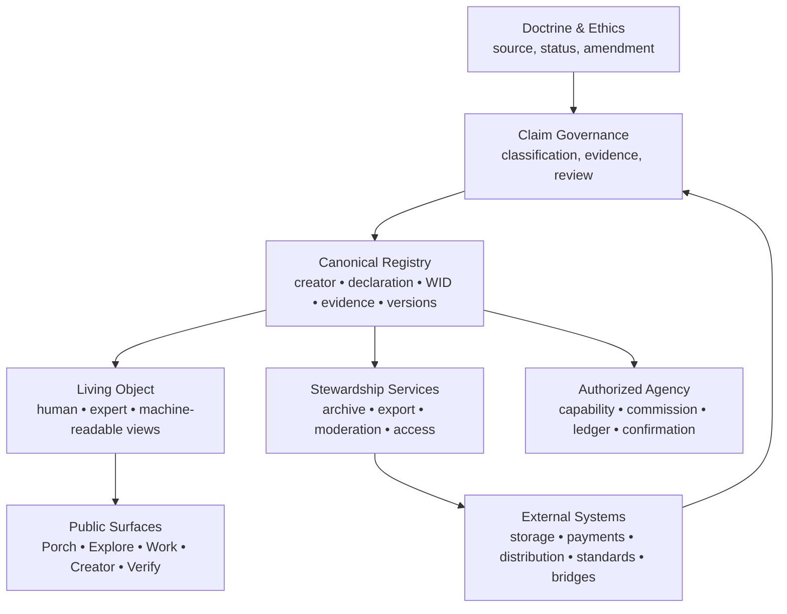

# J. Canonical Platform Architecture

> **Target architecture, not a claim of completion.** This defines the reference toward which future implementation should converge after authorization.

## Governing Order



## Six-Layer Alignment

| Layer | Canonical responsibility | Current foundation | Required proof / gap |
|---|---|---|---|
| Identity | Creator identity, contribution identity, authority, privacy, and continuity. | User/profile/handle/domain and participant fields exist. | Stable identity rules, contributor relationship flow, conflict/dispute protocol, privacy controls. |
| Manifestation | A Work as a living registry object, not only a media page. | Song/work pages, media, origin, visual/audio, and HAAI fields exist. | Canonical Living Object display across surfaces; uniform status and version display. |
| Relationship | Creator ↔ work ↔ supporter ↔ witness ↔ contributor ↔ guide relations. | Collections, projects, support, witness, and some lineage fields exist. | Typed relationship ontology, public/private visibility, consent, and revision history. |
| Registry | WID, provenance event, evidence, version/supersession, verification. | Hash/signature utility, WID table, verify route, and related routers exist. | Complete event map; append-only controls; key/time governance; independent verification. |
| Stewardship | Safety, moderation, data classification, export, preservation, claims discipline. | Terms, moderation, archive/export routes, and Law V exist. | Operational retention, restoration, policy/code consistency, claim review ownership. |
| Legacy | Long-lived identifiers, exportability, institutional memory, distribution independence. | Archive/export concepts and creator-data export route exist. | Tested recovery, format specification, external custody/standards strategy, adoption. |

## Canonical Record Envelope

Every future registry object should be representable as:

```text
Identity        — creator / contributor references and asserted authority
Manifestation   — media/object reference plus type and status
Intent          — creator’s stated purpose
Declarations    — contributor, HAAI, rights, consent, and license statements
Evidence        — source class, custody, timestamp, verifier, visibility
Provenance      — system events, hashes, signatures, versions, supersession
Relationships   — collection, guide, derivative, witness, distribution edges
Access          — public/private/restricted policy and disclosed exceptions
Support         — transfer, benefit, fee, fulfillment, and receipt state
Archive         — export package, retrieval, retention, and restoration records
Claims          — public statement IDs, evidence status, counsel status
```

## Architecture Constraints

1. **Doctrine does not override technical fact.** Claim display must disclose the actual implementation boundary.
2. **Technical fact does not adjudicate rights.** A hash, WID, timestamp, or account record is not ownership.
3. **Creator declarations remain declarations.** They retain source and version without being misrepresented as independent verification.
4. **Legal positions remain counsel-gated.** The claim registry controls public use until review.
5. **Agency is subordinate.** No agent may publish, seal, license, transfer rights, or invoke external Bridges without explicit scoped authority and creator confirmation.
6. **Retention is non-destructive.** Scope reduction hides/delists; it does not silently erase lineage.
7. **Every public surface consumes the same record vocabulary.** Page-specific copy cannot redefine WID, HAAI, rights, or support semantics.

## The Master System Diagram

```text
                    LIVING NEXUS
                         │
                  HUMAN CREATOR
                         │
                       INTENT
                         │
                   MANIFESTATION
                         │
              HUMAN + TOOL CONTRIBUTION
                         │
                    DECLARATION
                         │
                        WID
                         │
              ┌──────────┼──────────┐
              │          │          │
          PROVENANCE   RIGHTS    RELATIONSHIPS
              │          │          │
              └──────────┼──────────┘
                         │
                     DISCOVERY
                         │
                    SUPPORT
                         │
                    LICENSING
                         │
                    DISTRIBUTION
                         │
                     ARCHIVE
                         │
                       LEGACY
```

> **Display caveat:** This is the canonical system model. Each node needs an evidence class and must not imply legal effect merely through visual placement.

