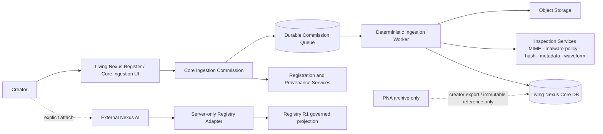

# Living Nexus Core Ingestion Commission, Nexus Registry Adapter, and PNA Preservation Specification

**Status:** Proposed architecture; no implementation or activation authorized
**Date:** 2026-09-12
**Author:** Manus AI
**Decision owner:** Keeper / Doc Seraph Mercer

> **Primary architecture decision:** The Ingestion Commission belongs to **Living Nexus Core**, not to the retiring PNA surface. PNA must be preserved as a creator archive before any successor is introduced. The external Nexus AI remains a separate interface that consumes only explicit, Registry-governed projections; it never receives direct database access, browser-held credentials, or authority to perform registration, publication, provenance, or avatar actions.

## 1. Purpose and scope

This specification aligns three adjacent systems into one authority-safe architecture:

| System | Purpose | Canonical authority | What it must not become |
|---|---|---|---|
| **Living Nexus Core Ingestion Commission** | Prepare a creator-approved asset for Draft registration using deterministic inspection and bounded automation. | Asset custody, technical facts, creator confirmation, Draft creation, registration, WID/provenance, publication authority. | An autonomous publishing agent or a generic AI chat workflow. |
| **External Nexus AI** | Provide a separate, signed-session intelligence interface using explicit, permitted Registry context. | Conversation execution and receipt evidence only; never canonical Work/provenance authority. | A direct database client, Registry owner, provider proxy in the browser, or a hidden publication path. |
| **PNA preservation/archive** | Preserve the retired creator workspace and records without treating it as the next product. | Existing PNA/Kept/marketplace/Quiver authorities remain where they are. | A silent migration, avatar successor, or unconsented AI corpus. |

The specification deliberately does **not** activate a queue, add a scheduler, issue a credential, configure a model provider, alter PNA routes, migrate an avatar, or change a Work, WID, provenance, storage, or entitlement record.

## 2. Non-negotiable system invariants

| Invariant | Required interpretation |
|---|---|
| **Public ≠ AI-permitted** | A public Work may be visible but remains unavailable to Nexus inference unless the authoritative Registry permission result is `ALLOW` and the user attaches it deliberately. |
| **Playing ≠ AI context** | Player state, listening history, and a playing Work never auto-attach to a Nexus conversation. |
| **Uploading ≠ registration** | Upload/storage establishes neither a Work record nor a WID/provenance record. |
| **AI inference ≠ creator testimony** | AI suggestions and summaries are never converted into Origin, testimony, authorship, or rights declarations without explicit creator action through the appropriate Core flow. |
| **Nexus ≠ provider** | Nexus owns the governed interface and receipt; any model provider is an explicitly configured server-side dependency, not an authority. |
| **Unspecified ≠ allow** | Missing/unknown AI permission fails closed. |
| **PNA retirement ≠ record deletion** | Retiring a surface never authorizes removal, mutation, automatic export, or successor transfer of its underlying creator records. |

## 3. Current-state constraints the design preserves

The present music registration path prepares a Work in browser state, seals the current WID payload on the client, uploads assets through the authenticated upload boundary, then calls `songs.upload` to create a `Draft` or `Published` song row. A WID-bearing Draft is currently the implicit registered state; it is not a distinct status. The visible registration path does not automatically create an entry in the separate `wids` registry table or a provenance event. [1]

The existing PNA Ingestion Commission ADR correctly separates model reasoning from deterministic services and requires a confirmation per consequential action. Its proposed model/tool/confirmation ideas remain useful. However, because PNA is now under preservation review, the new implementation must promote the Commission to a **Core capability** rather than extend the PNA shell. PNA may later link to an archive record, but it must not become the operational home for new ingestion. [2] [3]

The deployed Nexus staging service already requires a short-lived Living Nexus assertion, uses a server-side Registry adapter, applies strict Origin controls, limits request size, rate-limits requests, stores owned conversations, requires explicit permitted context before a witness request, and returns a receipt without calling a provider when none is configured. This specification retains those fail-closed properties. [4]

## 4. Target architecture



### 4.1 Authority allocation

| Layer | May do | Must never do |
|---|---|---|
| **Core Ingestion UI** | Collect creator intent, upload selection, visible measured facts, proposals, and explicit confirmations. | Treat a worker/model result as a creator declaration or automatically submit registration/publication. |
| **Commission service** | Create a bounded request, issue job references, track state, bind confirmations, and enforce transitions. | Allow one Commission to create unbounded work, cross creator boundaries, or survive material asset/proposal changes without review. |
| **Deterministic worker** | Perform technical inspection, hash calculation, waveform/derivative generation, storage verification, duplicate checks, and bounded retry. | Write creator-origin/testimony, decide rights/ownership, issue a WID, publish, change avatar state, or call Nexus with unapproved private context. |
| **Registration/provenance service** | Validate a creator-confirmed canonical payload, create the existing Draft/registration record, and execute separately authorized WID/provenance actions. | Reinterpret old WIDs or generate a WID from worker/model output without creator-confirmed payload. |
| **Registry R1** | Return governed read projections and permission state. | Expose raw tables, private corpus, raw query history, credentials, or write authority in R1. |
| **Nexus AI** | Operate a creator conversation, accept an explicit context attachment, call Registry through its adapter, and write execution receipts. | Query Core’s database directly, infer permission from visibility, attach playback, mutate a Work, register/publish, or create an avatar relationship. |
| **PNA archive** | Retain/archive/export private records under existing owner rules. | Serve as an ingestion runtime, AI context corpus, automatic successor source, or blanket avatar migration authority. |

## 5. Core Ingestion Commission contract

### 5.1 Commission identity

A Core Ingestion Commission is a **single creator-issued, bounded request to prepare one root asset for review**. It is neither a background agent mandate nor a publication command.

```ts
type CommissionState =
  | "awaiting_asset"
  | "asset_received"
  | "queued"
  | "inspecting"
  | "inspection_ready"
  | "proposal_ready"
  | "awaiting_confirm_draft"
  | "draft_saved"
  | "awaiting_confirm_registration"
  | "registered_draft"
  | "awaiting_confirm_publication"
  | "published"
  | "failed"
  | "cancelled";

interface CoreIngestionCommission {
  commissionId: string;             // opaque, server-issued
  creatorId: number;                // server-derived authenticated identity
  rootAsset: {
    storageKey: string;
    contentType: string;
    sizeBytes: number;
    sha256: string | null;           // null only before inspection completes
  } | null;
  requestedOutcome: "private_draft" | "registration_review";
  state: CommissionState;
  policyVersion: "core.ingestion.v1";
  idempotencyKey: string;
  createdAt: string;
  updatedAt: string;
}
```

The commission is creator-scoped. Root asset, purpose, and current inspection-result hash form its material identity. If any of those change, existing confirmations expire and a new proposal is required.

### 5.2 State machine and mutation rights

| State | Entry condition | Allowed operation | Forbidden operation |
|---|---|---|---|
| `awaiting_asset` | Creator has started a Commission. | Cancel; attach one owned/upload-authorized asset. | Worker execution; model call; Draft/Work creation. |
| `asset_received` | Asset reference passes intake authorization. | Create one deterministic inspection job. | WID generation; publication; AI context attachment. |
| `queued` / `inspecting` | Job is durable and leased by one worker. | Technical analysis, derived-artifact production, bounded retry. | Creator declarations, registration, publish, account/profile/avatar mutation. |
| `inspection_ready` | Measured technical result is complete and valid. | Present facts; run deterministic duplicate/provenance-preparation checks. | Convert suggestions into metadata without approval. |
| `proposal_ready` | A typed Draft proposal has been assembled from measured facts plus creator inputs. | Let creator edit/review proposal. | Save or seal automatically. |
| `awaiting_confirm_draft` | Canonical proposal hash presented to creator. | Consume a valid one-time confirmation to save a private Draft. | Reuse confirmation after any proposal/asset change. |
| `draft_saved` | Existing Core Draft/asset references are persisted. | Prepare separate registration proposal. | Publish, attach Quiver, or attach AI context by implication. |
| `awaiting_confirm_registration` | Registration/WID/provenance payload is fully displayed. | Run only the confirmed, existing registration action. | Make provider or worker decision authoritative. |
| `registered_draft` | A creator-confirmed registered Draft exists. | Prepare publication only if separately requested. | Treat Draft as public. |
| `awaiting_confirm_publication` | Existing publication readiness is satisfied and presented. | Invoke the explicit publication authority. | Skip creator confirmation or readiness checks. |
| `published` / `failed` / `cancelled` | Terminal outcome. | Read receipt/history and create a new Commission if needed. | Resume a stale or cancelled mutation path. |

### 5.3 Creator confirmation contract

Every state transition that creates or changes a Core record requires a short-lived single-use confirmation. A confirmation binds the actor, Commission, action, canonical proposal hash, asset hash, target object, authorization scope, policy version, expiration, and result reference.

```ts
interface IngestionConfirmation {
  confirmationId: string;
  commissionId: string;
  creatorId: number;
  action:
    | "save_private_draft"
    | "register_work"
    | "publish_work";
  proposalHash: string;
  rootAssetHash: string;
  policyVersion: "core.ingestion.v1";
  presentedAt: string;
  expiresAt: string;
  consumedAt: string | null;
  resultReference: string | null;
}
```

A worker receipt, an AI suggestion, an old confirmation, or a stale browser form is never a valid substitute for this record.

## 6. Deterministic worker pipeline

### 6.1 Intake and job contract

Workers are event-triggered by a persisted Commission/job record after the authenticated upload boundary accepts an object. The object must be persisted before queueing, and all stages must be idempotent against the Commission ID, root asset hash, and stage key.

```ts
type IngestionStage =
  | "verify_object"
  | "validate_media"
  | "compute_hash"
  | "extract_technical_metadata"
  | "extract_embedded_art"
  | "generate_waveform"
  | "run_duplicate_check"
  | "assemble_inspection_receipt";

interface IngestionJob {
  jobId: string;
  commissionId: string;
  stage: IngestionStage;
  rootAssetHash: string | null;
  idempotencyKey: string;
  attempt: number;
  maxAttempts: number;
  leaseExpiresAt: string | null;
  status: "queued" | "leased" | "succeeded" | "retryable_failure" | "terminal_failure" | "cancelled";
}
```

### 6.2 Required stages

| Stage | Deterministic input | Output/receipt | Write authority | Failure treatment |
|---|---|---|---|---|
| `verify_object` | Storage key, creator identity, declared MIME/size. | Object exists, is owned/authorized, checksum candidate, storage metadata. | Commission/job status only. | Terminal on missing/unauthorized object. |
| `validate_media` | Object stream and server allowlist. | Measured MIME, size, duration limit result, parser validation result, safety/format outcome. | Commission/job status only. | Terminal on disallowed/invalid media; never “repair” content silently. |
| `compute_hash` | Exact stored bytes. | SHA-256, byte length, content-verification timestamp. | Inspection receipt only. | Retryable only for transient storage read; otherwise terminal. |
| `extract_technical_metadata` | Validated media bytes. | Codec/container/duration/sample rate/channels/bitrate, embedded tags with source labels. | Inspection receipt only. | Partial result is allowed when parser fails non-critically; label as unavailable. |
| `extract_embedded_art` | Validated embedded cover data. | Optional normalized thumbnail/reference and source label. | Derived asset/reference only. | Omit derivative if extraction fails; do not substitute AI art. |
| `generate_waveform` | Canonical validated audio. | Derivative waveform key/hash/algorithm version. | Derived asset/reference only. | Retryable with bounded budget; Draft remains reviewable without waveform after final failure. |
| `run_duplicate_check` | Root hash plus creator/public safe projection. | Exact/near duplicate candidates, scope label, no-match result. | Inspection receipt only. | Fail closed to “unavailable”; never block a creator permanently on a transient index failure. |
| `assemble_inspection_receipt` | Outputs of prior successful/partial stages. | Immutable/sealed inspection record containing stage versions, outputs, warnings, hashes, and job results. | Commission moves to `inspection_ready`. | Terminal if root integrity is absent. |

### 6.3 Receipt semantics

The worker must communicate only what it can prove. Measured duration, hash, MIME, and waveform information are **measured**. Embedded tags are **extracted**. Duplicate results are **retrieved/indexed**. Creator-entered title, participation, origin, rights, and testimony remain **creator declarations**. Any AI-created proposal is an **AI suggestion**.

```ts
interface InspectionReceipt {
  receiptId: string;
  commissionId: string;
  rootAssetHash: string;
  policyVersion: "core.ingestion.v1";
  stages: Array<{
    stage: IngestionStage;
    status: "succeeded" | "partial" | "failed";
    toolVersion: string;
    outputHash: string | null;
    warningCodes: string[];
  }>;
  measuredFacts: Record<string, unknown>;
  derivedAssetRefs: Array<{ key: string; sha256: string; kind: "waveform" | "embedded_art_thumbnail" }>;
  createdAt: string;
}
```

The receipt is operational evidence; it is not itself WID provenance, testimony, or a publication decision.

### 6.4 Failure, retry, and cancellation rules

| Condition | Response |
|---|---|
| Transient storage/parser/derivative fault | Exponential bounded retry with stage-specific maximum attempts; preserve prior successful outputs. |
| Lease expiry | Another worker may resume only after verifying idempotency key and completed-stage receipt. |
| Invalid media, ownership failure, quota/size violation | Terminal failure with creator-safe explanation; no hidden retries. |
| Creator cancellation | Cancel future stages; do not delete already uploaded source or verified receipts automatically; offer explicit cleanup policy separately. |
| Duplicate candidate found | Inform creator; do not reject, merge, overwrite, or infer ownership. |
| Worker release/deployment | Jobs are durable and resumable; no in-memory-only source of truth. |

### 6.5 Hosting options for later approval

| Operational approach | Suitable workload | Tradeoff | Recommendation |
|---|---|---|---|
| **Event-triggered jobs with durable queue and short worker runs** | Upload inspection, hash, metadata extraction, waveform generation within request/job limits. | Lowest operational burden; jobs must be idempotent because instances can stop/restart. | **Preferred first slice.** |
| **Single persistent queue worker with the same durable queue** | Higher sustained volume, long-lived processing coordination, or low-latency worker pickup. | Requires an always-running managed process and capacity review; still must use DB/storage, not in-memory state. | Consider only after observed workload justifies it. |
| **Separate compute service** | Native media tools, Docker/system binaries, resource needs above managed limits, or long batch transcodes. | Adds operating cost, network/secret boundary, patching, and incident responsibility. | Use only when a measured Core worker requirement exceeds the managed environment. |

No scheduled polling is required for an upload-triggered Commission. A durable event/job handoff is preferable; scheduled reconciliation should be reserved for bounded stale-job recovery, not primary processing.

## 7. Exact external Nexus AI Registry adapter contract

### 7.1 Boundary statement

Nexus interacts with Living Nexus through a **server-only Registry R1 adapter**. The browser sends an authenticated Nexus request; Nexus validates the short-lived Living Nexus assertion; Nexus invokes the Registry with its own server-held credential; the adapter returns a typed governed projection. The browser never receives a Registry credential, provider credential, raw database response, or Living Nexus session cookie. [4]

```mermaid
sequenceDiagram
  participant B as Nexus browser
  participant N as Nexus server
  participant A as Registry adapter
  participant R as Living Nexus Registry R1
  B->>N: Authorization: Bearer short-lived LN assertion
  N->>N: Verify issuer, audience, signature, expiry, nonce-bound launch
  B->>N: Explicit attach WID to conversation
  N->>A: resolveWorkContext(wid)
  A->>R: Server-held Registry credential + read scope
  R-->>A: typed work and permission envelopes
  A-->>N: normalized public work + ALLOW/DENY/UNSPECIFIED
  N-->>B: attachment status; no credential or raw private data
  B->>N: Witness request
  N->>N: require user-attached ALLOW context
  N-->>B: execution receipt or fail-closed denial
```

### 7.2 Configuration and secret contract

| Configuration item | Location | Browser visibility | Requirement |
|---|---|---|---|
| Registry base URL | Nexus server environment. | None. | Allowlisted HTTPS Registry R1 origin only. |
| Registry API credential | Nexus server secret store. | None. | Finite, scoped, server-created credential; never Git/log/browser/receipt. |
| Living Nexus assertion issuer/audience/JWKS URL | Nexus server configuration. | Public verification material only. | Exact allowlisted issuer/audience; signature and expiry validation mandatory. |
| Conversation encryption key | Nexus server secret store. | None. | Required for durable private message storage. |
| Provider credential, if later approved | Nexus server secret store. | None. | Separate from Registry credential and capability; absence must fail truthfully. |

### 7.3 Approved Registry R1 access envelope

The Nexus Registry client is a first-party application identity, not an end-user identity. Its R1 capability is restricted to the following seven server-assigned read scopes. No R1 write scope exists; queue, library, testimony, and creator-corpus access remain outside this contract and require a future delegated-user authorization design. [5]

```text
registry:capabilities:read
registry:search:read
registry:creators:read
registry:works:read
registry:wids:read
registry:provenance:read
registry:permissions:read
```

The Registry base URL is configurable so deployment can move behind the canonical API hostname without changing the Nexus contract. The approved R1 route set is: `GET /health`, `GET /capabilities`, `GET /search`, `GET /autocomplete`, `GET /creators/:handle`, `GET /creators/:handle/works`, `GET /works/:wid`, `GET /works/:wid/provenance`, and `GET /works/:wid/permissions`. Every valid response carries a `registry.v1` envelope, request ID, source, data, provenance references, and pagination cursor when applicable. [5]

### 7.4 Adapter interface

```ts
type RegistryPermissionState = "ALLOW" | "DENY" | "UNSPECIFIED";

interface RegistryEnvelope<T> {
  apiVersion: "registry.v1";
  requestId: string;
  data: T;
}

interface RegistryAdapter {
  configured(): boolean;
  resolveWorkContext(wid: string): Promise<{
    work: PublicRegisteredWorkProjection;
    permissionState: RegistryPermissionState;
    permissions: WorkAiPermissionProjection;
    envelopeHash: string;
  }>;
}

interface PublicRegisteredWorkProjection {
  wid: string;
  title: string;
  creator: { reference: string; displayName: string | null };
  status: "Published";
  visibility: "public";
  provenanceRefs: Array<{ wid: string; kind: string }>;
}

interface WorkAiPermissionProjection {
  state: RegistryPermissionState;
  attributionRequired: boolean;
  policyVersion: string;
}
```

The **current staging adapter** exposes `configured()` and `resolveWorkContext(wid)`. `resolveWorkContext` makes two server-to-server calls—`/works/:wid` and `/works/:wid/permissions`—in parallel, validates the `registry.v1` envelopes, enforces an abort timeout, derives an envelope hash, and normalizes only explicit legacy consent during the staged transition. A future discovery capability may add a separately scoped `getCapabilities()` method, but it is not necessary for explicit Work attachment. [4]

The adapter may retrieve only approved R1 read projections. It must treat any invalid/missing/unknown permission as `UNSPECIFIED` and it must not call a Core database, infer permission from `Published`, `isPublic`, playback, prior chat, profile visibility, or a source URL.

### 7.5 Credential and request protocol

Registry credentials have a public key selector/prefix and a server-held-pepper HMAC-SHA-256 digest. The full high-entropy credential is returned only at issuance, stored only in the Nexus server secret store, subject to finite expiry and immediate revocation, and never embedded in browser code or a Nexus API response. Registry enforcement is ordered as TLS/host boundary; credential parse/lookup; constant-time digest comparison; client/credential status; expiry; route scope; rate/abuse policy; resource visibility/creator policy; read execution; then content-safe audit. [5]

Nexus must preserve the current adapter timeout behavior and treat failed/invalid upstream envelopes as a bounded Registry-unavailable/denied result. It must never retry a context attachment indefinitely or degrade a failed permission lookup into an `ALLOW`.

### 7.6 Request protocol and enforcement order

1. Nexus receives a request from an allowlisted origin and applies no-store/CSP/frame protections.
2. Nexus validates the short-lived Living Nexus assertion: signature, issuer, audience, expiry, and subject.
3. Nexus enforces request-size limit and per-subject/IP rate limit before expensive operations.
4. For an explicit WID attachment, Nexus validates WID syntax and the user’s conversation ownership.
5. Nexus calls `resolveWorkContext(wid)` with the server-held Registry credential.
6. The adapter validates the `registry.v1` envelope, scopes data to its allowed projection, hashes the envelope for receipt linkage, and returns normalized permission state.
7. Nexus persists the attachment as `ADDED_BY_USER` with the resolved permission snapshot.
8. A witness/inference operation selects only attachments where `permissionState === "ALLOW"` and `attachmentState === "ADDED_BY_USER"`.
9. Nexus records a receipt and a non-content audit result. A provider call is possible only under a separately approved capability and key.

### 7.7 Error and privacy contract

| Condition | Required response | Information that must not leak |
|---|---|---|
| Missing/invalid assertion | `401` signed-session authorization error. | Session internals, JWKS diagnostics, subject existence. |
| Disallowed origin | `403 NEXUS_ORIGIN_DENIED`. | Registry/provider addresses or CORS policy internals. |
| Missing Registry configuration | Readiness is not ready; protected context action fails closed. | Credential names, secret values, environment detail. |
| Unknown/malformed WID | `400` for malformed syntax; `404`/normalized not-found for valid unresolved reference. | Private-record existence. |
| Private/delegated resource | `403 DELEGATED_AUTHORIZATION_REQUIRED` or governed equivalent. | Whether a private record exists. |
| `DENY` or `UNSPECIFIED` permission | Context may be represented as unavailable/denied but cannot enter usable witness context. | Raw consent values or protected content. |
| Quota/rate limit | `429` with retry-safe client guidance. | Credential quota details or other users’ activity. |
| Provider absent or unavailable | Receipt is `PROVIDER_NOT_CONFIGURED` or a bounded provider failure. | Provider key/model internals, protected context/prompt. |

### 7.8 Receipt and audit requirements

Execution receipts may retain: receipt ID, actor subject reference, conversation reference, mode, policy version, explicit WID context references, normalized permission snapshot hash, Registry envelope hash, provider/model label if invoked, request/output content hashes, cost fields, status, and timestamps. They must not retain raw Registry credentials, raw private corpus, raw search text in security audit, session cookies, provider secret, or unapproved asset bytes.

The existing staging posture—conversation ownership, encrypted message storage, hash-oriented audit, explicit attachment, and provider-absent truthful receipt—is the correct pre-provider baseline. [4]

## 8. PNA preservation and archival strategy

### 8.1 PNA role during Core/Nexus work

PNA must enter a **preservation track**, not an expansion track. The new Core Ingestion Commission must not depend on PNA thread state, PNA image proposals, PNA modes, or PNA avatar state. The external Nexus AI must not use PNA archives as background retrieval context.

| PNA boundary | Preserve as | May flow automatically to Core worker? | May flow automatically to Nexus AI? | May flow automatically to an avatar successor? |
|---|---|---:|---:|---:|
| Private PNA threads/messages | Owner-scoped mutable workspace, exportable/read-only before retirement. | No. | No. | No. |
| Sealed Keeper diary / `WID-CNV-*` | Immutable Chain-of-Record reference. | No. | No; only explicit future permission/attachment under a separate contract. | No; may be linked as immutable reference only after explicit choice. |
| Keeper portraits/private skins | Private creator presentation assets. | No. | No. | No; creator must explicitly select/relicense any successor use. |
| Marketplace skins / AVT catalog fields | Separate catalog/economic record. | No. | No. | Read-only compatibility reference only; no automatic claim/entitlement migration. |
| Equipped avatar/profile projection | Current selected presentation state. | No. | No. | No; successor requires explicit creator selection. |
| Quiver assets | Creator-private prepared assets, saved explicitly. | No, unless creator selects an asset for a specific Commission. | No, unless creator attaches a permitted work context under a separate policy. | No; no silent rehosting or asset transfer. |
| PNA image proposals | Private transient metadata unless explicitly saved to Quiver. | No. | No. | No. |
| Guide records | Separate Guide/content authority. | No. | No. | No, unless separately approved outside PNA retirement. |

### 8.2 Preservation sequence

1. **Inventory and freeze the boundary.** Retain aggregate inventory, route map, schema references, and integrity information without reading/replicating private content.
2. **Build protected archive/export access.** A creator can inspect/export their own PNA threads/messages and relevant private portrait metadata. Sealed archive state is visually and technically distinct from mutable workspace material.
3. **Activate PNA archive mode.** Disable selected PNA write actions at the server boundary only after protected export/read-only access is accepted. Do not disable Keeper, Quiver, Avatar Registry, Guides, Work registration, or Registry capability by association.
4. **Operate a declared archive window.** Provide end date, export/support path, clear retained-record description, and truthful successor status.
5. **Retire routes to an authenticated archival destination.** Preserve `pna.` and `/pna` continuity. Do not repurpose the hostname without a durable decision.
6. **Design a successor independently.** Only after Core/Nexus boundaries are stable, specify a separate avatar/presence product with explicit creator opt-in and source-reference records.

### 8.3 No-successor-before-preservation gate

An avatar successor must not begin implementation until the following have passed: creator archive/export acceptance; route rollback proof; immutable/working/economic record separation; portrait/likeness authority definition; marketplace entitlement decision; source-reference contract; creator opt-in record; and explicit prohibition of automatic PNA/Quiver/testimony transfer.

The known current `equipAvatar` lack of purchase/ownership verification remains a separate hardening issue. It must be repaired under its own entitlement ADR, not quietly bundled with archive work or successor design. [3]

## 9. First implementation slices—when approved

| Slice | Included | Explicitly excluded | Approval required |
|---|---|---|---|
| **I1 — Core Commission record and inspection** | Additive Core Commission/job/receipt records; existing authenticated upload handoff; deterministic validation/hash/metadata receipt; no model. | PNA changes, provider calls, WID generation change, Draft save, publication, avatar/Guide changes. | Separate Core ingestion approval. |
| **I2 — Creator review and private Draft confirmation** | Creator view of measured facts; bounded proposal; single-use `save_private_draft` confirmation using current registration boundary. | Public publish, Registry write, PNA dependencies, Nexus context attach. | Separate confirmation-flow approval. |
| **I3 — Nexus Registry adapter hardening** | Typed adapter tests, envelope/error/receipt contract, credential lifecycle verification against staging; no provider. | Direct DB reads, browser credential, provider call, automatic context. | Separate Nexus staging approval. |
| **I4 — PNA archive surface** | Protected owner export/read-only experience, archive-mode flags, route continuity tests. | Route activation, data deletion/migration, avatar successor. | Separate preservation approval. |
| **I5 — Avatar successor contract** | New product authority, source-reference schema, explicit creator selection model, entitlement definition. | PNA data migration, automatic avatar import, portrait reuse, reissuance. | Separate successor approval. |

## 10. Required test and acceptance gates

| Area | Required evidence |
|---|---|
| Commission ownership | Creator A cannot inspect, alter, cancel, or confirm Creator B’s Commission/job/receipt. |
| Worker idempotency | Duplicate enqueue, lease expiry, retry, and deployment restart never create duplicate derivatives, Drafts, WIDs, or provenance events. |
| Asset custody | Hash is measured from stored bytes; derivatives link to root asset; no model output changes measured hash. |
| Authority | No worker/AI path can call registration, publication, WID/provenance, profile, avatar, marketplace, or Guide mutation without exact creator confirmation and existing authority checks. |
| Registry adapter | Wrong issuer/audience/signature/expiry fails; no Registry key enters browser/log/Git; unknown/private/UNSPECIFIED contexts fail closed; `ALLOW` requires explicit user attachment. |
| Receipt/audit | Receipts link to hashes/references and do not retain raw secrets, raw protected context, or raw security-search material. |
| PNA preservation | Cross-owner archive isolation, export completeness, sealed/mutable distinction, no new authority, route continuity, economic-count stability, and rollback all pass. |
| Regression | Existing upload, Register, Draft/Publish, WID verification, player, Quiver, Keeper, Avatar Registry, Guide, PNA, and Nexus signed-launch tests remain green. |

## 11. Decisions required from Doc before implementation

1. Confirm the Core-owned name: **Living Nexus Ingestion Commission**, distinct from legacy PNA.
2. Approve **I1 only** as the first eventual implementation slice, or keep this package planning-only.
3. Select the first operational worker posture: durable event-triggered processing with bounded jobs, or defer the hosting decision until expected media volume/tool requirements are measured.
4. Confirm that the first Commission supports **one audio asset → private Draft preparation only**, with WID registration and publication still separate confirmations.
5. Confirm whether AI should be absent from I1 (recommended) and introduced only after deterministic receipt/proposal boundaries are proven.
6. Approve PNA archive-surface planning as a separate slice before any PNA write disablement or route transition.
7. Defer avatar successor product definition until the PNA archive gates and marketplace entitlement ADR are complete.

## References

[1]: [Current Work preparation, registration, publication, WID, and provenance map](../../../docs/WORK_PREPARATION_REGISTRATION_PUBLICATION_CURRENT_TO_TARGET.md)

[2]: [Existing model-agnostic PNA Ingestion Commission ADR](../../../docs/ADR-025-MODEL-AGNOSTIC-PNA-INGESTION-COMMISSION.md)

[3]: [PNA surface retirement and avatar-successor preservation ADR](./ADR-PNA-RETIREMENT-AND-AVATAR-SUCCESSOR.md)

[4]: [Current separate Nexus staging server boundary](../../../../nexus-service/src/server.mjs)

[5]: [Registry API R1 contract, scope model, credential lifecycle, and route set](../../../../nexus-service/REGISTRY_API_R1.md)
