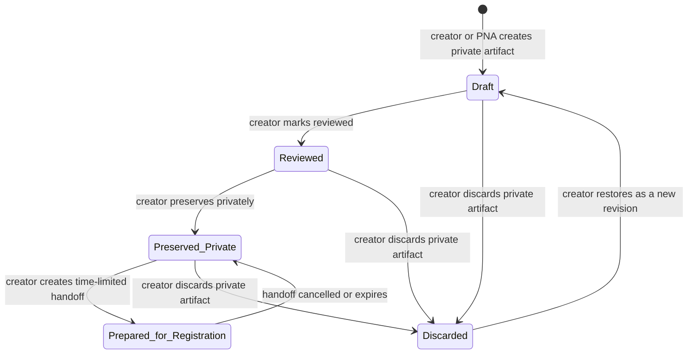

# PNA Context Envelope, Stewardship Profile, and Artifact Manifest Specification

**Status:** Proposed technical specification — no schema migration, new router, provider change, Registry mutation, or publication behavior is activated by this document.  
**Date:** 2026-10-03  
**Decision owner:** Living Nexus platform stewardship  
**Predecessors:** [PNA Workspace Experience Redesign](./PNA-WORKSPACE-EXPERIENCE-REDESIGN.md), [PNA × Libre WebUI Integration ADR](./PNA-LIBRE-WEBUI-INTEGRATION-ADR.md), [Drizzle Migration Reconciliation ADR](./DRIZZLE-MIGRATION-RECONCILIATION-ADR.md)

---

## 1. Decision in one sentence

> PNA may use only creator-selected, thread-bounded context; produce reviewable private artifacts under a declared Stewardship Profile; and hand an artifact into Manifest only through an explicit, reversible preparation step—never by treating a chat, source, artifact, or model response as a Work, WID, testimony, or publication.

This specification converts the current PNA workspace foundation into three governed systems:

1. **Context Envelope v1** — an inspectable record of exactly what PNA may read for one private thread.
2. **Stewardship Profile contracts** — a fixed, versioned declaration of each PNA profile’s purpose, permitted context, outputs, and prohibitions.
3. **Unified Artifact Manifest** — one lifecycle for private text, visual, research, planning, code, diagram, and structured-metadata proposals.

---

## 2. Scope and non-goals

### In scope

- Creator-private PNA threads and their selected context.
- Read-only references to a creator’s own Work, WID, notes, sealed diaries, Quiver assets, creator-approved documents, and explicit public sources.
- Explicit model-route disclosure and source-use receipts.
- Private artifact drafting, review, preservation, export, and Manifest preparation.
- Profile contracts for Guide, Compose, Witness, Registry, Archive, Vision, and Research.
- Context, Sources, Artifacts, and Activity interface states for desktop and mobile PNA.

### Explicitly out of scope

- Automatic inclusion of an entire Creator Domain, Archive, private thread history, Witnessing Circle correspondence, or device files.
- Any PNA write to `songs`, `wids`, provenance events, testimony, participation records, publication state, commerce, or support records.
- A new local model, provider, Libre WebUI deployment, Docker/terminal workspace, external tool, web crawl, or document-ingestion service.
- General team collaboration, public artifact sharing, or a substitute for consent-based Witnessing Circle correspondence.
- End-to-end encryption claims. Existing application and storage protections must be described precisely when implemented; this specification does not add encryption.

---

## 3. Current-state anchors and compatibility

| Existing authority | Current behavior | v1 treatment |
|---|---|---|
| `pna_threads` / `pna_thread_messages` | Creator-private, owner-scoped working continuity. `visualProposalJson` is message-local. | Remain canonical for conversations. Context Envelopes and Artifacts reference a thread; they do not replace it. |
| `keeper.chat` | Current model response path, with persona values `guide`, `conductor`, `witness`, `custodian`, and `archivist`. | A profile contract constrains requests before this path is called. It does not create a new model provider. |
| `keeper.generateArtwork` | Produces a private visual proposal. | Vision output becomes an Artifact candidate. Existing card behavior remains as a compatibility adapter until migration is complete. |
| `quiverImages` | Creator-private image vault and explicit saved visual state. | A preserved image artifact may link to a Quiver image. Quiver remains the asset vault; the Artifact Manifest records the review and context that led to it. |
| `keeperNotes` / sealed chat diaries | Creator-private working material and optional sealed diary records. | Readable only when explicitly attached through an Envelope. They are never silently injected into prompts. |
| `NexusContextRef` / `NexusContextPanel` | Side-effect-free, session-only Work/WID/now-playing inspection. | Reuse its typed reference and routing rules. “Now playing” stays a suggestion until a creator attaches it to an Envelope. |
| Manifest / Registry | Registration and WID issuance authority. | Receives only a deliberately prepared handoff. An artifact itself never becomes registered or published. |

### Compatibility rule

The existing `pnaThreadMessages.visualProposalJson` remains readable and functional. **No backfill runs automatically.** A creator may explicitly preserve a legacy proposal as a new Artifact; otherwise it remains a historical message attachment. This prevents retroactively reclassifying creator material or implying a new provenance state.

---

## 4. Architectural alignment

| Living Nexus layer | Strengthened by this specification | Boundary protected |
|---|---|---|
| **Identity** | PNA uses the authenticated creator’s own records and presents the active profile clearly. | A profile is never an author, creator, or provenance authority. |
| **Manifestation** | Artifacts gain a readable review surface and private lifecycle. | A draft is not a Work. |
| **Relationship** | Creator-selected sources, citations, and decisions are visible. | Private correspondence is not injected into PNA. |
| **Registry** | Manifest preparation can carry declared source references forward. | No PNA route issues WIDs or edits Registry history. |
| **Stewardship** | Context, model route, and action effects are inspectable before use. | Consent and owner checks occur server-side on every read/write. |
| **Legacy** | Private preservation and receipts make a creator’s decisions recoverable. | Transient model context is not silently upgraded into canonical evidence. |

---

## 5. Canonical concepts and language

| Canonical term | Definition | Must not be called |
|---|---|---|
| **Context Envelope** | A private, thread-bounded list of sources PNA is permitted to use. | Memory, automatic context, global knowledge. |
| **Context entry** | One attached source inside an Envelope. | Upload, hidden attachment. |
| **Stewardship Profile** | A fixed operating contract for PNA’s role in a thread. | Mode, personality preset, autonomous agent. |
| **Artifact Manifest** | The private record of a generated or imported proposal, its revisions, sources, route disclosure, and creator decisions. | Work, registered asset, publication. |
| **Artifact Review** | The creator’s inspection and decision surface for an artifact. | Approval by AI, automatic verification. |
| **Preserve privately** | Retain an artifact in creator-private PNA/Quiver storage. | Publish, register, seal. |
| **Prepare for registration** | Create a bounded handoff for the ordinary Manifest workflow. | Register, issue WID, publish. |
| **Action Receipt** | An append-only record of a creator-approved PNA side effect. | Provenance event, WID evidence. |
| **Model route** | The local or remote processing route selected for a request. | Private by default, unless the actual route is local. |

Internal legacy IDs remain stable for compatibility:

```text
guide       → Guide
conductor   → Compose
witness     → Witness
custodian   → Registry
archivist   → Archive
vision      → Vision
research    → Research
```

The UI uses the labels on the right. The persisted IDs on the left remain unchanged until a separate compatibility migration is approved.

---

# Part I — Context Envelope v1

## 6. Context Envelope invariant

A PNA request can use a source only if all conditions are true at request time:

```text
Authenticated creator
  AND owns the thread
  AND owns the active Envelope
  AND source is attached and not detached
  AND source resolver confirms current access
  AND selected profile permits this source kind
  AND selected model route has the required disclosure/consent
```

A client-supplied source ID is a **request**, never authority. The server resolves the source under the authenticated creator before it is shown, sent to a model, or cited.

### 6.1 Envelope ownership model

- One Envelope belongs to exactly one creator and one PNA thread.
- A thread has at most one **active** Envelope. It may have archived historic Envelopes for audit and recovery.
- Entries belong to one Envelope and are independently detachable.
- An Envelope revision increments whenever an entry is attached, detached, or its allowed route changes.
- A model use records the Envelope revision and exact entry IDs used. It does **not** duplicate the source body into the receipt.
- Existing now-playing behavior may make a session-only suggestion. It must never attach or persist itself without a creator action.

### 6.2 Supported source kinds

| Source kind | Canonical reference | v1 availability | Resolve rule |
|---|---|---:|---|
| `work` | `songs.id` and optional WID snapshot | Yes | Creator owns the Work; read only allowed PNA context fields. |
| `wid` | `wids.wid` | Yes | WID belongs to creator or is a public WID explicitly selected by creator. |
| `keeper_note` | `keeper_notes.id` | Yes | Creator owns the note. |
| `diary` | `keeper_chat_archives.id` | Yes | Creator owns the diary; sealed state is displayed, never modified. |
| `quiver_image` | `quiverImages.id` | Yes | Creator owns the image. |
| `document` | future creator-private document ID | Schema-ready only | Requires a separate document resolver and ingestion decision. |
| `public_source` | validated canonical URL + source fingerprint | Schema-ready only | Metadata/citation only in v1; retrieval is a separate approved capability. |

No envelope kind may reference:

- another creator’s private PNA thread, Quiver asset, note, diary, or correspondence;
- a database table name, SQL predicate, arbitrary URL payload, browser local-storage key, filesystem path, provider key, or raw token;
- a public Work by inference from a model response.

---

## 7. Exact persistence schema

The following is the proposed additive Drizzle/MySQL schema. Field names use the project’s current `snake_case` convention for PNA tables. Date values follow current Drizzle `timestamp` conventions and are transmitted as UTC-aware dates through the API.

### 7.1 `pna_context_envelopes`

```ts
export const pnaContextEnvelopes = mysqlTable("pna_context_envelopes", {
  id: varchar("id", { length: 64 }).primaryKey(),
  creatorId: int("creator_id").notNull(),
  threadId: varchar("thread_id", { length: 64 }).notNull(),
  purpose: varchar("purpose", { length: 240 }),
  state: mysqlEnum("state", ["active", "archived"]).notNull().default("active"),
  revision: int("revision").notNull().default(1),
  defaultRoute: mysqlEnum("default_route", ["creator_selects", "local_preferred", "remote_allowed"])
    .notNull().default("creator_selects"),
  createdAt: timestamp("created_at").notNull().defaultNow(),
  updatedAt: timestamp("updated_at").notNull().defaultNow().onUpdateNow(),
}, (t) => ({
  creatorThreadStateIdx: index("pna_context_envelope_creator_thread_state_idx")
    .on(t.creatorId, t.threadId, t.state),
  threadUpdatedIdx: index("pna_context_envelope_thread_updated_idx")
    .on(t.threadId, t.updatedAt),
}));
```

**Constraints enforced by service transaction, not a partial unique index:**

1. `threadId` resolves to `pna_threads.id` owned by `creatorId`.
2. At most one `active` Envelope exists per `(creatorId, threadId)`.
3. Archiving an Envelope cannot revoke historical `pna_context_use_receipts`; it only stops new use.
4. `defaultRoute` is a preference, not consent. A remote route still needs a valid scoped consent.

### 7.2 `pna_context_entries`

```ts
export const pnaContextEntries = mysqlTable("pna_context_entries", {
  id: varchar("id", { length: 64 }).primaryKey(),
  envelopeId: varchar("envelope_id", { length: 64 }).notNull(),
  creatorId: int("creator_id").notNull(),
  sourceKind: mysqlEnum("source_kind", [
    "work", "wid", "keeper_note", "diary", "quiver_image", "document", "public_source",
  ]).notNull(),
  sourceRef: varchar("source_ref", { length: 255 }).notNull(),
  titleSnapshot: varchar("title_snapshot", { length: 255 }).notNull(),
  widSnapshot: varchar("wid_snapshot", { length: 64 }),
  sourceUrlSnapshot: text("source_url_snapshot"),
  visibility: mysqlEnum("visibility", ["creator_private", "creator_approved", "public"])
    .notNull(),
  state: mysqlEnum("state", ["attached", "detached"]).notNull().default("attached"),
  attachedBy: mysqlEnum("attached_by", ["creator", "approved_import"]).notNull().default("creator"),
  attachedAt: timestamp("attached_at").notNull().defaultNow(),
  detachedAt: timestamp("detached_at"),
  detachedReason: varchar("detached_reason", { length: 240 }),
}, (t) => ({
  envelopeStateIdx: index("pna_context_entry_envelope_state_idx").on(t.envelopeId, t.state),
  creatorSourceIdx: index("pna_context_entry_creator_source_idx").on(t.creatorId, t.sourceKind, t.sourceRef),
  uniqueEnvelopeSource: uniqueIndex("pna_context_entry_unique_envelope_source")
    .on(t.envelopeId, t.sourceKind, t.sourceRef),
}));
```

`sourceRef` is intentionally a typed logical reference rather than a polymorphic foreign key. The backing objects have different ID types and different authorization paths. The service resolver must validate ownership/current availability every time the entry is read or used. The snapshots preserve a human-readable receipt when a source is later renamed, archived, or removed; snapshots do not override current authorization.

### 7.3 `pna_context_route_consents`

```ts
export const pnaContextRouteConsents = mysqlTable("pna_context_route_consents", {
  id: varchar("id", { length: 64 }).primaryKey(),
  creatorId: int("creator_id").notNull(),
  envelopeId: varchar("envelope_id", { length: 64 }).notNull(),
  envelopeRevision: int("envelope_revision").notNull(),
  route: mysqlEnum("route", ["local", "remote"]).notNull(),
  providerLabel: varchar("provider_label", { length: 128 }),
  modelLabel: varchar("model_label", { length: 128 }),
  scope: mysqlEnum("scope", ["one_request", "thread_session"]).notNull(),
  confirmedAt: timestamp("confirmed_at").notNull().defaultNow(),
  expiresAt: timestamp("expires_at").notNull(),
  revokedAt: timestamp("revoked_at"),
}, (t) => ({
  creatorEnvelopeRouteIdx: index("pna_context_consent_creator_envelope_route_idx")
    .on(t.creatorId, t.envelopeId, t.route, t.expiresAt),
}));
```

A `thread_session` consent expires no later than 60 minutes after confirmation and becomes invalid immediately when the Envelope revision, provider label, model label, or route changes. `one_request` consent is consumed by one use receipt. Local processing is displayed as a route, but it does not create a false privacy claim about every component of a local environment.

### 7.4 `pna_context_use_receipts`

```ts
export const pnaContextUseReceipts = mysqlTable("pna_context_use_receipts", {
  id: varchar("id", { length: 64 }).primaryKey(),
  creatorId: int("creator_id").notNull(),
  threadId: varchar("thread_id", { length: 64 }).notNull(),
  envelopeId: varchar("envelope_id", { length: 64 }).notNull(),
  envelopeRevision: int("envelope_revision").notNull(),
  messageId: varchar("message_id", { length: 64 }),
  route: mysqlEnum("route", ["local", "remote"]).notNull(),
  providerLabel: varchar("provider_label", { length: 128 }),
  modelLabel: varchar("model_label", { length: 128 }),
  entryIdsJson: json("entry_ids_json").notNull(),
  requestHash: varchar("request_hash", { length: 64 }).notNull(),
  disclosureSnapshot: text("disclosure_snapshot").notNull(),
  consentId: varchar("consent_id", { length: 64 }),
  outcome: mysqlEnum("outcome", ["prepared", "sent", "blocked", "failed"]).notNull(),
  createdAt: timestamp("created_at").notNull().defaultNow(),
}, (t) => ({
  creatorThreadCreatedIdx: index("pna_context_use_creator_thread_created_idx")
    .on(t.creatorId, t.threadId, t.createdAt),
  envelopeRevisionIdx: index("pna_context_use_envelope_revision_idx")
    .on(t.envelopeId, t.envelopeRevision),
}));
```

This record stores **identifiers, route disclosure, and a request hash—not copied private source bodies, API secrets, or provider credentials**. `requestHash` is generated server-side from the canonical ordered source identifiers, current source version/freshness markers where available, profile revision, and user message ID.

### 7.5 `pna_model_runs`

```ts
export const pnaModelRuns = mysqlTable("pna_model_runs", {
  id: varchar("id", { length: 64 }).primaryKey(),
  creatorId: int("creator_id").notNull(),
  threadId: varchar("thread_id", { length: 64 }).notNull(),
  userMessageId: varchar("user_message_id", { length: 64 }).notNull(),
  assistantMessageId: varchar("assistant_message_id", { length: 64 }),
  profileId: varchar("profile_id", { length: 32 }).notNull(),
  profileRevision: int("profile_revision").notNull(),
  route: mysqlEnum("route", ["local", "remote", "unknown"]).notNull(),
  providerLabel: varchar("provider_label", { length: 128 }),
  modelLabel: varchar("model_label", { length: 128 }),
  contextUseReceiptId: varchar("context_use_receipt_id", { length: 64 }),
  status: mysqlEnum("status", ["started", "completed", "failed", "cancelled"]).notNull(),
  createdAt: timestamp("created_at").notNull().defaultNow(),
  completedAt: timestamp("completed_at"),
}, (t) => ({
  creatorThreadCreatedIdx: index("pna_model_run_creator_thread_created_idx")
    .on(t.creatorId, t.threadId, t.createdAt),
  assistantMessageIdx: index("pna_model_run_assistant_message_idx").on(t.assistantMessageId),
}));
```

A model run records operational disclosure only. It is **not** evidence of authorship, creator intent, copyrightability, Participation Chain, or a Work’s canonical creation history.

---

## 8. Context Envelope API contract

All procedures are `protectedProcedure`. All owner checks happen in server helpers; no UI query or hidden input supplies authority.

| Procedure | Input | Server behavior | Result |
|---|---|---|---|
| `pnaContext.getActive` | `{ threadId }` | Verifies owned thread; returns active Envelope, entries, current consent status, and read-only source summaries. | Current inspection payload. |
| `pnaContext.create` | `{ threadId, purpose?, defaultRoute }` | Verifies owned thread; creates one active Envelope only when none exists. | Envelope summary. |
| `pnaContext.attach` | `{ threadId, sourceKind, sourceRef }` | Resolves source ownership/visibility, applies active profile policy, snapshots labels, increments revision, writes Action Receipt. | Updated Envelope. |
| `pnaContext.detach` | `{ threadId, entryId, reason? }` | Verifies envelope and entry ownership, marks detached, increments revision, revokes route consents for earlier revision. | Updated Envelope. |
| `pnaContext.setRoutePreference` | `{ threadId, defaultRoute }` | Updates preference only; never confirms remote egress. | Updated disclosure state. |
| `pnaContext.confirmRoute` | `{ threadId, route, providerLabel?, modelLabel?, scope }` | Shows/records exact route and current Envelope revision; creates scoped consent. | Consent expiry and disclosure. |
| `pnaContext.revokeRouteConsent` | `{ threadId, consentId }` | Owner-only immediate revocation. | `{ ok: true }` |
| `pnaContext.activity` | `{ threadId, cursor? }` | Owner-only page of Envelope changes and use receipts. | Cursor page, no raw model payload. |

### Context send gate

Before `keeper.chat` (or a successor) receives creator-approved context, the server must:

1. load the current active Envelope;
2. re-resolve every attached entry for the authenticated creator;
3. reject any missing, detached, unauthorized, unsupported, or profile-disallowed entry;
4. determine the actual route from server configuration—not a client flag;
5. require a currently valid route consent for remote context use;
6. write a `prepared` Context Use Receipt;
7. invoke the model;
8. update the receipt to `sent`, `failed`, or `blocked` and create a Model Run record;
9. append the reply to the private thread only after the normal PNA thread ownership check.

No failure may result in partial context being sent or a false successful-use receipt.

---

## 9. Context Envelope interface specification

### 9.1 Desktop layout

```text
┌──────────── PRIVATE RAIL ────────────┬──────────── CONVERSATION / CANVAS ───────────┬──────── CONTEXT & ARTIFACTS ────────┐
│ + New private thread                 │ [Thread title] [Profile] [Route status]        │ CONTEXT · SOURCES · ARTIFACTS · ACTIVITY│
│ Search private threads                │ [Active Envelope: 3 selected sources]          │                                      │
│ Recent threads                        │                                                   │ Context Envelope                    │
│ Pinned / Quiver / Notes / Diaries     │ Conversation                                     │ Private · Thread-bound · Revision 4 │
│ Stewardship Profiles                  │                                                   │ [What PNA can see]                  │
│                                       │ Composer: [Attach context] [Profile] [Send]     │ source rows / route disclosure       │
└──────────────────────────────────────┴───────────────────────────────────────────────┴──────────────────────────────────────┘
```

**Right rail dimensions:** `320–380px`, resizable with the existing accessible resizable primitive. It is hidden only through a deliberate creator toggle, never because the viewport is slightly narrower than a desktop breakpoint.

### 9.2 Context tab

The Context tab has this fixed reading order:

1. **Header:** `CONTEXT ENVELOPE` overline; thread-private scope label.
2. **State line:** `ACTIVE · REVISION 4 · 3 SOURCES` or `NO CONTEXT ATTACHED`.
3. **Model route disclosure:**
   - `ROUTE NOT SELECTED — no selected source has been sent to a model.`
   - `LOCAL ROUTE — selected material is processed through the configured local route.`
   - `REMOTE ROUTE — selected material may be sent to [provider/model]. Review and confirm before sending.`
4. **What PNA can see:** one explicit source card per attached entry.
5. **Attach context:** opens a constrained chooser of sources the creator is authorized to attach. It does not enumerate every platform record or permit arbitrary IDs.
6. **Detached sources:** hidden by default; available under Activity for recovery/audit, never used in a new request.

Each source card contains:

```text
[TYPE ICON]  WORK · CREATOR PRIVATE
Armor of Light
WID-… · attached by you · 3 Oct 2026
[Inspect] [Open authoritative record] [Detach]
```

The **Detach** action opens a compact confirmation only if the entry has been used in the current conversation: “Removing this source stops future use. Earlier messages and use receipts remain unchanged.”

### 9.3 Sources tab

Sources are not a second context list. They show the evidence associated with replies and Artifacts:

- response or Artifact title;
- source title and type;
- locator: WID, Work section, diary title, note title, image title, URL hostname, or future document page/section;
- route/use timestamp;
- direct route to the authoritative Living Nexus surface when one exists;
- `SOURCE`, `INFERENCE`, or `PROPOSAL` label.

The UI must never present a source citation as proof that an inference, model response, or generated artifact is factually correct.

### 9.4 Activity tab

Activity is a chronological creator decision record:

```text
You attached “Armor of Light” to this Envelope · Revision 4
Remote route consented for this Envelope revision · expires 21:24
Vision proposal preserved privately in Quiver · no Work created
Registration handoff prepared · expires 20:04 tomorrow · not registered
```

Every line uses explicit verbs and has a “What changed / What did not change” disclosure in a details dialog.

### 9.5 Mobile layout

At `< xl`, PNA keeps its existing deliberate primary surface switcher:

```text
[PNA · thread title] [Command]
[Conversation] [Context] [Artifacts]
```

- **Conversation** remains the default and retains the composer above player chrome.
- **Context** has a secondary, full-width segmented control: `Envelope · Sources · Activity`.
- **Artifacts** opens Artifact Review cards; selecting one opens a full-height review sheet with a visible back control.
- All surface and action controls are at least `44px` high.
- Switching surfaces must preserve scroll position and focused element when returning, but should not render duplicate focusable controls in an offscreen panel.
- `prefers-reduced-motion` removes slide transforms while retaining instant focus and text status updates.

### 9.6 Accessibility contract

- The primary surface switcher and rail tabs use `role="tablist"`, arrow-key navigation, `aria-selected`, `aria-controls`, and one active `tabpanel`.
- Envelope source count, route changes, action completion, and rejected consent announce through a polite `aria-live` region.
- Status is always text plus color/icon; gold alone is never the state indicator.
- Source titles are real text, never only cover art or iconography.
- Destructive wording is avoided: `Detach` and `Discard private artifact` state their consequences in full.
- A remote context confirmation dialog receives focus, contains the exact source count/types/provider route, and returns focus to the initiating Send control when closed.

---

# Part II — Stewardship Profile contracts

## 10. Profile model

Profiles are **server-shared, code-defined, versioned contracts in v1**. They are not creator-editable records and do not need a database table yet.

This avoids a profile-editor permission system before the core scope model exists. A future creator-authored protocol library may be separately designed as private, revisioned, creator-owned material; it must never silently override a system profile’s prohibitions.

```ts
export type PNAProfileId =
  | "guide" | "conductor" | "witness" | "custodian"
  | "archivist" | "vision" | "research";

export interface PNAStewardshipProfileContract {
  id: PNAProfileId;
  revision: number;
  label: string;
  purpose: string;
  permittedContextKinds: PNAContextSourceKind[];
  permittedOperations: PNAOperation[];
  artifactKinds: PNAArtifactKind[];
  requiredLabels: Array<"source" | "inference" | "proposal" | "action">;
  routePolicy: "creator_selects" | "local_preferred" | "remote_requires_confirmation";
  never: string[];
}
```

Every Model Run captures `profileId` and `profileRevision`. A profile contract may be improved in a future deployment, but earlier runs remain interpretable against the revision that applied at the time.

### 10.1 Global profile prohibitions

No Stewardship Profile may, without a separate ordinary Living Nexus creator flow:

- create, alter, or issue a Work, WID, testimony, provenance event, participation record, declaration, publication state, license, payment, or public page;
- represent the model as a creator, author, witness, steward with independent authority, or legal reviewer;
- read another creator’s private record;
- attach unselected private material;
- conceal a remote model route or provider label;
- treat a generated draft as copyrightable, registered, attributable, accurate, or ready for publication;
- invoke an external service, connector, or local workspace without an explicit approved action path.

### 10.2 Contract table

| Profile | Purpose | Permitted context | Permitted operations now | Artifact outputs | Must never do automatically |
|---|---|---|---|---|---|
| **Guide** (`guide`) | Help a creator articulate intent, direction, questions, and next decisions. | Work, WID, note, diary, Quiver image, approved document, public source. | Reply, clarify, create intent/brief proposal. | `creative_brief`, `intent_outline`, `decision_map`. | Claim the creator’s intent or testimony as established fact. |
| **Compose** (`conductor`) | Help shape form, arrangement, sequencing, pacing, lyrics, or cross-medium structure. | Work, note, diary, Quiver image, approved document. | Reply, structure analysis, draft creative plan. | `lyric_draft`, `arrangement_plan`, `structure_outline`, `revision_plan`. | Register or present any draft as a finished Work. |
| **Witness** (`witness`) | Help a creator reflect on emotional truth, lived experience, language, and testimony prompts. | Work, note, diary, approved document, public source selected by creator. | Reply, reflective questions, testimony prompt proposal. | `testimony_prompt_set`, `reflection_outline`, `theme_map`. | Write or alter official testimony; diagnose trauma, health, or legal issues; call an inference a lived fact. |
| **Registry** (`custodian`) | Explain current visible Registry/WID state and prepare a creator-controlled registration checklist. | Work, WID, note, diary, approved document. | Read-only explanation, missing-field checklist, metadata proposal. | `registration_checklist`, `metadata_review`, `provenance_summary`. | Issue a WID, modify canonical fields, state legal certainty, or call a record verified unless the Registry says so. |
| **Archive** (`archivist`) | Help find patterns across creator-selected archive material and cite the records considered. | Work, WID, note, diary, Quiver image, approved document. | Read selected context, create cited comparison or archive map. | `archive_map`, `comparative_note`, `source_index`. | Search the creator’s whole Archive by default, reveal private material, or make a preservation claim based on unavailable sources. |
| **Vision** (`vision`) | Prepare private visual directions and image proposals. | Work, note, diary, Quiver image, approved document. | Draft visual brief; current configured image generation after prompt validation. | `visual_brief`, `image_proposal`, `art_direction_board`. | Make an image canonical, associate it with a WID, add it to a Work, or publish it without a separate creator action. |
| **Research** (`research`) | Organize creator-provided research material and clearly distinguish source from inference. | Approved document, public source, Work/WID when relevant, note. | Synthesize attached material, form research questions, propose source list. | `research_brief`, `citation_map`, `comparison_matrix`, `question_set`. | Browse, cite, or assert unprovided external facts until a separately approved research connector exists; present inference as verified research. |

### 10.3 Operation catalog

```ts
export type PNAOperation =
  | "reply"
  | "read_attached_context"
  | "create_private_artifact"
  | "generate_private_visual"
  | "propose_action"
  | "prepare_manifest_handoff";
```

`prepare_manifest_handoff` is not a direct model tool. The model may render a structured **Action** proposal; only the creator’s confirmed click invokes the server procedure.

### 10.4 Profile UI

The composer header exposes a single profile control:

```text
[Guide ▾]  Creative direction and intent
Scope: 2 selected sources · Route: choose before send
[View boundaries]
```

**View boundaries** opens a small modal with four sections:

1. **Purpose**
2. **May use** — exact permitted source kinds, not current sources
3. **May prepare** — Artifact kinds
4. **Never does automatically** — prohibitions in plain language

Changing profile while a thread has attached sources triggers policy evaluation:

- compatible entries remain attached;
- incompatible entries remain visible but are marked `NOT AVAILABLE TO [PROFILE]`;
- sending is disabled until the creator detaches the incompatible entry or chooses a compatible profile;
- nothing is silently dropped, copied, or sent.

---

# Part III — Unified Artifact Manifest and review flow

## 11. Artifact definition

An Artifact is a creator-private proposal produced by PNA or explicitly imported into PNA for review. It can carry a draft, a visual, a plan, citations, a declared route, source links, revisions, and creator decisions.

> An Artifact may inform a future Work. It is never the Work itself.

### 11.1 Supported Artifact kinds

```ts
export type PNAArtifactKind =
  | "creative_brief"
  | "intent_outline"
  | "decision_map"
  | "lyric_draft"
  | "arrangement_plan"
  | "structure_outline"
  | "revision_plan"
  | "testimony_prompt_set"
  | "reflection_outline"
  | "theme_map"
  | "registration_checklist"
  | "metadata_review"
  | "provenance_summary"
  | "archive_map"
  | "comparative_note"
  | "source_index"
  | "visual_brief"
  | "image_proposal"
  | "art_direction_board"
  | "research_brief"
  | "citation_map"
  | "comparison_matrix"
  | "question_set"
  | "code_snippet"
  | "diagram"
  | "structured_metadata";
```

Types do not grant capabilities. For example, `structured_metadata` is a private proposal and may not alter Work metadata until the creator separately applies fields in Manifest or the applicable editor.

---

## 12. Exact Artifact persistence schema

### 12.1 `pna_artifacts`

```ts
export const pnaArtifacts = mysqlTable("pna_artifacts", {
  id: varchar("id", { length: 64 }).primaryKey(),
  creatorId: int("creator_id").notNull(),
  threadId: varchar("thread_id", { length: 64 }).notNull(),
  originMessageId: varchar("origin_message_id", { length: 64 }),
  originModelRunId: varchar("origin_model_run_id", { length: 64 }),
  contextEnvelopeId: varchar("context_envelope_id", { length: 64 }),
  contextEnvelopeRevision: int("context_envelope_revision"),
  profileId: varchar("profile_id", { length: 32 }).notNull(),
  profileRevision: int("profile_revision").notNull(),
  kind: varchar("kind", { length: 64 }).notNull(),
  title: varchar("title", { length: 255 }).notNull(),
  summary: varchar("summary", { length: 500 }),
  state: mysqlEnum("state", [
    "draft", "reviewed", "preserved_private", "prepared_for_registration", "discarded",
  ]).notNull().default("draft"),
  latestRevision: int("latest_revision").notNull().default(1),
  createdAt: timestamp("created_at").notNull().defaultNow(),
  updatedAt: timestamp("updated_at").notNull().defaultNow().onUpdateNow(),
}, (t) => ({
  creatorThreadUpdatedIdx: index("pna_artifact_creator_thread_updated_idx")
    .on(t.creatorId, t.threadId, t.updatedAt),
  creatorStateUpdatedIdx: index("pna_artifact_creator_state_updated_idx")
    .on(t.creatorId, t.state, t.updatedAt),
  originMessageIdx: index("pna_artifact_origin_message_idx").on(t.originMessageId),
}));
```

### 12.2 `pna_artifact_revisions`

```ts
export const pnaArtifactRevisions = mysqlTable("pna_artifact_revisions", {
  id: varchar("id", { length: 64 }).primaryKey(),
  artifactId: varchar("artifact_id", { length: 64 }).notNull(),
  creatorId: int("creator_id").notNull(),
  revision: int("revision").notNull(),
  createdBy: mysqlEnum("created_by", ["pna", "creator", "approved_import"]).notNull(),
  contentFormat: mysqlEnum("content_format", [
    "markdown", "plain_text", "json", "svg", "image_reference", "code", "mermaid",
  ]).notNull(),
  payloadJson: json("payload_json").notNull(),
  contentHash: varchar("content_hash", { length: 64 }).notNull(),
  changeSummary: varchar("change_summary", { length: 500 }),
  createdAt: timestamp("created_at").notNull().defaultNow(),
}, (t) => ({
  artifactRevisionUnique: uniqueIndex("pna_artifact_revision_unique").on(t.artifactId, t.revision),
  creatorCreatedIdx: index("pna_artifact_revision_creator_created_idx").on(t.creatorId, t.createdAt),
}));
```

`payloadJson` is schema-validated by `kind` and `contentFormat` before persistence. It may contain typed draft content, an image URL/reference, structured proposal fields, or a diagram source. It may not contain credentials, arbitrary HTML that executes inside PNA, unbounded binary data, or unverified claims of Registry status.

### 12.3 `pna_artifact_sources`

```ts
export const pnaArtifactSources = mysqlTable("pna_artifact_sources", {
  id: varchar("id", { length: 64 }).primaryKey(),
  artifactId: varchar("artifact_id", { length: 64 }).notNull(),
  artifactRevision: int("artifact_revision").notNull(),
  contextEntryId: varchar("context_entry_id", { length: 64 }),
  sourceKind: varchar("source_kind", { length: 32 }).notNull(),
  sourceRefSnapshot: varchar("source_ref_snapshot", { length: 255 }).notNull(),
  labelSnapshot: varchar("label_snapshot", { length: 255 }).notNull(),
  locatorSnapshot: varchar("locator_snapshot", { length: 500 }),
  relation: mysqlEnum("relation", ["source", "inference_basis", "creator_input", "reference_image"])
    .notNull(),
  createdAt: timestamp("created_at").notNull().defaultNow(),
}, (t) => ({
  artifactRevisionIdx: index("pna_artifact_source_artifact_revision_idx")
    .on(t.artifactId, t.artifactRevision),
  contextEntryIdx: index("pna_artifact_source_context_entry_idx").on(t.contextEntryId),
}));
```

Artifact source records preserve what was cited at creation time. Reading a source later still requires current authorization; an artifact may show a historical label even when the underlying source is no longer accessible.

### 12.4 `pna_artifact_links`

```ts
export const pnaArtifactLinks = mysqlTable("pna_artifact_links", {
  id: varchar("id", { length: 64 }).primaryKey(),
  artifactId: varchar("artifact_id", { length: 64 }).notNull(),
  creatorId: int("creator_id").notNull(),
  linkKind: mysqlEnum("link_kind", [
    "quiver_image", "keeper_note", "download_export", "manifest_handoff", "registered_work_reference",
  ]).notNull(),
  targetRef: varchar("target_ref", { length: 255 }).notNull(),
  createdAt: timestamp("created_at").notNull().defaultNow(),
}, (t) => ({
  artifactLinkUnique: uniqueIndex("pna_artifact_link_unique")
    .on(t.artifactId, t.linkKind, t.targetRef),
  creatorTargetIdx: index("pna_artifact_link_creator_target_idx").on(t.creatorId, t.linkKind, t.targetRef),
}));
```

A `registered_work_reference` is created only after the ordinary Manifest workflow confirms its own successful registration and the creator opted to retain the link. It does not change the Artifact state to “registered.”

### 12.5 `pna_artifact_handoffs`

```ts
export const pnaArtifactHandoffs = mysqlTable("pna_artifact_handoffs", {
  id: varchar("id", { length: 64 }).primaryKey(),
  artifactId: varchar("artifact_id", { length: 64 }).notNull(),
  creatorId: int("creator_id").notNull(),
  allowedFieldsJson: json("allowed_fields_json").notNull(),
  tokenHash: varchar("token_hash", { length: 64 }).notNull(),
  state: mysqlEnum("state", ["prepared", "consumed", "expired", "cancelled"]).notNull().default("prepared"),
  expiresAt: timestamp("expires_at").notNull(),
  consumedAt: timestamp("consumed_at"),
  cancelledAt: timestamp("cancelled_at"),
  createdAt: timestamp("created_at").notNull().defaultNow(),
}, (t) => ({
  creatorStateExpiryIdx: index("pna_artifact_handoff_creator_state_expiry_idx")
    .on(t.creatorId, t.state, t.expiresAt),
  tokenHashUnique: uniqueIndex("pna_artifact_handoff_token_hash_unique").on(t.tokenHash),
}));
```

The one-time plaintext handoff token is delivered only through the authenticated normal navigation flow and is never stored in source, URL query parameters, local storage, prompt text, browser history, or an Artifact payload. `allowedFieldsJson` is an allowlist of **proposal fields**, not a patch. Manifest reads it as a prefilling suggestion and requires the creator’s ordinary review/declaration before any persistence.

### 12.6 `pna_action_receipts`

```ts
export const pnaActionReceipts = mysqlTable("pna_action_receipts", {
  id: varchar("id", { length: 64 }).primaryKey(),
  creatorId: int("creator_id").notNull(),
  threadId: varchar("thread_id", { length: 64 }),
  artifactId: varchar("artifact_id", { length: 64 }),
  envelopeId: varchar("envelope_id", { length: 64 }),
  action: mysqlEnum("action", [
    "attach_context", "detach_context", "confirm_remote_route", "revoke_route_consent",
    "mark_artifact_reviewed", "preserve_artifact_privately", "export_artifact",
    "prepare_registration", "cancel_registration_handoff", "discard_artifact", "restore_artifact",
  ]).notNull(),
  status: mysqlEnum("status", ["proposed", "creator_confirmed", "completed", "failed", "cancelled"])
    .notNull(),
  idempotencyKey: varchar("idempotency_key", { length: 96 }).notNull(),
  effectSummary: varchar("effect_summary", { length: 500 }).notNull(),
  nonEffectSummary: varchar("non_effect_summary", { length: 500 }).notNull(),
  metadataJson: json("metadata_json"),
  createdAt: timestamp("created_at").notNull().defaultNow(),
  completedAt: timestamp("completed_at"),
}, (t) => ({
  creatorActionCreatedIdx: index("pna_action_receipt_creator_action_created_idx")
    .on(t.creatorId, t.action, t.createdAt),
  artifactCreatedIdx: index("pna_action_receipt_artifact_created_idx").on(t.artifactId, t.createdAt),
  creatorIdempotencyUnique: uniqueIndex("pna_action_receipt_creator_idempotency_unique")
    .on(t.creatorId, t.idempotencyKey),
}));
```

Action Receipts are operational accountability, not Registry provenance. They make it clear whether PNA prepared, saved, exported, or handed off something and record what stayed unchanged.

---

## 13. Artifact state machine



### Required transitions

| Transition | Required action | Writes | Does **not** write |
|---|---|---|---|
| `draft → reviewed` | `MARK REVIEWED` | Action Receipt; state update. | Work, WID, testimony, Quiver asset. |
| `reviewed → preserved_private` | `PRESERVE PRIVATELY` | Artifact link to a private destination when applicable; Action Receipt. | Public gallery, Work media, publication. |
| `preserved_private → prepared_for_registration` | `PREPARE FOR REGISTRATION` | One time-limited handoff, Action Receipt. | Manifest draft, Work, WID, publication. |
| `prepared_for_registration → preserved_private` | handoff consumed, cancelled, or expired | Handoff state; Action Receipt. | Artifact deletion or any Registry mutation by PNA. |
| any active state → `discarded` | explicit `DISCARD PRIVATE ARTIFACT` | Action Receipt. | Destruction of past receipts, model runs, or linked creator assets. |
| `discarded → draft` | `RESTORE AS NEW REVISION` | New Artifact Revision and Action Receipt. | Modification of historical Artifact Revision. |

No transition may skip creator review and move directly from draft to a registration handoff.

---

## 14. Artifact Review UI layout

### 14.1 Review card in the Artifacts rail

```text
[TYPE]  PRIVATE ARTIFACT · DRAFT
“Armor of Light — visual direction”
Vision · 3 selected sources · Local route

[Preview surface]

SOURCE  Work: Armor of Light · WID-…
INFERENCE  The proposal emphasizes…

[Inspect] [Mark reviewed]
```

After review:

```text
PRIVATE ARTIFACT · REVIEWED
What changes if preserved: a creator-private copy is retained.
What does not change: no Work, WID, testimony, or public page.

[Preserve privately] [Discard]
```

After preservation:

```text
PRESERVED PRIVATELY · Quiver / PNA Artifact
[Open private destination] [Prepare for registration]
```

### 14.2 Full Artifact Review sheet

Selecting **Inspect** opens a full-height desktop drawer or mobile sheet with these ordered sections:

1. **Artifact identity** — type, private state, created time, profile, and route.
2. **Preview** — rendered markdown, safe structured display, image, diagram, code, or JSON. No executable arbitrary HTML.
3. **Source basis** — each Artifact source with SOURCE / INFERENCE / CREATOR INPUT label and authoritative route.
4. **Route disclosure** — local/remote route, provider/model label when known, and source-use receipt timestamp.
5. **Revision history** — chronological, immutable prior versions and creator change notes.
6. **Decision panel** — exactly one next allowed action per current state, plus explicit discard.
7. **What this is not** — a fixed non-promotional boundary statement relevant to state.

Example for `prepared_for_registration`:

> **Prepared for registration is not registration.** This creates a limited handoff for Manifest. It has not created a Work, issued a WID, changed testimony, or published anything.

### 14.3 Export rules

Export is allowed only after review. The export dialog declares:

- file type and filename;
- whether the export contains private creator material;
- whether it is a draft/proposal;
- a SHA-256 checksum of the exported payload when the payload is file-like;
- no false claim that the exported checksum is a WID or Registry proof.

---

## 15. Artifact API contract

| Procedure | Input | Server behavior | Result |
|---|---|---|---|
| `pnaArtifact.list` | `{ threadId, state?, cursor? }` | Owner-scoped page of summaries. | Artifact list. |
| `pnaArtifact.get` | `{ id }` | Owner-scoped Artifact with revisions, sources, links, and receipts. | Full review payload. |
| `pnaArtifact.createFromResponse` | internal server operation | Validates profile output contract and creates draft/revision/source records atomically. | Artifact ID. |
| `pnaArtifact.createRevision` | `{ id, payload, changeSummary, idempotencyKey }` | Creator-only, validates kind payload, creates next immutable revision. | Revision summary. |
| `pnaArtifact.markReviewed` | `{ id, idempotencyKey }` | Valid transition only; writes receipt. | Current state. |
| `pnaArtifact.preservePrivately` | `{ id, destination, idempotencyKey }` | Requires review; writes destination link and receipt. For visual assets, calls the existing owner-scoped Quiver save flow. | Current state and link. |
| `pnaArtifact.export` | `{ id, revision?, format, idempotencyKey }` | Requires review; generates bounded export and receipt. | Download token/URL according to existing storage policy. |
| `pnaArtifact.prepareRegistration` | `{ id, allowedFields, idempotencyKey }` | Requires preserved state; strictly allowlists fields permitted for the artifact kind; creates one-time handoff. | Authenticated navigation handoff, expiry, boundary copy. |
| `pnaArtifact.cancelRegistrationHandoff` | `{ id, handoffId, idempotencyKey }` | Creator-only; invalidates unused handoff and returns Artifact to preserved state. | Current state. |
| `pnaArtifact.discard` | `{ id, reason?, idempotencyKey }` | Creator-only state transition; does not delete audit/revision records. | Current state. |
| `pnaArtifact.restore` | `{ id, idempotencyKey }` | Requires discarded state; creates new draft revision rather than editing history. | Current state and revision. |

### Manifest handoff contract

The ordinary Manifest route may consume a handoff only when:

1. the authenticated creator matches `creatorId`;
2. the token hash matches and `state === prepared`;
3. `expiresAt` is in the future;
4. the allowlisted fields conform to current Manifest input validation;
5. the creator sees each prefilled field and can accept, edit, or reject it;
6. consumption occurs in a transaction and marks the handoff `consumed` exactly once.

Manifest remains responsible for its own draft, disclosure, declaration, registration, WID, and publication rules. It must not infer any of those from the Artifact state.

---

## 16. Input/output labels inside PNA responses

Every consequential PNA response region uses one of these labels:

| Label | Meaning | Presentation |
|---|---|---|
| **SOURCE** | Directly selected or retrieved record with a locator. | Gold-dim label, source title, authoritative link. |
| **CREATOR INPUT** | Material directly entered or explicitly attached by the creator. | Bone label, editable-source context. |
| **INFERENCE** | Model interpretation derived from available material. | Smoke label and “interpretation, not record” helper. |
| **PROPOSAL** | A reviewable private draft. | Gold label and Artifact Review link. |
| **ACTION** | A bounded possible side effect requiring creator confirmation. | Action card with `what changes` and `what does not change`. |

A response may contain several labels. Labels do not give the model authority; they make the basis of each statement legible.

---

## 17. Migration and implementation plan

### Phase A — Contracts and read models

**Files/areas:**

- `client/src/components/pna/pnaWorkspaceTypes.ts`
- new shared PNA contract module used by client and server
- `server/routers/pnaThreads.ts` and a new focused `server/routers/pnaContext.ts`
- `server/routers/index.ts`
- `client/src/components/pna/PNAWorkspaceRail.tsx`
- `client/src/pages/PNAShellPage.tsx`

**Delivery:** static Profile contracts, current Context display states, profile boundary modal, UI labels, and no persistence beyond existing session context.

**No migration required.**

### Phase B — Context Envelope persistence

Add `pna_context_envelopes`, entries, route consents, use receipts, and model runs additively. Create a new focused PNA Context router. Use server-only resolvers for each source kind.

**Migration policy:** Generate a new Drizzle migration after the active `0135_dazzling_firebird` journal entry. Do not mutate `0134_reconcile_live_schema.sql`, its snapshot, or archived legacy migrations. Audit the generated SQL, snapshot, journal entry, and live development schema before checkpointing.

### Phase C — Artifact Manifest

Add Artifact, revisions, sources, links, handoffs, and Action Receipt tables additively. Adapt the existing visual proposal card to render either legacy `visualProposalJson` or a v1 Artifact summary.

No automatic backfill, and no write to Manifest/Registry/WID flows in this phase.

### Phase D — Manifest preparation adapter

Implement one-time handoff consumption in the existing Manifest draft path. Use an allowlist by Artifact kind. Require creator review and declaration. Add reverse link only after ordinary registration succeeds and the creator chooses to preserve it.

### Phase E — Profile enforcement and controlled future capabilities

Enforce profile/source compatibility at send time and add protected, explicitly approved capabilities only when their own router/connector threat model is approved. Documents, public-source retrieval, Archive search, Research connectors, and Libre handoff are each separate decisions.

---

## 18. Security, privacy, and rate controls

| Risk | Required control |
|---|---|
| Client invents or edits a source reference | Server resolves every reference against creator ownership and current visibility. |
| A detached source remains in later prompts | Envelope revision changes; send gate uses attached entries only; prior receipt remains historical. |
| Remote provider sees sources without creator knowledge | Route indicator plus valid scoped route consent; receipt stores disclosure snapshot. |
| Sharing/revocation becomes stale | Every fetch and model-use path rechecks ownership/grants; no authorization cached in the client. |
| Artifact action repeats on retry | Creator/action idempotency key is unique and checked transactionally. |
| Draft is mistaken for a Work | Persistent state copy, labels, non-effect summary, and no Artifact transition called “registered” or “published.” |
| Private payload leaks into audit tables | Receipts store IDs, metadata bounds, and hashes—not raw context/body/provider secrets. |
| Untrusted render executes inside PNA | Artifact preview supports trusted renderers only; no arbitrary executable HTML or inline script runtime in v1. |
| Large source attachments exhaust model or server limits | Per-kind size caps, source count cap (recommended 12 attached / 8 sent per request), bounded text extraction, token budget, and clear omitted-source state. |
| Excess requests or model cost | Per-creator send/action rate limits, server-side payload cap, idempotency, and model-route-specific quotas before rollout. |

### Required caps for v1

| Item | Limit |
|---|---:|
| Attached entries per Envelope | 12 |
| Entries included in one model request | 8 |
| Artifact title | 255 characters |
| Artifact summary | 500 characters |
| Action receipt summary | 500 characters |
| Thread purpose | 240 characters |
| Context-entry title snapshot | 255 characters |
| Context-entry detached reason | 240 characters |
| Artifact revision payload | Defined per kind; reject values over the server’s explicit size cap before database write |

The system must report when a source was omitted because of an explicit bound. It must not silently truncate an input and imply complete review.

---

## 19. Validation matrix

### Server and schema

- Context attach rejects another creator’s private note, diary, Quiver asset, PNA thread, or any forged source reference.
- Only one active Envelope can exist per creator/thread under concurrent requests.
- Detaching an entry increments revision and invalidates prior remote route consent for new sends.
- Remote sends with context fail without current route confirmation; local/remote state is accurately disclosed.
- Receipts contain no raw source text, provider key, token, or client-controlled provider label.
- Profile changes block incompatible attached entries until the creator resolves them.
- Artifact creation rejects a kind outside the active profile output contract.
- State transitions reject skips, repeated action mutations honor idempotency, and discarded history remains intact.
- A handoff is creator-scoped, time-limited, one-time, and cannot write a Work/WID/publication directly.
- Manifest consumes only allowlisted values and still requires ordinary creator review/declaration.
- New migration journal/snapshot/SQL coherence is asserted by a contract test.

### Interface and accessibility

- Desktop rail exposes Context, Sources, Artifacts, and Activity in keyboard-operable tabs.
- Mobile has one primary surface at a time, preserves 44px targets, and keeps composer/player ordering intact.
- Remote-route confirmation contains exact source count/types and returns focus correctly.
- Screen reader announces active source count, model-route state, action completion, and rejection.
- Reduced-motion mode removes panel slide/reorder motion without hiding state changes.
- Artifact Review always shows state and “what does not change” text.

### Regression boundary

- Existing PNA private threads, visual proposals, Quiver saves, Keeper notes, diaries, player context, Manifest registration, WID issuance, and public Works remain unchanged until their specifically scoped adapters are landed.
- No test may claim live notification, provider delivery, local privacy, or registration success without exercising that exact path.

---

## 20. Rollback

- **Before migration:** revert route/UI code and this specification; existing PNA threads and Quiver continue unchanged.
- **After migration but before use:** disable new router/UI entry points; retain private records without interpreting them as Registry data.
- **After Envelope/Artifact use:** do not delete creator records to roll back a UI. Preserve rows, disable new creation, and keep read/export access for creator stewardship.
- **Never** roll back by deleting a Work, WID, Artifact, Quiver asset, note, diary, or receipt without a separate creator-facing retention/deletion policy.

---

## 21. Acceptance criteria for approval to implement

Implementation may begin only when these decisions are accepted:

1. Context Entries are creator-selected and thread-bounded; no automatic Archive or correspondence ingestion.
2. Profile contracts stay code-defined and revisioned in v1; no profile editor yet.
3. The data model is additive and begins with the next monotonic Drizzle migration after active `0135`.
4. Remote model use with attached context requires an exact disclosure and scoped confirmation.
5. Artifact states remain private-draft states; no state means registered or published.
6. Manifest handoff is one-time, creator-scoped, time-limited, and only proposes allowed fields.
7. Existing visual proposals are compatibility-read only; no automatic reclassification/backfill.
8. The four known historic missing migration-file test references are resolved separately; they are not papered over by this PNA work.

---

## 22. Sources and design lineage

- [Libre WebUI repository](https://github.com/libre-webui/libre-webui)
- [Libre WebUI Assistant Profiles](https://docs.librewebui.org/assistant-profiles)
- [Libre WebUI Document Chat and citations](https://docs.librewebui.org/rag-feature)
- [Libre WebUI Artifacts](https://docs.librewebui.org/artifacts-feature)
- [Libre WebUI resource grants](https://docs.librewebui.org/sharing)
- Current Living Nexus authority: `server/routers/pnaThreads.ts`, `server/routers/keeper.ts`, `server/routers/quiver.ts`, `drizzle/schema.ts`, `client/src/lib/nexusContext.ts`, `client/src/components/pna/PNAWorkspaceRail.tsx`

This specification translates the useful patterns—inspectable scope, profile contracts, cited sources, and reviewable private artifacts—into Living Nexus doctrine. It does not copy Libre WebUI’s identity system, generic permission model, tool authority, deployment model, or public workspace behavior.
